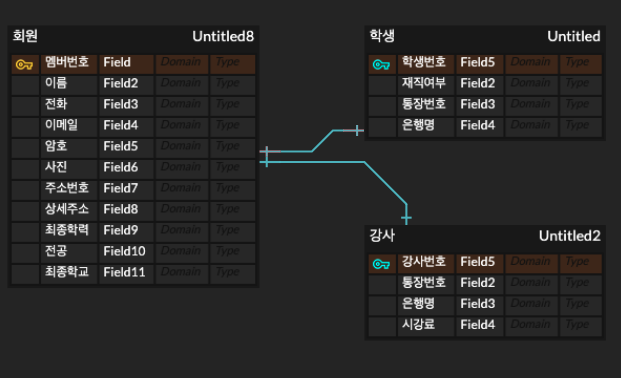

[PDF](https://github.com/eomjinyoung/bitcamp-study/blob/main/docs/%EC%8B%A4%EC%8A%B5%ED%94%84%EB%A1%9C%EC%A0%9D%ED%8A%B85.pdf)

24년의 1월이 다 갔다..
코드트리 아주 열심히 하는 중..!

# Review
## DB's Client
* 클라이언트마다 연결되는 **스레드마다** 설정이 있다.
  * DBMS 라이센스에 따라 스레드 개수를 제한한다...!! (동시 커넥션 수 제어...)
  * 근데 유저가 그걸 임의로 변경할 수 있다. 유저 세션 개수를 늘릴 수 있다는 거다. (개발사가 열어둠)
  * 근데 그렇게 세션 수를 늘리면, 유지보수 때 확인하고, 초과한 세션의 개수 (라이센스) 에 따라 추가 비용이 청구된다.


> 클라이언트의 예시
> 1. DBMS Client Program
> 2. DBMS Vendor API (Native API)
> 3. DBMS ODBC Driver
> 4. DBMS JDBC Driver


### SELECT 결과를 테이블에 입력하기
컬럼 타입이 같거나, 더 큰 크기(VARCHAR)에 가능함
### TRANSACTION
하나의 작업묶음 단위를 트랜잭션이라고 한다.
작업묶음 안에서 하나가 실패하면 전부 다 실패한 것으로 한다.
(작업을 일괄 적용하거나, 전부 취소하거나 두 가지 경우만 있다.)

물건의 주문-결제-배송이 한 작업묶음이 되는 것이 예시다. (아주 퉁쳐서 말했을 때)
이런 작업묶음 단위를 구현하려면 (트랜잭션을 구현하려면) AUTOCOMMIT을 활용할 수 있다.
실패시엔 ROLLBACK, 성공하면 COMMIT

### AUTOCOMMIT
```sql
SET AUTOCOMMIT = false;
COMMIT; --임시로 저장했던 작업을 DB에 적용함
ROLLBACK; --임시로 저장했던 작업을 모두 버림
```
### PROJECTION / SELECTION
PROJECTION: Column 선택 (SELECT)

SELECTION: Row 선택 (WHERE)

### SQL 실행순서
```sql
1. FROM
2. JOIN
3. ON
4. WHERE
5. SELECT
6. GROUP BY
7. HAVING
8. ORDER BY
9. LIMIT
10. ...
```
프조온 웨셀그 해오리..?

### Foreign Key
다른 테이블의 PK, UK를 저장(참조)하는 Column을 FK라고 한다.
First Normal Form를 거치면서 필요성이 나타난다. 
(게시글과 그에 연결되는 첨부파일 링크가 DB에 저장되어야 하는 상황을 생각해보자.)
- 파일은 파일 시스템에 저장한다.
- DB에는 파일 시스템에 저장된 파일의 링크만 저장한다.

1. 무효한 데이터가 입력되는 것을 방지한다.
2. 참조하는 데이터가 삭제되어 무효한 데이터가 되는 것을 방지한다.

```sql
ALTER TABLE 테이블명
    ADD CONSTRAINT 제약조건이름 FOREIGN KEY (컬럼명) REFERENCES 테이블명(컬럼명);
```


# TIL 
## Entitiy Relation Ship
DAsP, SQLD 할 때 배웠던 것들이 새록새록 기억난다. 거의 다 까먹었던 것들...🤣
원래 그런거지. 안하면 다 망각하는게 인간의 뇌.

### Tool
보통 부모테이블 먼저 선택하고 자식테이블 선택하여 관계를 만듦.

## 엔티티(테이블)간 관계의 종류
왼쪽: 부모, 오른쪽 자식.
부모:자식
### 1:1 OR 1:0
PK에 몇개의 FK가 대응되는지로 구분
* PK 1 개당 FK가 0 또는 1개가 대응함
  * Identifying Relationship (식별관계)
    * 식별 관계인 경우 실선으로 그린다.
    * 식별 관계가 아닌 경우 점선으로 그린다.
  * 자식테이블에서 FK가 PK가 되는 경우이다.
  * PK는 자식테이블의 FK가 되면서 동시에 식별자로 사용됨.
대표적인 예시인 강의 수강신청 시스템 DB모델링에서 생각해보면,
회원 기본정보 - 학생
회원 기본정보 - 강사
이런 테이블간의 관계에 해당한다.



회원 가입을 한다면, 기본정보 입력과 학생 OR 강사 정보 (추가정보) 입력이 한 단위로 묶여서 트랜잭션으로 처리되어야 한다. 추후 정보 입력으로 처리할 것이 아니라면, AUTOCOMMIT을 FALSE로 만들어서, 모든 작업이 완료되었을 때 커밋하던가, 아니면 하나라도 문제가 생기면 전체 작업을 취소(롤백) 해야 한다.

### 1:N (N>=0 인 정수)
TODO...

### Summary
[Source](https://www.conceptdraw.com/examples/meaning-of-dotted-line-in-er-diagram)


## 테이블 분리
제1정규화 하는 이유 중 하나로, 데이터 중복을 줄이려는 목적도 있지만...
다국어 지원(i18n)을 하려면 실제 값이 아니라 코드를 갖고 있어야 할 것이다.
지역 정보가 있다면, 그 지역명을 실제로 저장하는 게 아니라,
그 지역 코드만 가지고 있어야 다국어지원이 쉬울 것이다.

## ALL VS DINSTINCT
중복되는 값을 제거하고 한번만 출력하려면 DISTINCT를 붙인다. 붙이지 않으면 ALL이 암시적으로 들어간다.
```sql
SELECT DISTINCT 컬럼명 FROM 테이블명;
```
데이터 종류의 가지수를 알아내고자 할 때 사용된다.

## ORDER BY
컬럼 기준으로 정렬할 때 ORDER BY 예약어를 사용한다.
(SELECT 할 때는 무조건 사용한다고 보면 된다.)
오름차순(Ascending)은 생략 가능하다.
```SQL
SELECT 컬럼1, 컬럼2, 컬럼3 FROM 테이블1 ORDER BY 컬럼1 ; --생략하면 ASC
SELECT 컬럼1, 컬럼2, 컬럼3 FROM 테이블1 ORDER BY 컬럼1 ASC; 
SELECT 컬럼1, 컬럼2, 컬럼3 FROM 테이블1 ORDER BY 컬럼1 DESC; --역순으로
```


여러 컬럼들을 지정하여, 앞 순서의 컬럼에서 동일한 순서가 발생하는 행을 다음 순서의 컬럼에 따라 정렬한다.
```SQL
SELECT 컬럼1, 컬럼2, 컬럼3 FROM 테이블1 ORDER BY 컬럼1, 컬럼2 ; --생략하면 ASC
SELECT 컬럼1, 컬럼2, 컬럼3 FROM 테이블1 ORDER BY 컬럼1 DESC, 컬럼2 ASC; 
```

마찬가지로, `SELECT`는 지정되지 않은 컬럼을 삭제하는 것이 아니라, 출력할 컬럼을 **선택** 하는 것이므로, SELECT를 하지 않은 컬럼들도 정렬 기준으로 선택할 수 있다.

```SQL
SELECT 컬럼1, 컬럼2, 컬럼3 FROM 테이블1 ORDER BY 컬럼4 ASC, 컬럼5 DESC; 
```


가상의 컬럼을 SELECT 절 안에 함수를 통해 만들고, 그에 대해서도 ORDER BY로 정렬할 수 있다.

```sql
SELECT rno, concat(name,'(',loc,')') classname FROM room;
```

이 또한 SELECT 절이 단순히 **최종 출력할 컬럼을 선택해두는 것**임을 보여준다.

```
FROM
JOIN
ON
WHERE
GROUP BY
HAVING
SELECT
ORDER BY
LIMIT
```

## AS
컬럼의 이름을 그대로 쓰지 않고, 별도의 라벨을 지정할 수 있다.
이는 예약어 `AS` 로 가능하다.
```sql
select rno as room_no, loc as location, name from room;
```

그런데 `AS`를 생략해도 된다.
```sql
select rno room_no, loc location, name from room;
```

라벨은 공백을 포함하여 작성할 수 있다. single quotation으로 **반드시** 감싸야 한다.)
그러나 공백을 포함하지 말자. app에서 다루기 힘들어진다.

라벨을 지정하는 이유는, 콘솔에서 출력되는 것보다도 ResultSet 등에서 라벨명으로 데이터를 꺼낼 때 편의성과 가독성을 위해서다.

참고로 count() 함수는 NULL이 아닌 값만을 카운트한다. 튜플이 존재하더라도 해당 컬럼의 값이 NULL 이면 그것은 개수에 포함되지 않는다.

### UNION
```sql
[ ] UNION [ ]; --중복제외하고 합친다.
[ ] UNION ALL [ ]; --중복포함하여 합친다.
```

### MINUS
* MySQL에서는 MINUS 를 지원하지 않는다.
* Oracle에서는 MINUS (차집합) 연산을 지원한다.

MySQL에서는 아래와 같이, WHERE 절로 조건을 주는 방식으로 차집합을 구한다.
어떤 컬럼을 기준으로 차집합을 할 것인지 (bank)
stnt - tcher

```sql
/* 차집합
   mysql 은 차집합 문법을 지원하지 않는다.
   따라서 다음과 기존의 SQL 문법을 사용해서 처리해야 한다.
*/
select distinct bank
from stnt
where not bank in (select distinct bank from tcher);

/* 교집합
   mysql 은 교집합 문법을 지원하지 않는다.
   따라서 다음과 기존의 SQL 문법을 사용해서 처리해야 한다.
*/
select distinct bank
from stnt
where bank in (select distinct bank from tcher);
```
(집합은 중복원소를 저장하지 않으므로 DISTINCT)

### ChatGPT
한국어로 질문해서 그런가..? 잘못된 답을 준다.
ORACLE에 

```
내 질문:
집합연산자에 대한 Oracle, MySQL의 차이는?
```
---
ChatGPT:
Oracle과 MySQL은 둘 다 관계형 데이터베이스 관리 시스템(RDBMS)이지만, 각각의 제품은 특정한 문법과 기능을 가지고 있습니다. 집합 연산자는 이러한 데이터베이스 시스템에서 사용되는 SQL의 일부입니다. 아래는 Oracle과 MySQL 간의 주요 집합 연산자에 대한 차이점을 설명합니다.

1. **UNION 연산자:**
   - **Oracle:** 기본적으로 중복된 행을 제거합니다. `UNION ALL`을 사용하여 중복된 행을 포함할 수 있습니다.
   - **MySQL:** `UNION`과 `UNION ALL`을 모두 지원하며, 기본적으로 중복된 행을 제거하지 않습니다.

2. **INTERSECT 연산자:**
   - **Oracle:** INTERSECT 연산자를 지원하지 않습니다. 대신 INNER JOIN과 서브쿼리를 사용하여 유사한 결과를 얻을 수 있습니다.
   - **MySQL:** INTERSECT 연산자를 직접 지원하지 않습니다. INNER JOIN과 서브쿼리를 사용하여 비슷한 결과를 얻을 수 있습니다.

3. **MINUS 또는 EXCEPT 연산자:**
   - **Oracle:** MINUS 연산자를 사용하여 차집합을 얻을 수 있습니다.
   - **MySQL:** MINUS 연산자를 직접 지원하지 않습니다. LEFT JOIN 또는 NOT IN과 같은 다른 방법을 사용하여 차집합을 얻을 수 있습니다.

4. **OUTER JOIN:**
   - **Oracle:** `LEFT OUTER JOIN`, `RIGHT OUTER JOIN`, `FULL OUTER JOIN`과 같은 다양한 OUTER JOIN 유형을 지원합니다.
   - **MySQL:** `LEFT JOIN`, `RIGHT JOIN`, `FULL JOIN` 등의 OUTER JOIN 유형을 지원합니다.

각 데이터베이스 시스템은 자체적인 문법과 기능을 가지고 있기 때문에, 특히 집합 연산자와 같은 SQL 기능에서 차이가 발생할 수 있습니다. 이러한 차이를 고려하여 데이터베이스 쿼리를 작성해야 합니다.

---

## 테이블명 AS
AS로 테이블명도 별칭을 붙일 수 있다. 동일한 이름의 컬럼을 가지고 있는 두 테이블을 다룰 때, 매번 `테이블명.컬럼명` 으로 사용하기에 테이블명이 너무 길기 때문에 자주 사용된다.

```sql
-- 컬럼명 앞에 테이블명을 붙이면 너무 길다.
-- 테이블에 별명을 부여하고 그 별명을 사용하여 컬럼을 지정하라.
select b.bno, title, content, fno, filepath, a.bno
from board1 as b cross join attach_file1 as a;

-- as는 생략 가능
select b.bno, title, content, fno, filepath, a.bno
from board1 b cross join attach_file1 a;

-- 고전 문법
select b.bno, title, content, fno, filepath, a.bno
from board1 b, attach_file1 a;
```

### NATURAL JOIN
```sql
-- 2) NATURAL 조인
--    같은 이름을 가진 컬럼 값을 기준으로 레코드를 연결한다.
select b.bno, title, content, fno, filepath, a.bno
from board1 b natural join attach_file1 a;

-- 고전 문법
select b.bno, title, content, fno, filepath, a.bno
from board1 b, attach_file1 a
where b.bno = a.bno;
```

NATURAL JOIN이 가지는 문제점이 있다.
* 컬럼 이름이 기준이다.
  * 이름이 다르면 NATURAL JOIN 불가
    * 같은 이름 없으면 CROSS JOIN 된다.
  * 이름만 같고 의미가 다른 컬럼과 JOIN 될 수 있음
  * 같은 이름의 컬럼이 여러 개 있을 때
    * 모든 컬럼의 값이 일치할 경우에만 연결됨

### JOIN ~ USING
```sql
-- 3) JOIN ~ USING
--    같은 이름을 가진 컬럼이 여러 개 있을 경우 USING을 사용하여 컬럼을 명시할 수 있다.
select b.bno, b.title, content, a.fno, a.title, a.bno
from board4 b join attach_file4 a using (bno);

-- join ~ using 의 한계
-- => 두 테이블에 같은 이름의 컬럼이 없을 경우 연결하지 못한다.

-- 두 테이블의 데이터를 연결할 때 기준이 되는 컬럼이 이름이 같지 않으면
-- using을 사용할 수 없다.
```

### JOIN ~ ON
```sql
--    조인 조건을 on에 명시할 수 있다.
select no, title, content, fno, filepath, bno
from board5 b join attach_file5 a on b.no=a.bno;


-- 조건에 일치하는 경우에만 두 테이블의 데이터를 연결한다.
-- 이런 조인을 'inner join' 이라 부른다.
-- SQL 문에서도 inner join 이라 기술할 수 있다.
-- 물론 inner를 생략할 수도 있다.
```

