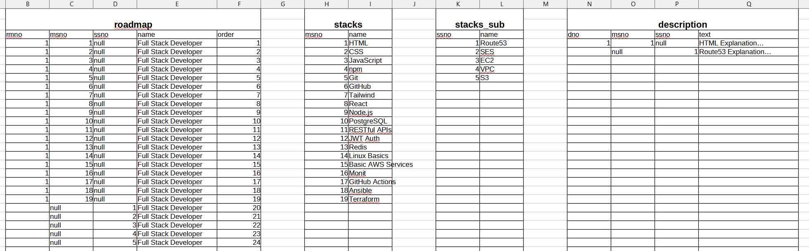
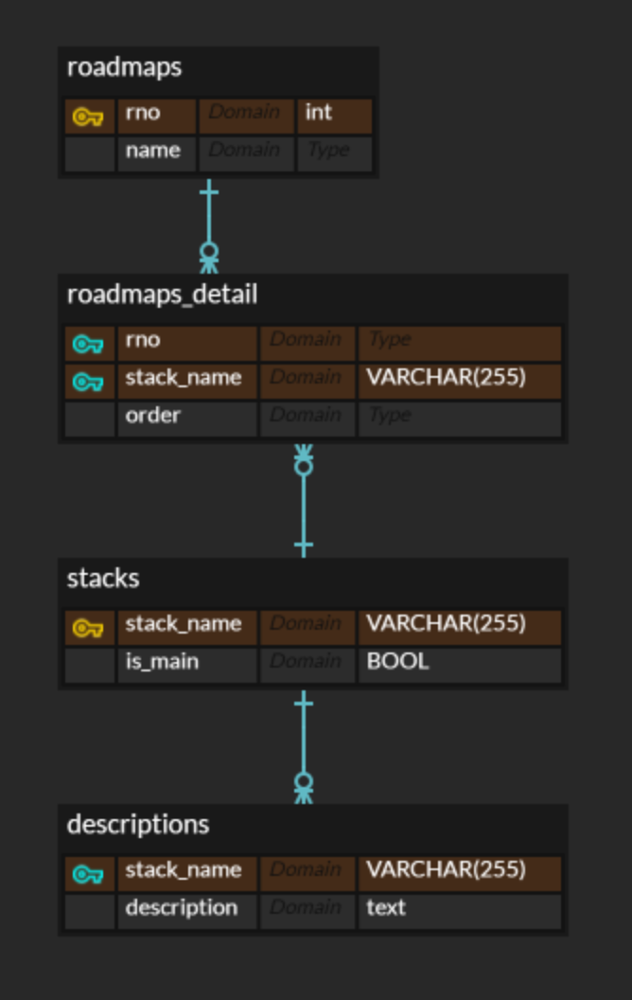

# Assignment
***DBMS와 통신하는 java App 클라이언트 프로그래밍하기***

* CLI 환경에서 동작
* `메뉴` 및 메뉴가 소속되는 `그룹`은 Composite Pattern 적용
*  JDBC Type4 Driver 적용
* DAO 분리
* Handler 분리
* VO 분리
* 아직 도메인은 분리되지 않음

## 무엇을 만들 것인가?
* 어떤 데이터를 다룰 것인가
* 어떻게 테이블에 저장할 것인가 (데이터 모델링)
* DAO, Handler 준비하기
* 테이블 생성부터 작업을 위한 쿼리 준비하기
강의시간에 작성했던 CRUD를 적절하게 골라서 재구성하기

## WHAT TO DO?
일단 첫 과제 시작의 소감 ! 
➡️ 이렇게 배웠던 걸 적용해 볼 기회가 생겨서 기쁘다!! 이렇게 작은 것부터 시작하는거지!! 😆
1. 뭘 만들어볼까 그걸 정하는게 제일 어렵다. 
2. 내가 만들어보고 싶던 것, 최근에 관심이 가는 것, 있으면 좋겠다 싶은 것 이런 식으로 나열하면서 좁혀봐야겠다.

* 내가 만들어보고 싶던 것
	* 노트북 가이드? 리뷰?
	* 전자기기 관련 정보?
* 관심 분야
	* 카메라(사진)
		* 바디
		* 렌즈
		* 소프트웨어
	* 건축 / 설계
		* BIM
		* PMS
	* 전자기기
		* 랩탑
		* Storage
		* Apple
* 있으면 좋겠다 싶은 것
	* 분야별 `좋은 글` 모음 (커뮤니티 서비스의 인기글 카테고리 같군)
		* 아싸 카페나 붇카페 같은.. 빅테크가 호스팅하는 코리안 커뮤니티 중에서 굉장히 통찰력이 좋은 사람이 쓴 것 같은 글들이 있다. 이런 글들은 버블 정렬되는 것처럼 보팅 시스템을 통해 위로 올라온다.
		* 이런 글들을 한 곳에서 모아서 볼 수 있다면?
* 다른 사람들에게 필요해보였던 것
	* 일단 '모른다는 것'을 모르는 것이 문제 (내가 그러니까...)
	* 개발 툴이나 로드맵에 모르는 것이 있다... 
		* 그래서 roadmap.sh 같은 페이지도 생긴 거 아닌가!!
	* 기술 발전이 빠른만큼 `모른다는 걸 모르는 일`이 많아서 더 괴롭다!!
		* 매번 반복하거나/고생했던 일들을 해결해주는 A가 있다고?
		* 어쩔수 없다고 생각했던 문제를 해결해주는 B가 등장했다고?
	* 미리 넣어둔 값을 서버에서 받아온다면?
	* 서버에서 수정하면 모든 클라이언트들이 변경된 값을 받으니까 업뎃, 컨트리븃도 쉬울 것!!
		* 하나의 **포스팅** 을 혼자서 업데이트하며 일구는 것은 너무 고되다.

--> roadmap.sh를 CLI로 구현해보자!

처음에는 메인스택과 서브스택으로 구분하려고 스택을 테이블을 나눠서 저장하려고 했다.
그런데 각 스택에는 설명이 들어가는데, 따로따로 JOIN하면 되긴 하지만 관리가 어려워질 것으로 보였다.

처음에 위와 같은 테이블들을 생각했는데, 확인해보니 어차피 스택의 이름은 유니크하기 때문에, 굳이 no 속성을 만들어줄 필요가 없어보였다. 또한 메인스택과 서브스택은 하나의 테이블에서 관리하되 메인인지, 서브인지만 하나의 속성을 추가하여 구분하여 주는 것이 나아보였다.

그래서 이렇게 바꿨다.

