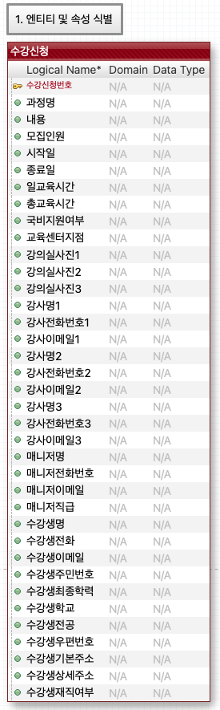

# Mini Project
소감
* CLI도 디자인에 따라 느낌이 많이 달라지는구나

## 데이터 모델링
데이터 모델링을 신입에게 시킨다면 사실 미친 회사.
어디에 FK를 잘못 박는다거나 하면 아주 잘못된 결과가 발생할 것.
SI 파견에서 단가때문에 경력 뻥튀기를 하는 잘못된 관행 
(신입인데 중급으로 보낸다던가, 3~4년차인데 고급으로 보낸다던가)
뻥을 치면 안된다. 근데 신입이 경력을 쌓기 힘든 것도 사실.

데이터가 여러군데 존재하면 중복된 데이터를 다 ㅂ바꿔야하는데
어찌하다 일부를 바꿔주지 않으면 문제가 발생
DB모델링의 가장 핵심 목적은 데이터의 중복방지이다.
중복되도 상관 없으면 그냥 한 테이블에 다 때려넣어도 상관 없음
중복되면 메모리가 낭비됨.

객체지향프로그래밍의 목적이 코드관리(중복줄이고 재사용성 높이기)인 것이다.

### 모델링이 뭔가?
시스템을 분석하고 구조화시켜 글과 그림으로 표현하는 것을 말한다. 
분석과 구조화라는 단어를 들으면 추상화라는 용어가 떠오른다.
참고로 렌더링은 명령어를 해석하여 화면에 출력하는 것을 말한다.

DB 모델링은 데이터를 분석하고 구조화시켜 데이터 속성과 관계를 글과 그림으로 표현하는 것이다.
목표는 데이터가 중복되지 않도록 데이터를 테이블로 구조하하는 것이다.
 중복 데이터를 제거하면 무엇이 좋은가? 데이터의 안정성과 

 DB 모델링의 목적은 데이터의 중복 관리다. 데이터 중복을 줄이는 것.신뢰성이 높아진다. 일관성과 무결성을 유지할 수 있게 되는 것이다. 주요 용어로는 테이블이 있다. 인텐션은 무엇인가? 스키마 헤더라고 부르는 것이다. 

### 용어
테이블: 릴레이션, 엔티티, 파일이라고도 쓰인다. 개발에서는 테이블, 모델링에서는 엔티티라는 용어로 많이 쓰인다.
인텐션, 스키마, 헤더는 데이터 구조 설계도를 말한다.
익스텐션, 인스턴스는 데이터를 말한다.
로우, 튜플, 레코드는 한 행을 말한다. 한 개의 데이터.
컬럼, 어트리뷰트, 필드는 데이터의 한 항목을 말한다. 열이다.

키는 데이터를 구분할 때 사용할 수 있는 식별자로 말한다. 수퍼키라고 부르기도 한다. 식별자는 데이터를 구분할 때 사용하는 값으로, 한개 이상의 컬럼으로 구성된다.
식별자는 키라고 부른다.

어떤 데이터를 유니크하게 구분할 수 있게 해주는 것이 키다. 그래서 데이터마다 같은 케이스를 가질 수 있는 것은 키로 사용할 수 없다. 그리고 유니크하다고 모두 키로 활용하지는 않는다. 가장 최소한의 컬럼값만으로 식별이 가능한 키인 최소키를 사용한다. 그렇게 선별된 키들이 후보키다.

학번, 주민번호, 이메일 같이 한 개만으로 구별가능한 경우도 있다. 
이름+이메일, 이름+주민번호 같은 조합도 키가 될 수 있다. 컬럼 개수가 늘어나는 문제가 생긴다.

### 기본 키의 선정
아주아주 중요한 포인트는, 변경 가능성이 없는 것이다.
후보키 중에서 데이터 식별자로 사용하기 위해 선정하면 나머지는 대안키(앨터네이트 키) 가 된다.
대안키는 PK와 마찬가지로 데이터 식별자로 대체하여 사용할 수 있다.

### 대리키(서로게이트키, 아티피셜키)
주 키를 최소로 찾아봐도 컬럼 여러개를 사용해야 한다거나, 적절한 주 키가 없을 때
일련번호같은 임의의 컬럼을 추가해서 주키로 쓰는 경우가 있다. 이럴 떄 만든 컬럼은 대리키, 서로게이트 키, 아티피셜 키 라고 불린다.
이런 경우는 상당히 많다. PK가 되기 위한 중요한 조건 중 하나가 변경 불가이기 때문이다. 주민번호 같은 개인정보 받기는 뭐하고, 핸드폰이나 이메일 주소같은 건 바뀔 수가 있다. 그러다보니 인공적으로 유니크한 번호를 부여해버리는 것이 가장 좋은 방법이 되는 경우가 많은 것이다.
사실 학번도 유니크한 번호를 인공적으로 부여해버린 것이다.

## DB모델링의 예시
수강신청 관리시스템의 DB모델링을 해볼 것.

처음에 이렇게 한 테이블에 때려넣었다고 하자.

### 중복을 제거한다. 제 1 정규화
수강신청 정보(수강생관련 정보)는 바뀌겠지만, 나머지 강의, 강의실정보, 강사나 매니저 정보는 변하지 않는다.
이렇게 변하지 않는 정보들이 중복되는 걸 다른 테이블로 분리해 해소하는 걸 제 1 정규화라고 한다.

### 제 3 정규화
일반적인 컬럼에 종속되게 하지 말라

### 포함관계와 배타적 관계

## F/B 엔지니어링
포워드 엔지니어링