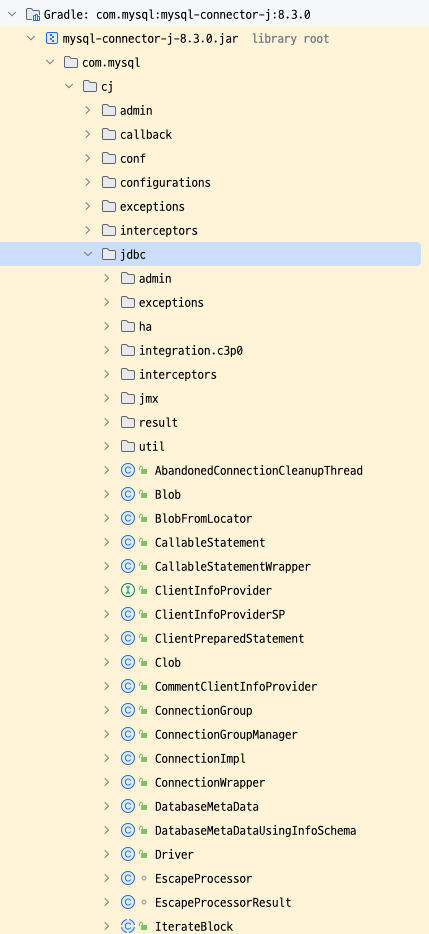
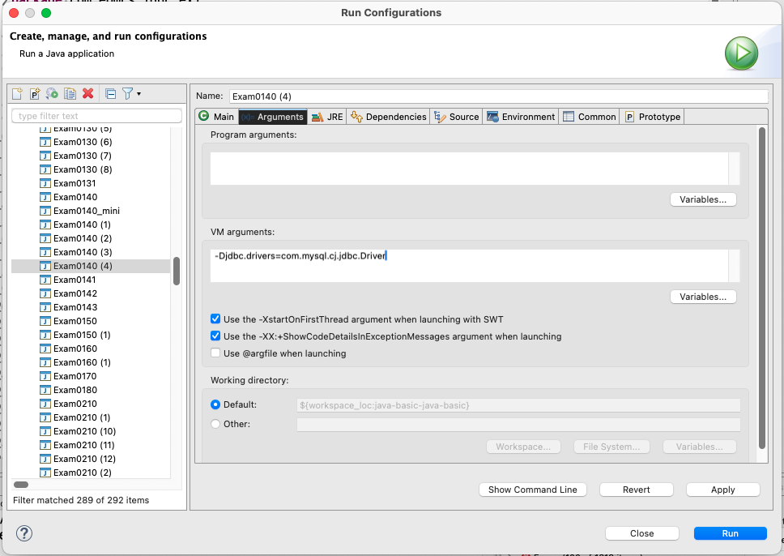

# TIL

* DBA는 훨씬 배우는 게 많다. InnoDB 최적화, 클러스터링, 메모리테이블 등등등 세부 주제가 더 많다. 적당한 DDL DMS DQL 작성하는 건 백엔드 엔지니어의 소양인데, java로 치면 DBA에게 그것은 리터럴을 배운 정도이다.
  * 데이터를 어떻게 저장할지, 퍼포먼스 스키마들의 변수들이 무엇을 의미하고 어떻게 활용하는지와 같은 세부주제가 아주 더 많다.
  * DB Modeling 과 관련된 부분도 그렇다.

## JDBC Programming
Java DB Connectivity
### Topics on JDBC Programming
1. Driver
2. DriverManager
3. Connection
4. Statement
5. ResultSet
6. PreparedStatement
7. Transaction: commit/rollback
8. Connection Pool: DataSource

### JDBC API & JDBC Driver
먼저 용어를 구분하고 넘어가야 한다.
* JDBC API는 java에서 제공하는 인터페이스 및 클래스임.
* JDBC Driver는 DBMS를 만든 벤더에서 제공하는 API 구현체 및 보조클래스임.

JDBC API는 java.sql 혹은 javax.sql 패키지에 위치한다.
JDBC API는 드라이버를 사용하기 위한 인터페이스가 존재한다.
JDBC Driver에는 해당 인터페이스에 대응하는 구현체가 존재한다.

MySQL의 드라이버를 예로 들면, 이런 것들이다. 

[https://central.sonatype.com/artifact/mysql/mysql-connector-java](https://central.sonatype.com/artifact/mysql/mysql-connector-java)

(gradle 이나 maven 사용하면 이런 의존성들을 인터넷에서 바로 다운받아서 라이브러리에 추가한다. 안 쓸수가 없음...)



위 이미지를 보면 connector 드라이버에서 jdbc에 대한 구현체들 (~~~Impl.class 파일들)이 존재하는 걸 볼 수 있다. JDBC API에 존재하는 인터페이스들을 구현한 것은 각 벤더들이 제공하는 드라이버에 존재한다는 걸 확인할 수 있다. 

참고로 Impl을 붙여두지 않은 구현체들도 있는데, 코드에서 직접 사용할 구현체들은 Impl을 붙이지 않고, 인터페이스에서 사용되는 것들은 Impl이 붙어있다.

### DB Modeling
DBMS 에 여러 사람들이 동시에 데이터를 넣으려고 하고, 조회하려고 하고, 삭제하거나 업데이트 하려고 할 것이다. 여러 클라이언트가 DBMS에 연결될 수 있도록 (멀티스레딩) 하고 

데이터가 여러 곳에 중복저장되면 아주 높은 확률로 데이터 결함이 발생한다. (수정, 삭제시 타고타고타고 올라가야 할 것이니까) 그래서 DB모델링이 중요한 것이며, 이런 중복 저장을 방지하기 위한
1NF, 2NF, 3NF ... 가 중요한 것이다. (정규화)

* 영어 표현방법을 빨리 이해하는 방법: 하나의 예시를 이해하기
* DB Modeling을 빨리 이해하는 방법: 하나의 DB를 모델링해보기

---

* 1NF: 원자성. 한 칸에 여러 데이터가 뭉쳐 있으면 그것을 여러 행으로 쪼갤 것.
* 2NF: 
* 3NF: 특정 단과대학-전공 ➡️ 동
* 4NF
* 5NF

---

다대다 관계의 해소
* 하는 이유: DBMS에서 다대다 관계를 표현(구현)할 수 없음
* 하는 방법: 관계 정보를 저장할 별도 테이블을 만든다. (이런 테이블은 일반적인 엔티티라고 부르지 않고 릴레이션 테이블이라고 한다.)

### Driver & Driver Manager (JDBC API)

* Driver는 인터페이스인데 DriverManger는 concrete class이다. 

아래와 같은 순서로 사용된다.

1. Driver 구현체의 인스턴스를 생성한다.
2. Driver 구현체를 등록한다.
Driver 구현체는 JDBC URL, Driver Instance를 가진다. (포함한다.)
* Driver Instance를 생성한 다음 그것을 DriverManager 에 등록하여 사용한다.
이는 `DriverManger.registerDriver(객체);` 형태로, 메서드에 아규먼트로 인스턴스를 주는 방식이다.
* URL 또한 메서드에 아규먼트로 주는 방식이다. `DriverManager.getDriver()`

코드로 보면 이렇다.

드라이버 구현체의 인스턴스를 생성하고 DriverManager에 등록하기
```java
      // 1) java.sql.Driver 구현체의 인스턴스를 생성한다.
      java.sql.Driver mariadbDriver = new org.mariadb.jdbc.Driver();
      java.sql.Driver oracleDriver = new oracle.jdbc.OracleDriver();
      java.sql.Driver mssqlDriver = new com.microsoft.sqlserver.jdbc.SQLServerDriver();
      java.sql.Driver mysqlDriver = new com.mysql.jdbc.Driver();

      // 2) java.sql.Driver 구현체의 인스턴스를 드라이버 관리자에 등록한다.
      DriverManager.registerDriver(mariadbDriver);
      DriverManager.registerDriver(oracleDriver);
      DriverManager.registerDriver(mssqlDriver);
      DriverManager.registerDriver(mysqlDriver);
```

URL을 준다.
```java
      // DriverManager에 등록된 Driver 인스턴스를 확인해보자!
      // => DriverManager.getDriver(jdbcUrl);
      // => jdbcUrl
      // jdbc:[DBMS]://서버주소:포트번호/데이터베이스명
      java.sql.Driver driver = DriverManager.getDriver("jdbc:mariadb://");
      System.out.println(driver);

      java.sql.Driver driver2 = DriverManager.getDriver("jdbc:oracle:thin://");
      System.out.println(driver2);

      java.sql.Driver driver3 = DriverManager.getDriver("jdbc:sqlserver://");
      System.out.println(driver3);

      java.sql.Driver driver4 = DriverManager.getDriver("jdbc:mysql://");
      System.out.println(driver4);
```
OUTPUT
```
org.mariadb.jdbc.Driver@33909752
oracle.jdbc.OracleDriver@5e2de80c
SQLServerDriver:1
com.mysql.cj.jdbc.Driver@fe18270
```

참고로, `JDBC 드라이버 구현체의 인스턴스`라는 용어는 `JDBC 드라이버 구현체` 라고 줄여서 지칭되는 경우가 아주 많다.

### JDBC 구현체들의 관계
1. Driver 구현체는 Connection 구현체를 생성한다. (DriverManger.getConnection() -> connection())
2. Connection 구현체는 Statement 구현체를 생성한다. (createStatement())
3. Statement 구현체는 ResultSet 구현체를 생성한다. (executeQuery())
4. ResultSet 구현체는 데이터를 가져온다. (next(), get~~~())

그럼 Driver 구현체는 누가 생성해주나? connect 메서드가 URL과 기타 정보를 받아서 생성한다. 그런데 connect 메서드는 직접 사용이 불가능하다. DriverManager를 통해서 사용가능하다. DriverManager에게 getConnection() 메서드를 사용하여 요청해야 가능한 것이다.


### JDBC URL

### No Suitable Driver
`java.sql.SQLException: No suitable driver` 라는 예외를 보는 경우
1. 드라이버 구현체의 인스턴스를 드라이버 매니저에 제대로 등록하지 않은 경우
2. 드라이버 구현체 등록할 때 오타가 난 경우
3. 외부 라이브러리를 등록하지 않은 경우

### 사실은.. 자동 등록된다.
드라이버 구현체를 조회해보면 아래처럼 스태틱 블럭에 registerDriver 하는 부분이 있다.
```java
/** MariaDB Driver */
public final class Driver implements java.sql.Driver {

  static {
    try {
      DriverManager.registerDriver(new Driver());
    } catch (SQLException e) {
      // eat
    }
  }
```
이런 스태틱 블럭은 MariaDB에만 있는 게 아니다. 사실상 모든 JDBC 드라이버에 적용되어 있다. 이는 java측에서 권고하고 있는 사항이다. 
* 처음부터 이렇게 드라이버를 등록하는 스태틱 블럭이 존재했던 것은 아니다. 
* 이전에는 직접 DriverManager.registerDriver() 메서드를 호출하여 등록해야 했다.

그리고 안에서 new Driver()로 드라이버 인스턴스를 생성하는 걸 볼 수 있다. 앞에서 드라이버 인스턴스를 만들 필요도 없던 것이다. (가비지를 만들었다)

그래서 `Class.forName("org.mariadb.jdbc.Driver");` 하나면 된다.
근데 여기서 더 발전한다. 
왜? DBMS를 변경하는 경우를 생각해보면, 
1. 저 스트링 전부가 변경해야 한다.
2. 빌드를 다시 해야 한다.
3. 도커 이미지 업로드한다.
4. 서버에서 올린 이미지 다운로드 받는다.
5. 서버에서 컨테이너를 새로 만들고 실행한다.

**고객사가 사용하는 DBMS 마다 소스코드가 변경되어야 한다는 것이다.**
그래서 properties 파일을 두는 방식을 사용한다.

### properties 를 외부 값에 저장.
하드코딩을 하면 안되고, 게터와 세터를 써야 하는 이유와 마찬가지다.
**그래서, 외부에 저장된 properties 파일을 두고 그것을 읽어와서 DBMS에 적용한다.**

```
# property name=value
jdbc.driverClassName=org.mariadb.jdbc.Driver
jdbc.url=jdbc:mariadb://
#jdbc.driverClassName=oracle.jdbc.OracleDriver
#jdbc.url=jdbc:oracle:thin://
```

```java
    try {
      Properties props = new Properties();
      props.load(new FileReader("./jdbc-driver.properties"));
      System.out.println(props.getProperty("jdbc.driverClassName"));
      System.out.println(props.getProperty("jdbc.url"));

      // 위의 방식을 사용하면 다음과 같이, 
      // Driver 구현체를 소스 파일에 직접 명시할 필요가 없다.
      Class.forName(props.getProperty("jdbc.driverClassName"));
      java.sql.Driver driver = DriverManager.getDriver(props.getProperty("jdbc.url"));
      System.out.println(driver);

    } catch (Exception e) {
      e.printStackTrace();
    }
```

이렇게 키=값 형태의 외부 값을 읽어와서 사용하는 방식이다. 
여기서 더 발전할 수 있다. 

### 
