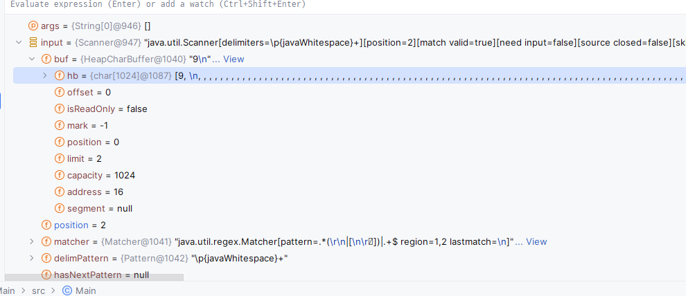

알고리즘 조각지식 (java 기준)
1. 이스케이프 문자도 당연히 길이에 포함된다. (1자로 포함됨)
2. `next()`와 `nextLine()` 메서드의 동작

| 상황                          | `next()` 메서드 동작                                                             | `nextLine()` 메서드 동작                               |
| ----------------------------- | -------------------------------------------------------------------------------- | ------------------------------------------------------ |
| 첫 글자가 공백인 경우         | 공백 이후의 첫 번째 비공백 문자를 만날 때까지 대기하여 그 이전까지의 문자열 반환 | 개행 문자(`\n`)를 만날 때까지의 문자열 반환, 공백 무시 |
| 공백만 입력된 경우            | 아무런 값도 반환하지 않고 다음 입력을 대기                                       | 빈 문자열 반환                                         |
| 개행 문자(`\n`)만 입력된 경우 | 아무런 값도 반환하지 않고 다음 입력을 대기                                       | 빈 문자열 반환                                         |
| 일반적인 경우                 | 공백을 만날 때까지의 문자열 반환                                                 | 개행 문자(`\n`)를 만날 때까지의 문자열 반환, 공백 포함 |

특히, 개행문자를 받았을 때 next(), nextLine()은 완전히 예상을 빗나가게 동작한다.
이로 인한 IndexOutOfBound, 혹은 NoSuchElement 예외가 발생할 수 있으니 주의해야겠다.

아래 디버그 스크린샷을 보면, next(), nextInt() 등으로 받으면 개행문자까지 버퍼에 들어간다.

