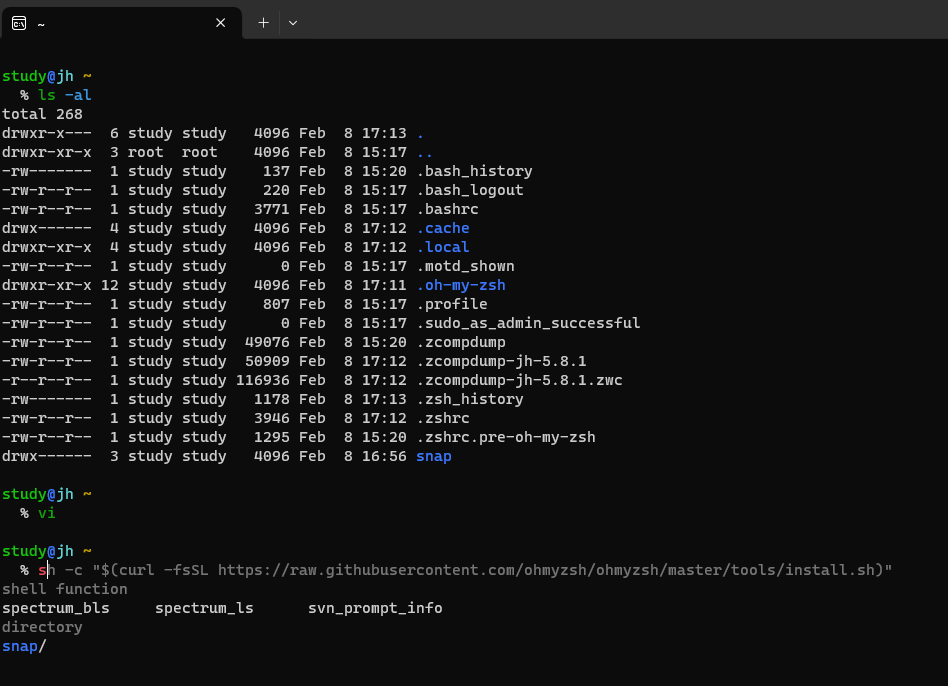

[PDF](https://github.com/eomjinyoung/bitcamp-study/blob/main/docs/%EC%8B%A4%EC%8A%B5%ED%94%84%EB%A1%9C%EC%A0%9D%ED%8A%B85.pdf)

# Review
## SQL Injection 차단
* 원리: Dynamic SQL 구성시 String에 SQL 구문을 삽입하여 전체 SQL문을 왜곡시킴
* 방어: PreparedStatement 사용하여, SQL문과 값을 구분하여 받도록 함. (파싱 자체가 필요가 없어지니 구문삽입이 불가)

## JDBC Programming

# TIL
## Application Server 아키텍처로 변환
이전의 방식은 DBMS 서버에 각 클라이언트들이 스레드를 받아서 접속하는 방식이었다.
이 방식의 가장 큰 문제는 무엇인가?


### Client - DBMS 방식의 문제점
**가장 큰 문제점은, 클라이언트 기능을 변경하려면 모든 클라이언트 소프트웨어도 변경해야 한다는 것이다.**
업데이트가 발생할 때마다 클라이언트가 재설치를 해줘야 한다는 것이다.
무한 경쟁의 시대에서 프로덕트는 끊임없이 개선되고 변경된다.
조직 또한 그 변화를 따르고, 조직원들의 업무도 변경된다.
이에 따라 제품의 라이프 사이클이 점점 짧아진다.
제품 개선때마다 매번 재설치를 유저에게 요구하기엔 피로도가 너무 높아지는 것이 문제다.

### 과거로의 회귀
유닉스 서버 한대에 여러대의 터미널 단말들이 붙어서 소프트웨어를 사용했던 그 과거로의 회귀가 문제의 해결 방법으로 제안된다.


특히, 서버의 단가가 하락하고 성능은 상승했으며, 블레이드 시스템, 클러스터링 등 기술 발전이 있던 시대였다.


### 회귀(?) 방법
클라이언트 - 서버 구조를 두개로 쪼갠다.
클라-서버, 클라-서버


## StringWriter
출력하는 문자열을 내부 버퍼에 유지한다.
PrintWriter -> StringWriter 같은 방식으로 연결하고
.print("~~~") 할 때마다 StringWriter 버퍼에 그 내용을 저장한다. (입출력을 바로 하는게 아니다)

### 발생했던 문제
* Prompt 공유로 인한 breadcrumb
* 멀티스레딩 재적용 필요 (스레드풀)

### 개선할 점
DB에 커넥션이 단 하나임. 동시에 여러 클라이언트의 요청이 있는 경우 덮어씌워지는 문제가 발생할 수 있음. 그래서 커넥션풀도 적용해야 함.

### 어플리케이션 서버 아키텍처의 유지보수 용이성
사용자의 클라이언트 앱은 변경할 필요가 없음! 재설치하지 않아도 됨..


### 이후 추가될 기능
로그인 기능. 

자동화된 커넥션풀 기능 사용 (JDBC)
DAO 직접 만들었는데 중복되는 부분이 많음. 프록시패턴 적용해서 개선해볼 것.
그리고 이후에는 프록시 패턴을 내장한 프레임워크 (마이바티스)를 적용할 것
이후 기본스트림 활용하는 용도였던 클라이언트앱을 버리고 웹브라우저 사용해볼 것

결국, 서버앱에서는 핸들러를 개발하면 되는 것. 이걸 편하게 해 주는 것이 Servlet...
여기서부터 웹 애플리케이션 개발의 시작

핸들러를 늘리면 퍼사드패턴 (프론트 등) 적용됨
직접 만들어볼 것. 이걸 제대로 만들어둔게 스프링 프레임워크.

이런 흐름이, 왜 웹어플리케이션을 우리가 이렇게 개발하는지를 설명해주는 역사들...
DAO와 Handler만 작성하면 나머지는 자바의 API나 자바의 다른 프레임워크들이 커넥션풀, 스레드풀, 프록시패턴... 거진 다 해결해준다. 프로토콜에 맞춰서도. 그럼에도 안에서 무슨 일이 일어나는지 알 필요가 있기 때문에 배우는 것!


## 그 외 했던 일
Ubuntu WSL2로 설치함
(한번 설치했다 삭제하면 wsl -l 명령어로 확인해보고, wsl unregister 명령어 써서 삭제해야 재설치 후 접속 가능하다.)

그리고 zsh 설치하고 oh-my-zsh 설치하고나서 관련 플러그인을 설치하고 싶었다.
근데 이 명령어가 안먹히길래..


```zsh
```

찾아보니 아주 잘 정리된 글이 있었다.

=> [https://gist.github.com/n1snt/454b879b8f0b7995740ae04c5fb5b7df](https://gist.github.com/n1snt/454b879b8f0b7995740ae04c5fb5b7df)

```bash
sudo apt install zsh-autosuggestions zsh-syntax-highlighting zsh

sh -c "$(curl -fsSL https://raw.githubusercontent.com/ohmyzsh/ohmyzsh/master/tools/install.sh)"

git clone https://github.com/zsh-users/zsh-autosuggestions.git $ZSH_CUSTOM/plugins/zsh-autosuggestions

git clone https://github.com/zsh-users/zsh-syntax-highlighting.git $ZSH_CUSTOM/plugins/zsh-syntax-highlighting

git clone https://github.com/zdharma-continuum/fast-syntax-highlighting.git ${ZSH_CUSTOM:-$HOME/.oh-my-zsh/custom}/plugins/fast-syntax-highlighting

git clone --depth 1 -- https://github.com/marlonrichert/zsh-autocomplete.git $ZSH_CUSTOM/plugins/zsh-autocomplete
```

플러그인의 적용은 .zshrc 파일에 명시해줘야 한다.
nano 혹은 vi 같은 에디터를 사용하면 된다.
```bash
nano ~/.zshrc
```

해당 설정 파일을 쭉 내리다보면 `plugins=(git)` 이라는 문장을 만나게 될 것이다.
git 말고 다른 플러그인들을 추가해주면 된다.

```
plugins=(git zsh-autosuggestions zsh-syntax-highlighting fast-syntax-highlighting zsh-autocomplete)
```
참고로 윈도우 WSL 터미널에서 클립보드 값을 터미널에 붙여넣는게 가능하니 그냥 붙여넣기 하면 된다.
윈도우 터미널에서는 그냥 Ctrl+V 하면 되는데, 터미널 에뮬레이터를 사용하는 경우에는 마우스 가운데 휠 클릭을 하거나 우클릭 또는 우클릭 후 뜨는 컨텍스트 메뉴에서 Paste 하면 된다.



### Screenfetch


추가로 위 사진처럼 이쁜 정보화면을 받아보고 싶다면, screenfetch를 추천한다.
**neofetch가 가장 유명한 것으로 알고 있는데, 파이썬 같은 의존성 다 받으면 140MB 정도를 받아야 한다... 🤣** 
*그에 비해서 screenfetch는 요구하는 의존성이 많지 않고 합해서 1400kB 정도다.* 물론 이런 정보를 fetch해오는 소프트웨어는 정말 많아서, 이것저것 써보면 된다. [이렇게 fetch 소프트웨어들을 정리해둔 글](https://beucismis.github.io/awesome-fetch/)이 있을 정도로 많다.

사용 방법은 screenfetch를 입력하면 된다.
여기에 옵션을 줘서 색을 빼거나, 로고를 빼거나, 로고만 출력하거나, 로고를 바꾸거나, verbose 하게 출력하거나... 그러한 일들을 할 수 있다.

설치는 apt를 통해서 쉽게 가능하다.
```bash
sudo apt install screenfetch
```

스크린패치의 문서를 확인해보고싶다면 [여기](https://www.mankier.com/1/screenfetch)에서 확인해보면 된다.