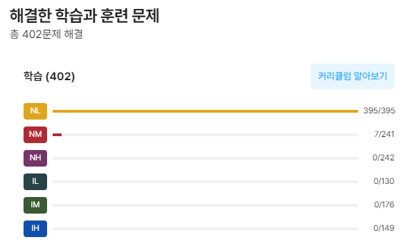

설날 잘 보내구 왔다. 연휴간 코드트리 가장 첫 단계인 NL을 드디어 다 풀었다!!

# TIL
62Day에 배웠던 내용 리뷰
* Application Server Architecture의 도입은 경쟁이 심해졌기 때문
  * 글로벌 경쟁에서 제품/조직/업무에 변경이 많아지니 앱도 변경이 그만큼 많아짐.
  * C/S Architecture로는 재설치가 너무 많아짐!
  * 그래서 C/S - C/S(DBMS) 형태로 분할하였음. (이전에 서버에서 모든 것을 돌리던 때로 회귀함)
* Computer 자체가 너무나도 귀했던 시절, 서버 한대로 모든 것을 처리
* 여러 클라이언트가 한 서버에 동시에 몰리는 부하를 감당하기 힘들었음. 마침 컴퓨터가 보급되었겠다, 클라이언트들에게 앱을 배포함. 
* 앱 업데이트 주기가 빨라지니, 매번 재설치 요청하기 힘들어졌음. 반대로 서버 및 네트워크의 성능은 많이 개선됐음. 그래서 다시 서버가 전부 처리해주기로 함.
* 현대에 와서는 클라이언트와 서버가 기능의 목적에 따라 그 부하를 나눠가져가는 형태
  * 쇼핑몰 같은 경우는 서버가 대부분의 기능을 처리해줌
  * 게임 같은 경우는 클라이언트가 대부분의 기능을 처리함. 필수적으로 공유해야 할 정보만 서버와 주고 받음.
  * 메신저 같은 경우는 서버가 데이터를 받아서 보관하며 조회할 수 있게 해주는 역할을 하고, 나머지는 클라이언트가 처리하는 형태
  * 엑셀 등 오피스, 어도비 포토샵 같은 제품들은 네트워크 기능을 일부 가지고 있으나 오프라인으로 유저가 원하는 기능들 대부분을 사용할 수 있는 응용 프로그램.

## 현재 myapp 의 I/O 분석
소켓을 통해 데이터 입출력을 한다. PrinterWriter로 내용을 받고, StringWriter에서 버퍼에 넣고 보낸다. (입출력 횟수를 줄여 속도를 높인 것)

## DB Connection Pool
DB Connection Pool을 사용하는 이유는 Thread Pool을 사용하는 이유와 동일하다.

### 현 상황
클라이언트들이 서버의 스레드풀에서 개별 스레드를 받아서 서버와 소켓을 통해 TCP/IP 통신하고 있다.
서버는 DBMS와 하나의 커넥션 객체 (con) 로 연결되어 있다. (서버의 con과 DBMS 의 스레드 1개가 연결된다.)
클라이언트가 Tx(Transactionl)들을 보내면 서버의 해당하는 스레드가 수신하고 서버의 유일한 con으로 보낸다.
서버는 con을 통해 DBMS의 스레드에 쿼리를 준다. 이 쿼리들은 임시DB에 저장된다. 

### 스레드간 DB Connection 공유의 문제점
**`rollback`, `commit`이 공유되기에 트랜잭션의 Atomicity가 보장되지 않는다.**

한 클라이언트의 여러 쿼리들을 묶어 트랜잭션으로 처리해야 하는 경우라고 하자. (이런 경우가 대부분일 것이다.)
그런데 커넥션이 단 하나라면, 다른 클라이언트가 `COMMIT` 요청한 경우... 다른 클라이언트의 요청들 또한 `COMMIT`된다.
트랜잭션의 Atomicity이 보장되지 않는다.

반대로, 어떤 클라이언트가 `ROLLBACK`으로, 요청했던 작업을 취소하는 경우를 생각해보자. 해당 커넥션을 사용했던 다른 클라이언트의 요청들도 삭제된다. 😱
COMMIT / ROLLBACK 은 Table 간이 아니라 Database를 기준으로 처리되므로, 전혀 다른 기능을 이용하더라도 커넥션이 분리되지 않으면 커밋/롤백 기능이 원하지 않는 결과를 가져오게 된다.

DBMS에 클라이언트가 개별 스레드로 직접 붙었던 경우는 이런 문제가 없었지만,
Client - Server - DBMS 형태가 되면서 이런 문제가 생겼다.

## 해결: 스레드별 DB Connection 생성하기
**서버에서 각각의 클라이언트에게 별도의 Connection 객체를 만들어준다.**

클라이언트가 Connection 객체를 공유하면 안된다.
이 방법을 구현하려면 어떻게 해야할까?
구현 방법을 알아보기 앞서, Connection 인스턴스를 만드는 것이 어떤 비용을 갖는지 알아보자.

### Connection 생성 비용
커넥션을 하나 생성하는 것은 간단한 일이 아니다.
우선 아래와 같은 일들을 처리해야 한다.
1. 사용자 인증(**Authentication**): 어떤 DBMS이며 어떤 주소인지, ID와 PWD가 유효한지 검증해야 한다.
2. 권한 검증(**Authorization**): 인증된 사용자인 경우, 어느 정도까지 사용할지 권한의 범위를 검증해야 한다.
이 둘을 합쳐서 `Auth`라고 부른다.

Auth는 다른 프로그램과 통신해야 하며, Authentication과 Authorization은 순차적으로 실행되어야 한다.

### 방법1: 메서드별로 Connection 인스턴스 새로 만들어주기. (myapp50)
커넥션 공유 해소를 위해 가장 처음에 생각해 볼 수 있는 방법이다.
INSERT INTO, DELETE, UPDATE 같은 작업마다 커넥션을 새로 만드는 것이다.

이 방법은 아주 많은 단점이 있다.
1. 커넥션을 만드는 비용이 매번 발생한다.
2. 그렇게 만든 커넥션이 매번 가비지가 되어 메모리를 낭비한다.
3. 동일한 클라이언트여도 기능별로 커넥션이 공유되지 않는다. (**기능 여러개를 하나의 트랜잭션으로 구현할 수 없다.**) 
 
특히 3번 단점이 아주 심각한 단점이다. **DBMS를 사용하는 가장 근본적인 이유중 하나는 트랜잭션을 구현하는 것이다.** 그런데 기능 하나에 대해서만 트랜잭션을 구현할 수 있다는 것은 심각한 결함이다.

### 방법2: 스레드당 1개의 Connection 인스턴스를 유지하기 (myapp51)
클라이언트와 연결되는 스레드마다 커넥션을 할당하여 사용한다.

방법1과 마찬가지로 클라이언트마다 commit/rollback에 영향을 받지 않게 되는 목적이 잘 달성된다.
방법2는 방법1의 단점들을 해소한다.
1. 클라이언트의 연결이 끊기기 전까지는 커넥션을 다시 만들지 않아도 된다.
2. 클라이언트의 연결이 끊기기 전까지는 커넥션이 가비지가 되지 않는다.
3. 여러 기능들을 묶어서 트랜잭션을 구현할 수 있다.

> SPOILER: MyBatis나 Hybernate 같은 프레임워크들은 방법2처럼 스레드별로 Connection 인스턴스를 유지하는 방법을 사용하고 있다.

이를 구현하려면,
* DAO 객체는 클라이언트마다 다른 동작을 해줄 필요가 없으니, 여러 인스턴스를 만들면 메모리 낭비다.
* 그래서 클라이언트와 연결되는 스레드를 기준으로 Connection을 만들어줘야 한다.
* 풀링 기법을 사용하기 위해 적절한 클래스를 사용한다. ThreadLocal 클래스. 스레드의 로컬변수를 지원하기 위한 클래스다.

각 기능마다 connection을 get() 메서드로 가져와서 사용한다.

### 방법3: 비즈니스 로직을 수행하는 객체 사용 (트랜잭션 제어 객체 분리) (52: myapp)

**DAO의 메서드는 업무에 따라 여러 개를 하나의 트랜잭션으로 묶어 실행해야 할 떄가 있다. 그러므로 트랜잭션은 DAO를 호출하는 비지니스 로직 객체에서 제어해야 한다.**

방법2 에도 문제가 있다. DAO에서 트랜잭션을 제어할 때 문제점이 발생한다.

**트랜잭션의 제어란 AUTOCMMIT 여부의 설정과 COMMIT, ROLLBACK을 하는 것을 말한다.**

DAO에서 트랜잭션을 제어한다는 것은 무슨 말인가? 방법2는 `클라이언트-----서버측 스레드-----핸들러-----DAO` 구조로 묶여있다.

그리고 트랜젝션의 제어는 **DAO**에서 하고 있다.
이러면 트랜잭션을 제대로 제어할 수 없다.

게시글을 내용을 적고, 첨부파일을 업로드하고, 마지막으로 게시글 작성을 완료하는 상황을 생각해보자. 게시글 내용 적었을 때(DAO) 해당 DAO에서 커밋이 일어났을 것이다. 첨부파일을 올리는 것에 성공하건 성공하지 못하건간에 COMMIT 하게 되니 문제다.

그래서 트랜잭션 제어는 비지니스 로직에서 해야 한다. 다르게 말하면, DAO를 호출하는 쪽에서 트랜잭션을 제어해야 한다.

DAO는 누가 호출하는가? 핸들러에서 호출한다.
핸들러에서 트랜잭션을 제어해야 한다.

실무에서는 방법3이 사용된다.
커넥션풀로 커넥션 공유를 해소하며, 핸들러에서 트랜잭션을 제어한다.

### DB 커넥션 낭비  
트랜잭션 제어시 스레드 당 한개의 DB 커넥션을 유지할 때 생길 수 있는 문제점?
스레드 수 만큼 DB 커넥션이 생성되기에 발생하는 문제다.
* DB 커넥션의 낭비가 심하다.
* DB 커넥션을 효율적으로 사용하지 못한다.

Stateful, Stateless와 유사하다. 무조건 연결 상태를 유지하고 있는 것은 자원을 낭비하게 된다.
DB 커넥션도 스레드별로 두는 건 좋은데, 계속 커넥션을 연결하지 않는다.

그래서 풀링 기법을 적용한다. (방법3은 진짜 풀링이 아니었던 것...)
3만명이 사용한다고 해도 항시 DB를 이용하지는 않기 때문에, 커넥션 50개 정도만 풀에 있어도 큰 문제가 없다.

