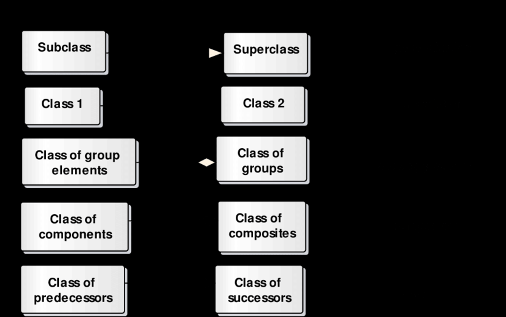

시간이 참 빨리 간다.
어제 밤에 보니까 이 영상에서 사람들이 댓글로 불타고(?) 있던데..
https://www.youtube.com/watch?v=0t8RovnvRsI
미디어 특성상 조회수 유발을 위해, 그리고 작성이 쉬운 방향으로 컨텐츠가 만들어지다보니까 자극적인 것이 나온다.

https://www.itworld.co.kr/mainnews/324967
https://www.infoworld.com/article/3709230/what-ai-wont-replace-in-your-programming.html
https://www.infoworld.com/article/3712001/getting-through-the-awkward-toddler-phase-of-generative-ai.html

아이러니한 것
옛날에는 신기술에 적응하지 못한 사람들이 도태되었는데
이제는 구 기술에 통달하지 못한 사람들이 도태된다는 것

온라인 컨텐츠보다 깊게 전달할 수 없으면 오프라인 컨텐츠는 (강사는) 살아남을 수 없음
이전에는 신기술을 얇게라도 알고 있는 사람들이 살아남았다면
이젠 깊게 알고 있는 사람들이 살아남고, 얄팍하게 알고 있는 사람들을 AI로 대체할 것
개발자로 일하는 사람들의 평균 연령대는 높아질 것인가..? 꼭 그럴 것 같진 않다.
큰 흐름은 굳이 개발자가 아닌 다른 직업들도 유사한 흐름을 타고 갈 것 같다.

# Review
* DB 커넥션 공유의 문제?
  * 트랜잭션 구현 불가
* ThreadLocal 클래스?
  * 클래스는 스태틱 변수를 가질 수 있다.
  * 인스턴스는 인스턴스 변수를 가질 수 있다.
  * 스레드: 나는?
    * 너를 위해서 스레드 변수 (ThreadLocal)을 준비했어.
* DB 커넥션 공유를 해소하는 방법은?
  * 어디서 해소하나?
    * Business Logic을 담당하는 객체에서 트랜잭션을 처리한다.
    * 업무 시작 / 끝(트랜잭션을 구현하기 위한 커밋/롤백)을 정의하려면 Business Logic이 필요하기 때문에
  * 어떻게 효율화하나?
    * Pooling 기법을 적용한다.
      * 커넥션은 만드는데 많은 비용이 든다.
        * 스레드는 운영체제가 만들어주므로 시간이 오래 걸린다. (VT 는 다르지만)
      * 자원의 수가 한정되어 있는 경우에도 적합하다.
      * Thread, DB Connection이 대표적인 예시다.
      * 또한 사용할 수 있는 자원이 한정되어 있다.
    * Stateless 방식과 마찬가지로, 실제로 그것을 사용하는 시간은 얼마 되지 않는다.
      * 그래서 쓰고 다쓰면 바로 보관한다.

# TIL
## 프록시패턴 적용

Proxy 만든 이유: 기존 객체를 변경하지 않고 close() 기능을 변경하려고.
왜 변경하나? 풀에 반납하는 코드를 여기서 해결해서 코드 중복을 방지하려고
```java

    @Override
  public void close() throws SQLException {
    if (origianl.getAutoCommit()) {
      // return this connection to DB Connection Pool  (DBCP)
      connectionPool.returnConnection(this); //프록시를 보낸다.
    }

    origianl.close();
  }
```
이렇게 함으로서 프록시를 써서, 커넥션 close()를 풀에 적합한 행동을 하도록 변경

**이것이 실무에서 Pooling 기법을 이용하면서도 반환하는 메서드를 보지 못하는 이유.**
프록시 객체로 close()를 오버라이딩하여 그 부분에 풀에 반환하는 것을 구현함.
좋은 점? 풀링 기법을 구현하기 위해 커넥션을 사용하는 모든 소스코드에 풀 반환 코드를 중복하여 구현하지 않아도 된다.

풀에 반환하는 코드가 중복되는 경우
---
```java
package bitcamp.myapp.handler.board;

import bitcamp.menu.AbstractMenuHandler;
import bitcamp.myapp.dao.BoardDao;
import bitcamp.myapp.vo.Board;
import bitcamp.util.DBConnectionPool;
import bitcamp.util.Prompt;
import java.sql.Connection;

public class BoardViewHandler extends AbstractMenuHandler {

  private BoardDao boardDao;
  private DBConnectionPool connectionPool;

  public BoardViewHandler(DBConnectionPool connectionPool, BoardDao boardDao) {
    this.connectionPool = connectionPool;
    this.boardDao = boardDao;
  }

  @Override
  protected void action(Prompt prompt) {
    Connection con = null;
    try {
      con = connectionPool.getConnection();

      int no = prompt.inputInt("번호? ");

      Board board = boardDao.findBy(no);
      if (board == null) {
        prompt.println("게시글 번호가 유효하지 않습니다.");
        return;
      }

      prompt.printf("번호: %d\n", board.getNo());
      prompt.printf("제목: %s\n", board.getTitle());
      prompt.printf("내용: %s\n", board.getContent());
      prompt.printf("작성자: %s\n", board.getWriter());
      prompt.printf("작성일: %1$tY-%1$tm-%1$td %1$tH:%1$tM:%1$tS\n", board.getCreatedDate());

    } catch (Exception e) {
      prompt.println("조회 오류!");

    } finally {
      connectionPool.returnConnection(con);
    }
  }
}

```
중복 구현을 해소한 경우
---
```java
package bitcamp.myapp.handler.board;

import bitcamp.menu.AbstractMenuHandler;
import bitcamp.myapp.dao.BoardDao;
import bitcamp.myapp.vo.Board;
import bitcamp.util.Prompt;
import java.sql.Connection;

public class BoardViewHandler extends AbstractMenuHandler {

  private BoardDao boardDao;

  public BoardViewHandler(BoardDao boardDao) {
    this.boardDao = boardDao;
  }

  @Override
  protected void action(Prompt prompt) {
    Connection con = null;
    try {

      int no = prompt.inputInt("번호? ");

      Board board = boardDao.findBy(no);
      if (board == null) {
        prompt.println("게시글 번호가 유효하지 않습니다.");
        return;
      }

      prompt.printf("번호: %d\n", board.getNo());
      prompt.printf("제목: %s\n", board.getTitle());
      prompt.printf("내용: %s\n", board.getContent());
      prompt.printf("작성자: %s\n", board.getWriter());
      prompt.printf("작성일: %1$tY-%1$tm-%1$td %1$tH:%1$tM:%1$tS\n", board.getCreatedDate());

    } catch (Exception e) {
      prompt.println("조회 오류!");

    }
  }
}

```

## 트랜잭션 제어 기능을 분리하기
트랜잭션 제어를 캡슐화해보자.
보통 트랜잭션은 TX로 줄여 말한다.
이런 트랜잭션을 제어하는 코드들은, 유사한 코드가 계속해서 반복된다.
`setAutoCommit(false) -> con.commit() 혹은 con.rollback() -> con.close() (프록시에서 풀에 반환)`

그래서 중복 코드를 줄이면서, 가독성을 향상하기 위해 TransactionManager라는 객체를 만들어서 사용한다.
변수명은 보통 txManager로 줄여서 짓는다.

참고로 DBConnectionPool은 나중에 스프링프레임워크에서 DataSource 라는 이름으로 바뀐다. 

```java
package bitcamp.util;

import java.sql.Connection;

public class TransactionManager {

  ConnectionPool connectionPool;

  public TransactionManager(ConnectionPool connectionPool) {
    this.connectionPool = connectionPool;
  }

  public void startTransaction() throws Exception {
    connectionPool.getConnection().setAutoCommit(false);
    System.out.printf("[%s] 트랜잭션 시작\n", Thread.currentThread().getName());
  }

  public void commit() throws Exception {
    connectionPool.getConnection().commit();
    complete();
  }

  public void rollback() throws Exception {
    connectionPool.getConnection().rollback();
    complete();
  }

  private void complete() throws Exception {
    Connection con = connectionPool.getConnection(); // 이게 맞나?... 두번 꺼내는 거 아니야?
    con.setAutoCommit(true);
    con.close();
    System.out.printf("[%s] 트랜잭션 종료\n", Thread.currentThread().getName());
  }
}

```

## Class Relationship, Entity Relationship 
* relationship between table보다 Entity Relationship이 맞다.
클래스간의 관계와 엔티티간의 관계는 일치하지 않는다.
DB는 DB대로, 클래스는 클래스대로 맞춰서 작성해야 한다.


객체간의 관계는?
사용, 포함, 컴포지션(복합) 으로 나눈다고하면,
* 사람 - 심장은 복합이다. 
사람이 죽으면 심장도 죽고 심장이 죽으면 사람도 죽는다. 강하게 결합되어 있다. 한 객체가 다른 객체에 포함되지만 두 객체의 라이프사이클이 같다.
* 사람 - 안경은 어떠할까? 
안경은 시력을 올려주는 중요한 물건이다. (저교정 쓰고 아이들은 햇빛 많이 받게 해라!) 그러나 사람과 안경은 라이프사이클이 같지 않다.
* 사람 - 칫솔은? 
심장이나 안경보다 훨씬 덜 중요하다. (참고로 나는 이빨을 잘 닦는다)  주가 되는 객체의 라이프사이클과 칫솔의 라이프사이클은 관계가 없다. 필요할 때 사용할 뿐.

이런 관계는 두 객체의 관계가 어떤 의도로 만든 관계인지를 표현하기 위한 것이다.
그러니까 정답이 없다. 작성자가 보는 사람들에게 알려주고 싶은 것을 적는 것이다. 그리고 알려주고 싶은 것의 기준은 라이프사이클이 좋은 기준이다.
이거갖고 싸우면 그냥 다 연관으로 그려버림... 싸우라고 만든 것 아닌데~ 의사소통하라고 만든건데~

게시글/첨부파일은 복합은 아님. 게시글 지우면서 첨부파일을 남길 일은 없지만, 첨부파일 지운다고 게시글이 없어지면 안됨.

### 개발시의 역할극이 중요한 이유
DBA, FE, BE 를 최대한 분리해야 한다. 그래야 유지보수가 쉬워진다. 
DB, FE, BE 코드를 섞으면 나중에 변경 생길 때 갈아엎어야 한다.

## Table---DAO---Handler
핸들러가 DAO를 통해서 DB의 테이블을 관리할 것이다.
하나의 핸들러는 하나 혹은 여러개의 DAO를 사용할 수 있다.

**DAO는 하나 혹은 여러 개의 테이블을 관리할 수 있는데, 하나의 DAO가 하나의 Table을 Own하도록 한다.**
왜냐면 어떤 핸들러가 어떤 테이블에 대한 책임이 있는지를 구분하는 것이 디버깅 등 관리에 유리하기 때문이다.
* 그래서 한 테이블은 하나의 DAO에게만 소유되도록 설계한다.
* DAO는 자신이 소유하지 않는 테이블에 대해서는 VIEW 만 하도록 한다.

DAO간의 관계를 맺는 것도 금지된다. DAO의 독립성이 유지되어야 한다. 그래야 유지보수가 현실화되기 때문이다.
같은 이유로 핸들러간의 의존 관계 또한 금지된다.

## Domain Class & Table
java로 작성한 클래스와 mysql로 작성한 테이블을 생각해보자.
이들은 많은 차이를 가지고 있다.

1. 변수명을 만드는 규칙도 다르고 (Camel/Snake Naming Convention)
2. 한쪽에는 있지만 다른 쪽에는 없는 Variable/Column이 있을 수 있다

**이렇게 차이가 나는 것은 자연스러운 것이다.**
테이블을 다룰 때는 DBA의 관점으로, DB에 집중해서 설계하면 된다.
클래스를 다룰 때는 Developer의 관점으로, Class에 집중해서 설계하면 된다.

## Dev Ops
서비스 회사들은, 백엔드팀 프론트엔드팀 DB팀 배포팀 기획팀 분석팀 설계팀 뭐 이런식으로 팀을 나눠놓지 않는다.
회사는 그런식으로 살아남기 힘들다. 한 개인에게 개발과 배포는 기본이고, 기획/분석/설계를 하나 같이 하는 식이다.
그리고 조직을 거대하게 두지 않는다. 마치 회사 안에 스타트업이 있는 것처럼, 3~6명 정도의 작은 팀으로 쪼개둔다.
그 팀들이 작은 서비스들을 기획/분석/설계/개발/배포를 다 하는 것이다. 주어진 요구사항대로만 개발하여 구현만 한다? 이런 일은 요새 없다.
그 팀이 개발한 서비스에 대한 고객의 반응이 좋으면 팀이 커지거나, 인센티브를 받는다. 고객의 반응이 좋지 않으면 인원이 줄거나 팀이 해체된다.
### 평가와 배치
직책자들은 신입들을 계속해서 평가할 것이다. 구현은 잘하는데 기획은 못한다면, 구현 비중이 높은 부서로 배치할 것이다. 구현도 잘하고 기획도 잘한다면? 신규 서비스를 개발하는 곳으로 배치할 것이다. 정이 없는(?) 점은 초반에 생긴 인상은 오래 갈 것이라는 것이다. 창의성, 적극성이 뛰어나다는 인상을 주면 그것이 오래 갈 것이다. 반대의 인상을 주었다면 그 또한 오래 갈 것이다.

## 변경
게시글 변경시 첨부파일을 추가하거나 삭제하는 기능을 추가해보자.
어떻게 구현해야할지 고민해보자.
```
[변경]
번호? 9
제목(0)? <사용자입력>
내용(0)? <사용자입력>
작성자(tester)? <사용자입력>
-------------------------------
 첨부파일 번호 | 첨부파일 이름
-------------------------------
        1      |    a1.gif
        2      |    a2.gif  
-------------------------------
[선택사항] 첨부파일 삭제(번호입력):  <사용자입력>

<사용자가 유효하지 않은 번호를 입력한 경우 넘어감>

[선택사항] 첨부파일 추가(파일경로입력):  <사용자입력>

<사용자가 유효하지 않은 번호를 입력한 경우 넘어감>


게시글을 변경했습니다.
```