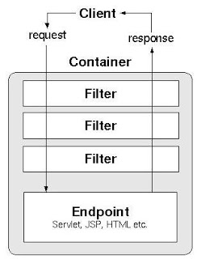

# Review
* CGI란?: Common Gateway Interface로 웹 서버가 실행하는 앱과 웹서버가 통신하는 인터페이스
* 스크립트 언어가 많이 쓰이는 이유?: CGI(Common Gateway Interface)에 스크립트 언어가 적합함
* AS Architecture (Application Server): 서버에서 응용프로그램이 돌아가고, 클라이언트는 웹 브라우저를 클라이언트 애플리케이션으로 이용함.
* 참고로 이 시기(AC 1995-2000 정도)에 LAMP 스택이 대세가 되었고, 델파이/비주얼 베이직 기술들이 웹 개발 주류에서 밀려났음
  * 93년 C -> C++, 델파이 주류
  * 93년 모질라 전신인 mosaic browser 등장
  * 95년 Visual Basic 히트
  * 블리자드 워크래프트도 이 쯤에 나왔다고 한다. IPX/SPX 프로토콜 이용해 네트워크 멀티플레이어 게임을 했다고 하네. 
  * 98년도쯤 1Mbps 속도의 네트워크 보급
* IIS + VBScript -> 윈도우 종속
* PHP, Perl은 소스코드가 노출됨. java는 바이트코드만 필요하므로 소스코드 노출되지 않음. 그래서 개발사가 좋아함 ㅋㅋ
  * 프로덕트 구매한 클라이언트의 관계자들이 스크립트들을 주변에 공유하거나 본인이 가져가서 창업을 해버리는 경우가 상당히 많았다고 함.
  * 스크립트 언어에 대한 거부감이 있던 기존 C++ 진영에서도 java OOP를 보고 넘어가는 경우도 있었다고 함. PHP에는 안넘어갔으나 java에는 넘어감.
  * OOP는 소스코드 규모가 커지면서 유지가 어려워지는 문제를 해결하기 위한 분할정복기법이다. 그때는 스크립트 언어는 규모가 큰 코드를 관리하기 굉장히 어려웠다. 그것도 java로 넘어가는 하나의 원인이 되었다.
  * 단순 게시판 형태에서 인사관리/물류관리 등 더 복잡한 웹 애플리케이션에 대한 수요가 증가하면서 java로 전환은 더욱 가속되었다.
* Monolithic VS MSA?
  * 모놀리식과 마이크로서비스 아키텍처
  * 한 앱에서 기능 전체 처리
  * 기능을 서버/DBMS 분리하여 마이크로서비스로 변경
  * 오버해드 발생. 네트워크 통해 기능간 통신하며 연동해야
* 기업용 프로그램은 뭐가 다른가?
  * 동시접속이 가장 큰 차이
    * 통신, 분산컴퓨팅, 보안, 권한
* 서블릿과 EJB?
  * 서블릿은 작은 기능이다. 
  * Java EE 서버가 서블릿을 호출해야 하는데
    * 서블릿은 로컬에 있다.
    * EJB는 프록시 패턴이 적용되어 skeleton에 의해 실행된다.
    * EJB는 현재는 잘 사용되지 않는다. RESTful API에 잠식되었다.
  * **서블릿은 웹 컴포넌트를 만드는 기술이고, EJB는 분산 컴포넌트를 만드는 기술이다.**
    * Remote Object
  * 은행에서 분산시스템 만들 때 EJB를 굉장히 많이 썼다.
* 분산컴퓨팅
  * myapp version 40 에서 boardDaoImpl 클래스에서 json 기반으로 클라이언트가 서버에 요청/ 서버가 json으로 응답하는 걸 만들었다. 이걸 리플렉션도 도입하고 더 전문적으로 만들면 EJB 기술.
    * stub은 RMI-IIOP 통해 메서드 호출을 요청한다.
    * java EE 서버가 원격객체인 EJB를 호출

`BoardListHandler ---findAll()---> BoardDaoImpl[stub] ---request---> Server[skeleton] ---BoardDaoImpl[remote object]---> json` 
stub과 skeleton을 묶어서 ORB(Object Request Broker) 라고 부른다.

# 원격 객체와 RESTful
웹 컴포넌트를 원격 객체로 만드는 기술이 RESTful 이다. (이것이 정의는 아님)
웹 컴포넌트를 URL로 표현해서 HTTP 요청을 통해 java EE 서버가 서블릿을 실행하도록 만든다.

기존의 웹 기술을 가지고 서블릿같은 웹 컴포넌트를 원격 객체로 서비스하는 기술
이전에는 RMI나 EJB가 사용되었는데 RMI, EJB 명세에 따라 별도 프로그램을 만들어야 했다.
RESTful은 원격 객체를 서비스하기 위해 다른 별도 프로그램을 작성하지 않아도 된다.

### 원격 객체
원격 객체는 리모트(다른 컴퓨터) 에 존재하는 객체를 말한다.
분산 컴포넌트는 원격 객체다.
 

웹 컴포넌트
HTML 이미지 등을 서비스함 (웹서버)

분산 컴포넌트
앱에게 호출을 받고 값을 리턴해줌 (웹애플리케이션)

## RMI 에 대한 이해 (원격 메서드 호출)
PDF 참조
## Java EE 구현 서버 / 서블릿 컨테이너
Java EE 구현 서버에서 웹 관련 기술만 서비스하는 서버를 서블릿 컨테이너라고 함

### Java EE 기술들 버전과 구현 서버의 버전 관계
구현 서버가 지원하는 Java EE 기술들이 다름. 문서를 보고 기술버전을 파악해야 함.
하위호환은 해도 상위호환은 되지 않으므로..

### Java EE VS Jakarta EE
오라클에서 이클립스로 넘어가면서 라이센스 분쟁 피하기 위해 패키지명이 변경됨 javax. -> Jakarta.
서블릿 컨테이너 버전에 따라 import 를 전부 변경해줘야 할 수 있으므로 주의

### 자바 웹 프로젝트를 생성하고 톰캣 서버를 임베딩하여 실행할 수 있니?
gradle init하고, build.gradle에서 톰캣 implement 해주고, main에서 톰캣 코드 작성

# SSR
Server-side rendering을 구분하는 기준은?
HTML을 생성하는 역할을 서블릿등을 통해 서버해서 한다면 서버사이드 렌더링.
(당연히 물론 받은 문서를 디스플레이하기 위한 렌더링을 클라이언트측 브라우저에서 하기는 함)

그런데 서블릿에서는 JSON,XMl 포맷데이터만 주고, 이것을 클라이언트사이드에 있는 js 객체가 받아서 HTML 문서를 만든다면? 클라이언트 사이드 렌더링 (CSR) 이다.
여기서 js객체가 생성하는 때 DOM API 라는 용어가 나오고, AJAX라는 용어가 나온다. 이건 나중에 배운다!!! 궁금하다!!!

# 최종 팀 프로젝트를 위한 팀이 결성됐다.
같이 점심도 먹고 성실하게 공부하시던 분들하고 팀이 되어 좋다.

# 서블릿 학습
서블릿 클래스를 만든 후, 서블릿 컨테이너에 등록해야만 사용할 수 있다.
등록 방법 1)
  웹 애플리케이션 배치 파일(web.xml; DD(Deploy Description) 파일)에 서블릿 정보를 등록한다.
  => WEB-INF/web.xml
  => DD File: Deployment Descriptor File
  => 배치 예:
     <servlet>
         <servlet-name>서블릿별명</servlet-name>
         <servlet-class>서블릿 클래스의 전체이름(패키지명 포함)</servlet-class>
     </servlet>

     <servlet-mapping>
         <servlet-name>서블릿별명</servlet-name>
         <url-pattern>클라이언트에서 요청할 때 사용할 URL(/로 시작해야 한다.)</url-pattern>
     </servlet-mapping>
등록 방법 2)
  서블릿 클래스 선언부에 @WebServlet 애노테이션을 붙인다.
  => @WebServlet
     @WebServlet(URL)
     @WebServlet(value=URL)
     @WebServlet(urlPatterns={"URL1", "URL2", ...})

서블릿 실행 방법
=> http://서버주소:포트번호/웹애플리케이션이름/서블릿URL
예) http://localhost:8080/eomcs-java-web/ex01/s01

서블릿 구동 과정
1) 웹 브라우저가 서블릿 실행을 요청한다.
2) 서블릿 컨테이너는 해당 URL의 서블릿 객체를 찾는다.
3.1) 서블릿 객체를 아직 만들지 않았다면,
=> 서블릿 클래스에 대해 인스턴스를 생성한다.
=> 생성자를 호출한다.
=> init()를 호출한다.
=> service()를 호출한다.
3.2) 서블릿 객체가 생성되어 있다면,
=> service()를 호출한다.

만약 웹 애플리케이션이 종료된다면
=> 생성된 모든 서블릿들의 destroy() 메서드를 호출한다.

결론!
=> 특별한 옵션을 주지 않으면 클라이언트가 최초로 요청했을 때 서블릿 인스턴스를 생성한다.
=> 그리고 그 서블릿 인스턴스는 클래스 마다 오직 한 개만 생성된다.
=> init(), destroy()은 오직 한 번만 호출된다.
=> service()는 클라이언트가 요청할 때 마다 호출된다.

## 서블릿은 한개만 생성된다.
주의!
=> 서블릿 인스턴스는 오직 클래스 마다 한 개만 생성된다.
   그래서 모든 클라이언트가 같은 서블릿 인스턴스를 사용한다.
=> 클라이언트마다 구분되어야 할 데이터는
   서블릿 인스턴스 변수에 보관해서는 안된다.
=> 왜?
   인스턴스는 모든 클라이언트가 공유하기 때문이다.

# 서블릿의 배치
```java
//이렇게 한개의 경로에만 배치할 수도 있고
@WebServlet("/ex01/first")

//하나의 서블릿을 여러 경로에 배치할 수도 있다.
@WebServlet(value={"/ex01/first","/ex/first","/first"})
```
파라미터에 대해 이해가 안되면 애노테이션 문법 복습.
1. 변수가 value인 경ㅓ우 키를 생략 가능
2. 값이 하나인 경우에 중괄호 생략 가능

## XML 
서블릿 컨테이너는 `/WEB-INF/web.xml` 파일을 읽어와서 서블릿의 별명을 설정할 수 있다.
<servlet>
  <servlet-name> 서블릿 별명 </servlet-name>
  <servlet-class>  서블릿 클래스의 FQName </servlet-class>
  ...
</servlet>
<servlet-mapping>
  <servlet-name> 설정한 서블릿 별명 </servlet-name>
  <url-pattern> /hello 등 URL </url-pattern>
<servlet-mapping>

## web.xml

```xml
<!DOCTYPE web-app
    PUBLIC "-//Sun Microsystems, Inc.//DTD Web Application 2.3//EN"
    "http://java.sun.com/dtd/web-app_2_3.dtd">

<!--
위에서 -로 시작하면 사적인 규칙이고 + 면 공적 규칙이라는 뜻 (사조직/공조직의 의미임)
WWW도 사조직임.
-//작성조직//무엇인지//언어는뭔지
-웹주소
-->


<web-app>
```

### 애노테이션 무시?
```xml
<web-app xmlns="http://xmlns.jcp.org/xml/ns/javaee"
  xmlns:xsi="http://www.w3.org/2001/XMLSchema-instance"
  xsi:schemaLocation="http://xmlns.jcp.org/xml/ns/javaee
                      http://xmlns.jcp.org/xml/ns/javaee/web-app_4_0.xsd"
  version="4.0"
  metadata-complete="false">

<!--  metadata으로 완성된다. Annotation은 무시한다.-->
```

# Generic Servlet
제네릭 서블릿은 서블릿과, 서블릿컨픽, 시리얼라이저블 인터페이스들을 구현했다.
```java
public abstract class GenericServlet implements Servlet, ServletConfig, java.io.Serializable {

    private static final long serialVersionUID = 1L;

    private transient ServletConfig config;
```

## 왜 Serializable 해야 하는가?
첫번쨰 궁금증. 왜 Serializable 인터페이스를 구현했을까?
백업을 위한 것. 이는 가용성을 위해서다. 애플리케이션이 실행되다가 문제가 발생했을 때, 서블릿 객체를 직렬화하여 다른 서버에 전달한다. 받은 직렬화된 데이터를 역직렬화해서 실행하는 방식으로 가용성을 높일 수 있다.
다만.. 많은 경우는 이를 이용하지 않고 웹 서버를 재시작 시키는 방식으로 사용한다. 서버들을 클러스터로 묶어두고 사용하는 경우가 아니라면..

# 주요 웹 컴포넌트
주요 웹 컴포넌트는 **필터, 서블릿, 리스너** 이다.

이 셋들은 서로 어떤 관계가 있을까? 일단 각각이 무엇인지 알아보자
참고로 여기서 필터나 리스너 개념은 다른 언어에서도 거의 유사하게 쓰인다.
필터나 리스너 뿐 아니라 다른 주제도 언어마다 일부 차이는 있어도 큰 개념들은 거의 다 동일하다.

## 필터 Filter
필터 인터페이스를 구현해서 만들어야 한다.
필터 인터페이스를 확인해보면...
```java
  default void init(FilterConfig filterConfig) throws ServletException {
    }
  //필터 객체가 생성될 때 호출됨.
  //필터 객체는 웹앱이 실행되면 바로 인스턴스 생성됨.

  void doFilter(ServletRequest request, ServletResponse response, FilterChain chain)
            throws IOException, ServletException;
  //서블릿 요청에 필터가 적용될 때 호출됨
  //다음 필터를 호출하고, 없으면 서블릿(최종목적지)를 호출함.
            
  default void destroy() {
    }
  //웹 애플리케이션 종료시 호출됨
```



필터는 web.xml 혹은 애노테이션에서 WebFilter를 정의해두면, 해당 식을 평가하여 해당하는 주소로 들어오는 HTTP 요청을 먼저 처리한다. 서블릿을 실행하기 전/후에 항상 해야 할 작업이 있다면 필터를 통해 처리할 수 있다.

### 필터의 사용 예시
대표적으로 암호 해제, 암호화가 있다.
압축 해제 및 압축 또한 예시이다.
디코딩, 인코딩도 또한 예시이다.
로그 남기기(로깅) 또한 예시이다.

특정 URL에 대해 서블릿의 서비스 실행 전후에 실행되는 기능을 만들 수 있다.


### 필터에 적용된 디자인패턴
필터는 서블릿 실행 전 후에 기능을 추가할 때 사용된다.
SOLID: Open Closed Principle. 기존 코드를 변경하지 않고 기능을 추가하거나 변경하는, 객체지향프로그래밍의 좋은 예시이다.

Chain of Responsibility (GoF)
---
java EE 웹 컴포넌트인 필터는 `Chain of responsibility` 라는 GoF 패턴을 따른 것이다. `FilterChain`이라는 클래스가 이 Chain of Responsibility 패턴을 구현한다. 필터 체인 클래스는 체인을 관리하는 매니저라고 보면 된다.


데코레이터도 이렇게 OCP를 구현한 패턴이다. 다만 필터가 데코레이터패턴과 다른 점 중 하나는 동일한 인터페이스를 구현하는 것이 아니라는 것이다. 

### 디자인 패턴의 위력
Chain Of Responsibility 패턴이 적용된 것이 아니었다면?
필터 역할을 하는 코드, 혹은 필요한 메서드를 호출하는 코드가 서블릿마다 배치가 되어야 할 것이다...

## 리스너 Listener
스포일러: 리스너는 GoF의 Observer Pattern이 구현되었다.  리스너라는 단어도 옵저버랑 의미가 비슷하다 ㅎㅎㅎ...

리스너는 수동적인 느낌이 있고, 옵저버는 적극적인 느낌이 있는 단어긴 하다.

물론 실제로는 알려주는 측이 적극적(?) 인 것이지, 옵저버(리스너)가 적극적인 것은 아니다. 

### 리스너는...
리스너는 필터랑은 조금 다르다.
리스너는 HTTP 요청이 들어오면 requestInitialized가 호출되고 바로 리턴된다. 그리고 필터를 거쳐 서블릿의 service()가 호출되고, 다시 필터의 리턴 리턴 리턴... 다 거치면 서블릿 컨테이너가 리스너를 불러준다(requestDestroyed()를 호출해준다.)


Source: Oracle

### 리스너를 특정 URL에?
일단 어노테이션`@WebListener` @에서 어떤 특정 URL에 바인딩하는 것은 지원되지 않는다. 

XxxListner 형태로 다양한 클래스가 있다.
이전에 배웠던 ServletContextListner 같은 클래스들이다.
ServletRequestListenr도 등등등... 상황에 맞는 인터페이스를 구현하면 된다.

### 객체의 라이프사이클을 파악하는 것이 중요하다
리스너와 필터와 서블릿을 다루는 여러 클래스와 인터페이스들을 보다보면, 객체의 라이프사이클을 파악하면서 다루는 것이 중요하다는 것이 느껴진다.


## 서블릿 컨테이너를 보면...
객체지향의 정수가 담겨있음
근데 SI에서 이게 뭔지 모르고 페이지만 힘겹게 만들어나가면.. 뭐가 적용되어있는건지 학습할 틈이 없음.
어느정도 여유가 있으면 세미나등 지식/기술 교류하면서 학습을 잘 함. 세미나든 뭐든 활동의 이름이 중요한 게 아니라 기술과 지식의 교류가 유지되는 것이 아주아주 중요. 이건 어떤 분야건간 동일함.

