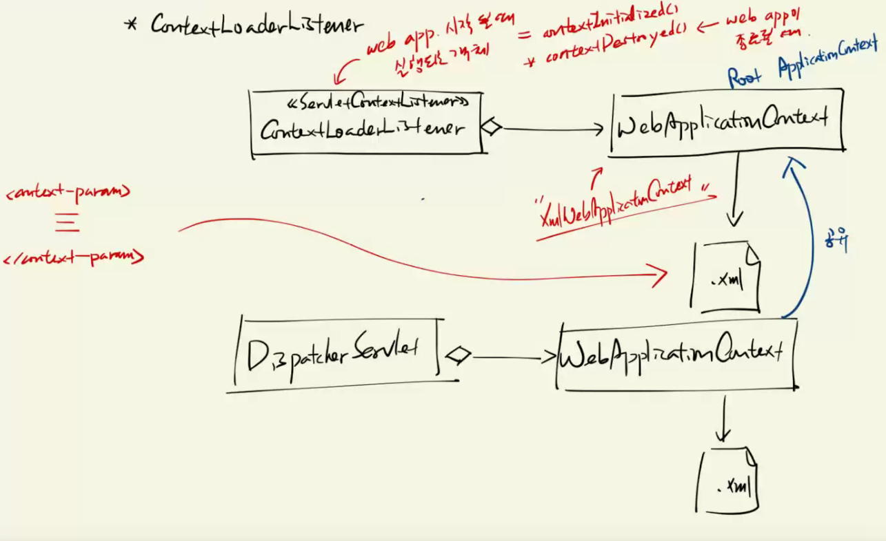

[PDF](https://github.com/eomjinyoung/bitcamp-study/blob/main/docs/%EC%8B%A4%EC%8A%B5%ED%94%84%EB%A1%9C%EC%A0%9D%ED%8A%B88.pdf) 

# Review
어제는 애너테이션을 이용해서 Spring Framework의 IoC 컨테이너가 의존 객체들을 생성하는 방법들을 알아봤다. 주요 포인트는 아래와 같다.

* IoC 컨테이너의 원리는? 컨베이어 벨트와 작업자 객체의 비유
* @Autowired 를 이용하여 의존객체를 주입하는 방법은?
* BeanPostProcessor 동작 원리와 사용법은?
* 생성자를 통해 의존 객체를 주입하는 방법은?
* 의존 객체 주입시 여러 방법이 있는데 (생성자, 세터, 필드) 각각의 장단점은? 어떨 때 써야 하는가?
* @Qualifier, @Resource 가 무엇을 하는것인가?
  * @Resource는 java 확장 lib이며 component + qualifier
* 객체 생성을 자동화할 수 있는가? (@Component)
* @Controller, @Service, @Repository는 각각 어떤 객체에게 붙여주는가? 왜 이런 분류를 해뒀나?
* XML 대신 Java Config를 사용해서 IoC Container 설정하는 방법은?
* @Bean, @Configuration 이 애너테이션들은 무엇인가? 어디에 쓰는가?
* @PropertySource, @Value를 이용하여 `*.properties` 파일의 값을 다룰 수 있는가?
  * 이건 어디에 쓰는가? 하드코딩 방지


# Use-case

## 유즈케이스 식별 가이드라인 2
### CRUD에 해당하는 경우 한 개의 유즈케이스로 합치는 것이 관리하기 편하다.
예를 들면, 학사관리 시스템에서 교육과정에 대해 등록/조회/변경/삭제 기능이 있다면 `과정관리` 같은 하나의 유즈케이스로 합친다는 것이다. 다만, 합쳐서 2-4주 내에 개발이 가능한 경우만 CRUD를 합쳐서 하나의 유즈케이스로 작성하는 것이 좋다. 합쳤을 때 해당 유즈케이스에 대한 개발 분량이 4주를 초과하는 경우는 분리하여 각각의 유즈케이스를 작성하는 것이 맞을 것이다. (물론 이야기한 4주라는 기준은 예시이다.)


### 서로 관련된 유즈케이스는 하나의 유즈케이스로 합친다.
로그인, 로그아웃 같은 관련된 작은 유즈케이스들은 `사용자 인증`같은 하나의 유즈케이스로 합쳐서 작성한다. 이러한 가이드라인은 **반드시 이렇게 해야 한다** 같은 원칙이라기보단, 변수의 네이밍과 같이 편의를 위한 것이다.

### 여러 유즈케이스에 중복되는 시나리오가 있다면 별도의 유즈케이스로 분리한다.
게시글의 [등록, 변경, 삭제]를 각각의 유즈케이스로 작성할 때를 가정해보자. 각각의 유즈케이스는 모두 앞단에 중복되는 시나리오가 있다. 그것은 `사용자 인증`이다.

`사용자 인증`은 첫번째 가이드라인상 업무가 아니기 때문에 유즈케이스가 될 수 없지만, 다른 업무들을 실행하기 위한 `공통된 시나리오`에 해당하기 때문에 별도의 유즈케이스로 분리한다.

> 시나리오는 사용자가 시스템에서 행하는 어떠한 작업을 의미하는 용어로 쓰였다.

이런 사용자 인증은 다른 유즈케이스에 `include(포함)`하는 관계로 표현된다.

#### extend - 마찬가지로 업무는 아니지만, 공통된 시나리오라서 별도의 유즈케이스로 분리한 경우
사용자 인증은 공통된 시나리오라 별도의 유즈케이스로 분리하고 include로 표현했는데, 비슷한 이유로 분리하고 `extend(확장)`로 표현해야 하는 경우가 있다.

먼저 그 차이부터 적으면, include는 `필수인 경우`이고, extend는 `필수가 아닌 경우`이다. 

내 생각에 가장 직관적인 예시는 이것이다. 

---
게시판에서 글을 올릴 때,
* 사용자 인증은 **필수**이다. (include 포함)
* 파일 첨부는 **선택**이다. (extend 확장)
  * 다만, 파일 첨부를 게시글 등록에 필수적으로 만들 것이면 include로 표현하는 게 맞다.

include, extend는 관계를 의미하므로, 주어와 목적어가 있다. 여기선 게시글 등록이 주어가 되고, 사용자 인증 및 파일 첨부가 목적어가 된다. 화살표의 뾰족한 머리가 목적어를 향하게 표현한다.

서술하면, 
게시글 등록은 사용자 인증을 포함한다.
게시글 등록은 파일첨부를 확장한다.

---

# 유즈케이스 목록 예시
예시 작성해보고 팀프로젝트 `모두의 스터디`를 위한 유즈케이스를 작성해보자
## 액터
- 사용자
  - 로그인하지 않은 사용자
- 회원
  - 회원 가입한 사용자
    - 학생: 개인출석 및 과제를 관리하는 회원
    - 매니저: 과정을 관리하는 회원
    - 강사: 강의를 관리하는 회원
    - 관리자: 전체 시스템을 관리하는 회원

## 유즈케이스
- 사용자 (로그인하지 않은 상태)
  - 과정조회
  - 회원가입(학생, 강사, 매니저)
  - 회원탈퇴(학생, 강사, 매니저)
  - 로그인
- 회원
  - 로그인  
  - 로그아웃
  - 과정조회
  - 게시글관리(전체게시글조회, 개인게시글관리)
- 매니저
  - 과정관리
  - 출석관리
  - 게시글관리(전체 게시글)
- 강사
  - 과정조회
  - 과제관리(전체 학생에 대하여)
  - 출석조회
- 학생
  - 과정조회
  - 과정신청
  - 과정신청취소
  - 과정신청조회
  - 출석조회
  - 과제관리(본인의 과제에 대하여)
- 관리자
  - 회원관리(전체회원)


# mvc-app 만들기
## gradle init
### 그레이들 설정
```groovy
/*
 * This file was generated by the Gradle 'init' task.
 *
 * This generated file contains a sample Java application project to get you started.
 * For more details on building Java & JVM projects, please refer to https://docs.gradle.org/8.6/userguide/building_java_projects.html in the Gradle documentation.
 */

plugins {
    // Apply the application plugin to add support for building a CLI application in Java.
    id 'application'
}

repositories {
    // Use Maven Central for resolving dependencies.
    mavenCentral()
}

dependencies {

    // Spring WebMVC 프레임워크 라이브러리
    implementation 'org.springframework:spring-webmvc:5.3.32'

    // log4j 2.x 라이브러리
    implementation 'org.apache.logging.log4j:log4j-core:2.23.1'

    implementation 'org.apache.tomcat.embed:tomcat-embed-jasper:9.0.85'
    implementation 'javax.servlet:jstl:1.2'

    // Use JUnit Jupiter for testing.
    testImplementation libs.junit.jupiter

    testRuntimeOnly 'org.junit.platform:junit-platform-launcher'

    // This dependency is used by the application.
    implementation libs.guava
}

// Apply a specific Java toolchain to ease working on different environments.
java {
    toolchain {
        languageVersion = JavaLanguageVersion.of(21)
    }
}

application {
    // Define the main class for the application.
    mainClass = 'bitcamp.App'
}

tasks.named('test') {
    // Use JUnit Platform for unit tests.
    useJUnitPlatform()
}
```
## 웹서버 실행을 위한 코드 작성 (톰캣)
```java
package bitcamp;

import java.io.File;
import org.apache.catalina.WebResourceRoot;
import org.apache.catalina.connector.Connector;
import org.apache.catalina.core.StandardContext;
import org.apache.catalina.startup.Tomcat;
import org.apache.catalina.webresources.DirResourceSet;
import org.apache.catalina.webresources.StandardRoot;

public class App {

    public static void main(String[] args) throws Exception {
        // 톰캣 서버를 구동시키는 객체 준비
        Tomcat tomcat = new Tomcat();

        // 서버의 포트 번호 설정
        tomcat.setPort(8888);

        // 톰캣 서버를 실행하는 동안 사용할 임시 폴더 지정
        tomcat.setBaseDir("./temp");

        // 톰캣 서버의 연결 정보를 설정
        Connector connector = tomcat.getConnector();
        connector.setURIEncoding("UTF-8");

        // 톰캣 서버에 배포할 웹 애플리케이션의 환경 정보 준비
        StandardContext ctx = (StandardContext) tomcat.addWebapp(
            "/", // 컨텍스트 경로(웹 애플리케이션 경로)
            new File("src/main/webapp").getAbsolutePath() // 웹 애플리케이션 파일이 있는 실제 경로
        );
        ctx.setReloadable(true);

        // 웹 애플리케이션 기타 정보 설정
        WebResourceRoot resources = new StandardRoot(ctx);

        // 웹 애플리케이션의 서블릿 클래스 등록
        resources.addPreResources(new DirResourceSet(
            resources, // 루트 웹 애플리케이션 정보
            "/WEB-INF/classes", // 서블릿 클래스 파일의 위치 정보
            new File("build/classes/java/main").getAbsolutePath(), // 서블릿 클래스 파일이 있는 실제 경로
            "/" // 웹 애플리케이션 내부 경로
        ));

        // 웹 애플리케이션 설정 정보를 웹 애플리케이션 환경 정보에 등록
        ctx.setResources(resources);

        // 톰캣 서버 구동
        tomcat.start();

        // 톰캣 서버를 구동한 후 종료될 때까지 JVM을 끝내지 말고 기다린다.
        tomcat.getServer().await();

        System.out.println("서버 종료!");
    }
}

```

## webapp 디렉토리 만들어서 준비 (app/src/main/webapp/WEB-INF)
index.html 만들어서 서블릿 컨테이너가 요청에 응답하는지 확인 (아래는 예시)


```html
<!doctype html>
<html lang="en">
<head>
  <meta charset="UTF-8">
  <meta name="viewport"
        content="width=device-width, user-scalable=no, initial-scale=1.0, maximum-scale=1.0, minimum-scale=1.0">
  <meta http-equiv="X-UA-Compatible" content="ie=edge">
  <title>Spring WebMVC 예제</title>
</head>
<body>
<h1>Spring WebMVC 예제</h1>
</body>
</html>
```

App.java에서 설정한 톰캣 포트로 요청 보내보기

index.html이라고 이름짓는 이유는? 요청한 자원이 명시되지 않으면 welcome-file으로 응답함.
```xml
  <welcome-file-list>
    <welcome-file>index.html</welcome-file>
    <welcome-file>index.htm</welcome-file>
    <welcome-file>default.htm</welcome-file>
  </welcome-file-list>
```

### 하위 경로에 WEB-INF 추가하여 서블릿 설정 넣기
1. web.xml
2. app-servlet.xml

```xml
<?xml version="1.0" encoding="UTF-8"?>
<web-app xmlns="http://xmlns.jcp.org/xml/ns/javaee"
  xmlns:xsi="http://www.w3.org/2001/XMLSchema-instance"
  xsi:schemaLocation="http://xmlns.jcp.org/xml/ns/javaee
                      http://xmlns.jcp.org/xml/ns/javaee/web-app_4_0.xsd"

<!--  http와 같은 프로토콜들을 스키마/스킴 이라고 부르기도 한다. 스키마 파일의 위치를 가리키는 형태는, 
schemaLocation = "네임스페이스이름[화이트스페이스]스키마파일URL[화이트스페이스]동일하게 다 할 때까지 반복.." -->

<!--  위와 같은 방식으로 쓴다. 화이트스페이스는 [탭,스페이스,뉴라인]을 모두 포함해서 부르는 말이다.-->

  version="4.0" metadata-complete="false">

  <description>
    스프링 Web MVC 프레임워크 예제 테스트
  </description>

  <display-name>java-spring-webmvc</display-name>

  <!-- Spring Web MVC의 프론트 컨트롤러 역할을 수행할 서블릿을 지정한다. -->

  <!-- DispatcherServlet 배치하기 : 방법1-->

  <!-- => DispatcherServlet은 자체적으로 IoC 컨테이너(기본: XmlWebApplicationContext)를 보유하고 있다.
       => 파라미터를 사용하여 IoC 컨테이너의 설정 파일을 지정해야 한다.
          초기화 파라미터명: contextConfigLocation
          초기화 파라미터값: 예) /WEB-INF/app-servlet.xml
       => 설정하고 싶지 않다면 init-value를 비워둬라.
  -->
  <servlet>
    <servlet-name>app</servlet-name>
    <servlet-class>org.springframework.web.servlet.DispatcherServlet</servlet-class>
    <init-param>
      <param-name>contextConfigLocation</param-name>
      <param-value>/WEB-INF/app-servlet.xml</param-value>
    </init-param>
    <!-- 서블릿을 요청하지 않아도 웹 애플리케이션을 시작시킬 때 자동 생성되어
         IoC 컨테이너를 준비할 수 있도록
         다음 옵션을 붙인다. -->
    <load-on-startup>1</load-on-startup>
  </servlet>
  <servlet-mapping>
    <servlet-name>app</servlet-name>
    <url-pattern>/app/*</url-pattern>
  </servlet-mapping>

  <welcome-file-list>
    <welcome-file>index.html</welcome-file>
    <welcome-file>index.htm</welcome-file>
    <welcome-file>default.htm</welcome-file>
  </welcome-file-list>

</web-app>
```

```xml
<?xml version="1.0" encoding="UTF-8"?>
<beans xmlns="http://www.springframework.org/schema/beans"
  xmlns:context="http://www.springframework.org/schema/context"
  xmlns:xsi="http://www.w3.org/2001/XMLSchema-instance"
  xsi:schemaLocation="http://www.springframework.org/schema/beans
        https://www.springframework.org/schema/beans/spring-beans.xsd
        http://www.springframework.org/schema/context
        https://www.springframework.org/schema/context/spring-context.xsd">

  <context:component-scan base-package="bitcamp"/>

</beans>
```
디스패처 서블릿을 app으로 네이밍하는 것은 예제 코드에서부터 시작되었는데, 컨벤션이 되었다.

web.xml에 작성된 주석들이 중요하다!!

## log4j를 설정파일을 추가한다.
추가할 파일은 `app/src/main/resources/log4j2.xml`이다.

```xml
<?xml version="1.0" encoding="UTF-8"?>
<Configuration>

  <!-- 로그 출력 형태를 정의한다. -->
  <Appenders>

    <!-- 표준 출력 장치인 콘솔로 출력하는 방식을 정의한다. -->
    <Console name="stdout" target="SYSTEM_OUT">
      <PatternLayout pattern="[%-5level] %d{yyyy-MM-dd} [%t] %c{1} - %msg%n" />
    </Console>

    <File name="file" fileName="./logs/file/sample.log" append="false">
      <PatternLayout pattern="[%-5level] %d{yyyy-MM-dd} [%t] %c{1} - %msg%n" />
    </File>
  </Appenders>

  <!-- 로그 출력을 적용할 대상과 로그 출력 레벨을 지정한다. -->
  <Loggers>

    <!-- Root => 모든 대상에 적용할 기본 로그 출력 형식과 레벨 -->
    <Root level="info" additivity="false">
      <AppenderRef ref="stdout" /> <!-- 로그를 출력할 때 사용할 출력 방식 지정 -->
    </Root>
  </Loggers>
</Configuration>
```

이제 System.out.printf("%s",printStr) 같은 방식으로 로그를 수동으로 관리하지 않아도 된다. 개발 완료 이후 디버그용 로그를 제거한다거나 하는 작업도 필요하지 않다. log4j 로 로그 출력 레벨, 로그 출력 대상을 xml 파일 하나에서 간단하게 설정할 수 있다.


단적으로, `<Root level="info" additivity="false">` 에서 info를 debug로 바꾸면, 디버깅을 위한 로그까지 더 자세하게 출력해준다. 개발하는 동안에는 level을 debug로 설정하고 보는 것이 좋다. 그러면 이런 로그들을 볼 수 있다.

```
[INFO ] 2024-03-13 [main] DispatcherServlet - Initializing Servlet 'app'
[DEBUG] 2024-03-13 [main] XmlWebApplicationContext - Refreshing WebApplicationContext for namespace 'app-servlet'
[DEBUG] 2024-03-13 [main] ClassPathBeanDefinitionScanner - Identified candidate component class: file [C:\Users\jh\git\mystudy\mvc-app\app\build\classes\java\main\bitcamp\HelloController.class]
```

이러한 로깅 라이브러리는 개발에 있어서 선택이 아니다. 필수다. 출력 레벨, 출력 대상(클래스 등), 출력 방법(파일/기본 스트림 등..)을 각 클래스마다, 프로젝트마다 개발자가 직접 설정한다고 생각해보자... 끔찍하다.

### log4j의 구현?
그럼 log4j는 어떻게 구현된 것인가? 또 리플렉션으로 메서드나 변수들을 확인해서 처리한 것인가? 사실 그렇진 않다. 로깅을 지원하는 클래스(로깅의 대상이 되는 클래스)들이 어떤 때 어떤 로그를 어떤 조건에 따라서 출력할 것인지 하나하나 코드를 작성해둔 것이다. Spring web-mvc에서는 DispatcherServlet 클래스가 그렇다. 

프론트 컨트롤러 패턴이 적용되었기 때문에 모든 요청을 DispatcherServlet이 받게 되니 자연스럽게 이렇게 된 것이다. DispathcerServlet이 아주 복잡해졌지만, 그것에서만 작성하면 되었기에 아주 편리한 로깅 시스템을 갖게 된 것이다.

코드단을 보면 logging의 원리를 확인해 볼 수 있다. 여기서 하나 더 유추해볼 수 있는 점은, `logger가 꼭 log4j가 아니여도 동일한 인터페이스를 사용한다면 사용이 가능할 것이다.`라는 점이다.

```java
  private void initMultipartResolver(ApplicationContext context) {
    try {
      this.multipartResolver = (MultipartResolver)context.getBean("multipartResolver", MultipartResolver.class);
      if (this.logger.isTraceEnabled()) {
        this.logger.trace("Detected " + this.multipartResolver);
      } else if (this.logger.isDebugEnabled()) {
        this.logger.debug("Detected " + this.multipartResolver.getClass().getSimpleName());
      }
    } catch (NoSuchBeanDefinitionException var3) {
      this.multipartResolver = null;
      if (this.logger.isTraceEnabled()) {
        this.logger.trace("No MultipartResolver 'multipartResolver' declared");
      }
    }

  }
```

```java
protected void render(ModelAndView mv, HttpServletRequest request, HttpServletResponse response) throws Exception {
    Locale locale = this.localeResolver != null ? this.localeResolver.resolveLocale(request) : request.getLocale();
    response.setLocale(locale);
    String viewName = mv.getViewName();
    View view;
    if (viewName != null) {
      view = this.resolveViewName(viewName, mv.getModelInternal(), locale, request);
      if (view == null) {
        throw new ServletException("Could not resolve view with name '" + mv.getViewName() + "' in servlet with name '" + this.getServletName() + "'");
      }
    } else {
      view = mv.getView();
      if (view == null) {
        throw new ServletException("ModelAndView [" + mv + "] neither contains a view name nor a View object in servlet with name '" + this.getServletName() + "'");
      }
    }

    if (this.logger.isTraceEnabled()) {
      this.logger.trace("Rendering view [" + view + "] ");
    }

    try {
      if (mv.getStatus() != null) {
        request.setAttribute(View.RESPONSE_STATUS_ATTRIBUTE, mv.getStatus());
        response.setStatus(mv.getStatus().value());
      }

      view.render(mv.getModelInternal(), request, response);
    } catch (Exception var8) {
      if (this.logger.isDebugEnabled()) {
        this.logger.debug("Error rendering view [" + view + "]", var8);
      }

      throw var8;
    }
  }
```

## app-servlet.xml 파일에 대해서
**WEB-INF 말고 다른 곳에 두지 마라.** 

왜냐하면, WEB-INF가 아니면 클라이언트가 요청해서 받아볼 수 있기 때문이다. JDBC 연결을 위한 정보도 들어갈 수 있는 설정파일이 노출되는 것은 치명적인 결함이다.

클라이언트에게 노출되면 안되는 정보는 WEB-INF 경로 밑에 둬야 한다.

```xml
<?xml version="1.0" encoding="UTF-8"?>
<web-app xmlns="http://xmlns.jcp.org/xml/ns/javaee"
  xmlns:xsi="http://www.w3.org/2001/XMLSchema-instance"
  xsi:schemaLocation="http://xmlns.jcp.org/xml/ns/javaee
                      http://xmlns.jcp.org/xml/ns/javaee/web-app_4_0.xsd"
  version="4.0" metadata-complete="false">

  <description>
    스프링 Web MVC 프레임워크 예제 테스트
  </description>

  <display-name>java-spring-webmvc</display-name>

  <!-- Spring Web MVC의 프론트 컨트롤러 역할을 수행할 서블릿을 지정한다. -->
  
  <!-- DispatcherServlet 배치하기 : 방법2-->
  
  <!-- => Spring IoC 설정 파일을 웹 디렉토리에 두기
       => 주의! 
          일반 웹 디렉토리는 클라이언트에서 접근할 수 있기 때문에 
          설정 정보가 노출될 위험이 있다. 
          절대로 일반 웹 디렉토리에 두지 말라!
  --> 
  <servlet>
    <servlet-name>app</servlet-name>
    <servlet-class>org.springframework.web.servlet.DispatcherServlet</servlet-class>
    <init-param>
      <param-name>contextConfigLocation</param-name>
      <param-value>/config/app-servlet.xml</param-value>
    </init-param>
    <load-on-startup>1</load-on-startup>
  </servlet>
  <servlet-mapping>
    <servlet-name>app</servlet-name>
    <url-pattern>/app/*</url-pattern>
  </servlet-mapping>
  
  <welcome-file-list>
    <welcome-file>index.html</welcome-file>
    <welcome-file>index.htm</welcome-file>
    <welcome-file>default.htm</welcome-file>
  </welcome-file-list>

</web-app>
```
### 의도

IoC 컨테이너를 안쓰겠다면 `<param-value></param-value>`
```xml
    <init-param>
      <param-name>contextConfigLocation</param-name>
<!--      <param-value>/WEB-INF/app-servlet.xml</param-value>-->
      <param-value></param-value>

    </init-param>
```

비워두면 자동으로 찾는다.
```xml
    <init-param>
      <param-name>contextConfigLocation</param-name>
<!-- 비워두면 자동으로 찾는다. -->
    </init-param>
```


아래 코드의 주석들로 정리.
```xml
<?xml version="1.0" encoding="UTF-8"?>
<web-app xmlns="http://xmlns.jcp.org/xml/ns/javaee"
  xmlns:xsi="http://www.w3.org/2001/XMLSchema-instance"
  xsi:schemaLocation="http://xmlns.jcp.org/xml/ns/javaee
                      http://xmlns.jcp.org/xml/ns/javaee/web-app_4_0.xsd"
  version="4.0" metadata-complete="false">

  <description>
    스프링 Web MVC 프레임워크 예제 테스트
  </description>

  <display-name>java-spring-webmvc</display-name>

  <!-- Spring Web MVC의 프론트 컨트롤러 역할을 수행할 서블릿을 지정한다. -->
  
  <!-- DispatcherServlet 배치하기 : 방법3-->
  
  <!-- => contextConfigLocation 초기화 변수가 없으면 
          다음 규칙에 따라 작성된 IoC 설정 파일을 자동으로 찾는다.
          /WEB-INF/서블릿이름-servlet.xml 
          해당 파일을 찾지 못하면 예외가 발생한다.
       => contextConfigLocation 초기화 변수가 있다면,
          - 지정한 설정 파일을 로딩하여 객체를 준비한다.
          - 만약 변수의 값이 비어 있다면, 아무런 객체를 생성하지 않는다.
            변수가 없을 때와 달리 예외가 발생하지 않는다.
       => 즉 contextConfigLocation 변수를 생략하는 것과 
          변수의 값을 비워두는 것은 다르다.
  --> 
  <servlet>
    <servlet-name>app</servlet-name>
    <servlet-class>org.springframework.web.servlet.DispatcherServlet</servlet-class>
    <!--  
    <init-param>
      <param-name>contextConfigLocation</param-name>
      <param-value></param-value>
    </init-param>
    -->
    <load-on-startup>1</load-on-startup>
  </servlet>
  <servlet-mapping>
    <servlet-name>app</servlet-name>
    <url-pattern>/app/*</url-pattern>
  </servlet-mapping>
  
  <welcome-file-list>
    <welcome-file>index.html</welcome-file>
    <welcome-file>index.htm</welcome-file>
    <welcome-file>default.htm</welcome-file>
  </welcome-file-list>

</web-app>
```

## ContextLoaderListener 으로 대체하기



페이지 컨트롤러를 DispatcherServlet에 연결된 IoC 컨테이너에서가 아니라, ContextLoaderListener의 IoC 컨테이너에서 만들기

**아래는 가능은 한데, 사실 아래 예제에서는 굳이 저렇게 할 이유가 없다.** DispatcherServlet이 자기가 가진 IoC 컨테이너 뿐만 아니라 부모 객체의 IoC 컨테이너 안의 객체도 쓸 수 있다는 것을 보이기 위한 예제인 것이다.

**그것을 왜 보였는가?** 컨트롤러 객체들은 디스패처서블릿의 IoC 컨테이너에서 관리하는데, **컨트롤러 객체들**이 **공통적으로 사용하는 객체들**(DAO, TxManager 등)은 ContextLoaderListener의 IoC 컨트롤러에서, 다시 말해 부모 객체의 IoC 컨테이너에서 공통된 의존 객체들을 꺼내 쓰는 일이 있기 때문이다.

```xml
<?xml version="1.0" encoding="UTF-8"?>
<web-app xmlns="http://xmlns.jcp.org/xml/ns/javaee"
  xmlns:xsi="http://www.w3.org/2001/XMLSchema-instance"
  xsi:schemaLocation="http://xmlns.jcp.org/xml/ns/javaee
                      http://xmlns.jcp.org/xml/ns/javaee/web-app_4_0.xsd"
  version="4.0" metadata-complete="false">

  <description>
    스프링 Web MVC 프레임워크 예제 테스트
  </description>

  <display-name>java-spring-webmvc</display-name>

  <!-- 글로벌 Spring IoC 컨테이너 준비 -->
  <listener>
    <listener-class>org.springframework.web.context.ContextLoaderListener</listener-class>
  </listener>  
  
  <!-- ContextLoaderListener가 사용할 IoC 컨테이너 설정 파일 정보 -->
  <context-param>
    <param-name>contextConfigLocation</param-name>
    <param-value>/WEB-INF/config/app-context.xml</param-value>
  </context-param>
  
  <!-- => DispatcherServlet의 IoC 컨테이너를 사용하고 싶지 않다면,
          contextConfigLocation 초기화 파라미터의 값을 빈 채로 두면 된다.
          초기화 파라미터 변수가 없으면 안된다.
          왜? 
          없으면 /WEB-INF/서블릿이름-servlet.xml 파일을 자동으로 찾기 때문이다.
  --> 
  <servlet>
    <servlet-name>app</servlet-name>
    <servlet-class>org.springframework.web.servlet.DispatcherServlet</servlet-class>
    <init-param>
      <param-name>contextConfigLocation</param-name>
      <param-value></param-value>
    </init-param>
    <load-on-startup>1</load-on-startup>
  </servlet>
  <servlet-mapping>
    <servlet-name>app</servlet-name>
    <url-pattern>/app/*</url-pattern>
  </servlet-mapping>
  
  <welcome-file-list>
    <welcome-file>index.html</welcome-file>
    <welcome-file>index.htm</welcome-file>
    <welcome-file>default.htm</welcome-file>
  </welcome-file-list>

</web-app>
```

### 위 내용에 대해서
ApplicationContext가 IoC Container 역할을 한다.


org.springframework.web.context.ContextLoader 클래스를 보면, Spring Framework에서 Spring에서 어떻게 구현된 것인지 볼 수 있다. 

살짝 보면...
```java
protected void configureAndRefreshWebApplicationContext(ConfigurableWebApplicationContext wac, ServletContext sc) {
    String configLocationParam;
    if (ObjectUtils.identityToString(wac).equals(wac.getId())) {
      configLocationParam = sc.getInitParameter("contextId");
      if (configLocationParam != null) {
        wac.setId(configLocationParam);
      } else {
        wac.setId(ConfigurableWebApplicationContext.APPLICATION_CONTEXT_ID_PREFIX + ObjectUtils.getDisplayString(sc.getContextPath()));
      }
    }

    wac.setServletContext(sc);
    configLocationParam = sc.getInitParameter("contextConfigLocation");
    if (configLocationParam != null) {
      wac.setConfigLocation(configLocationParam);
    }

    ConfigurableEnvironment env = wac.getEnvironment();
    if (env instanceof ConfigurableWebEnvironment) {
      ((ConfigurableWebEnvironment)env).initPropertySources(sc, (ServletConfig)null);
    }

    this.customizeContext(sc, wac);
    wac.refresh();
  }
```


여기까지가 git\eomcs-java\eomcs-spring-webmvc\app\src-01~05 까지 내용이다.