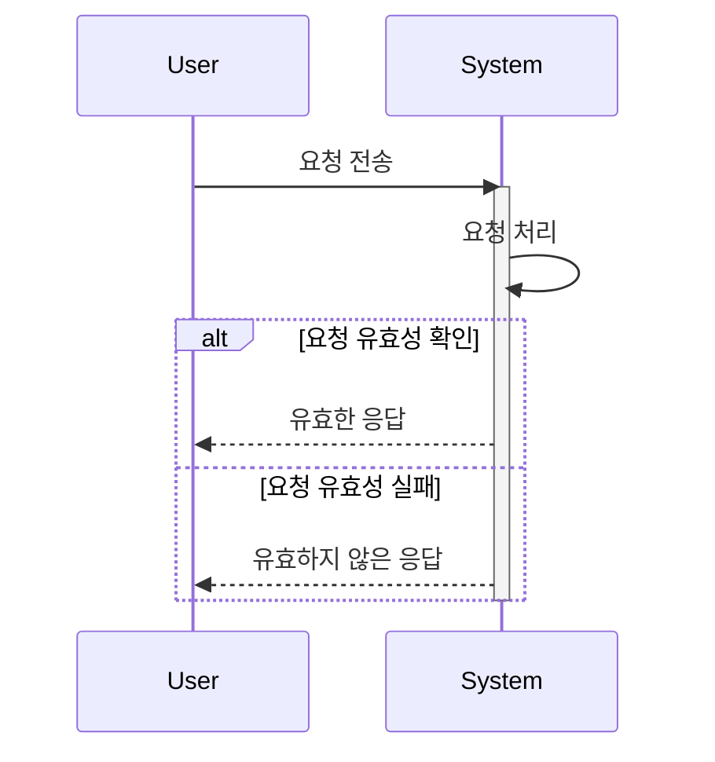
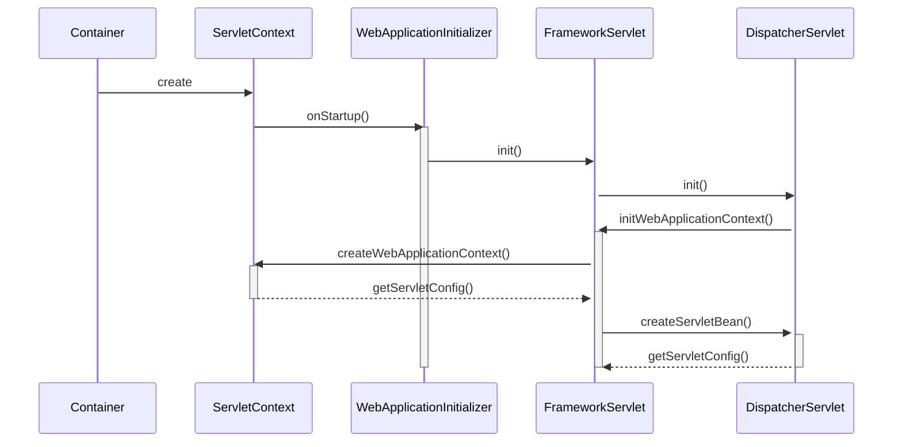
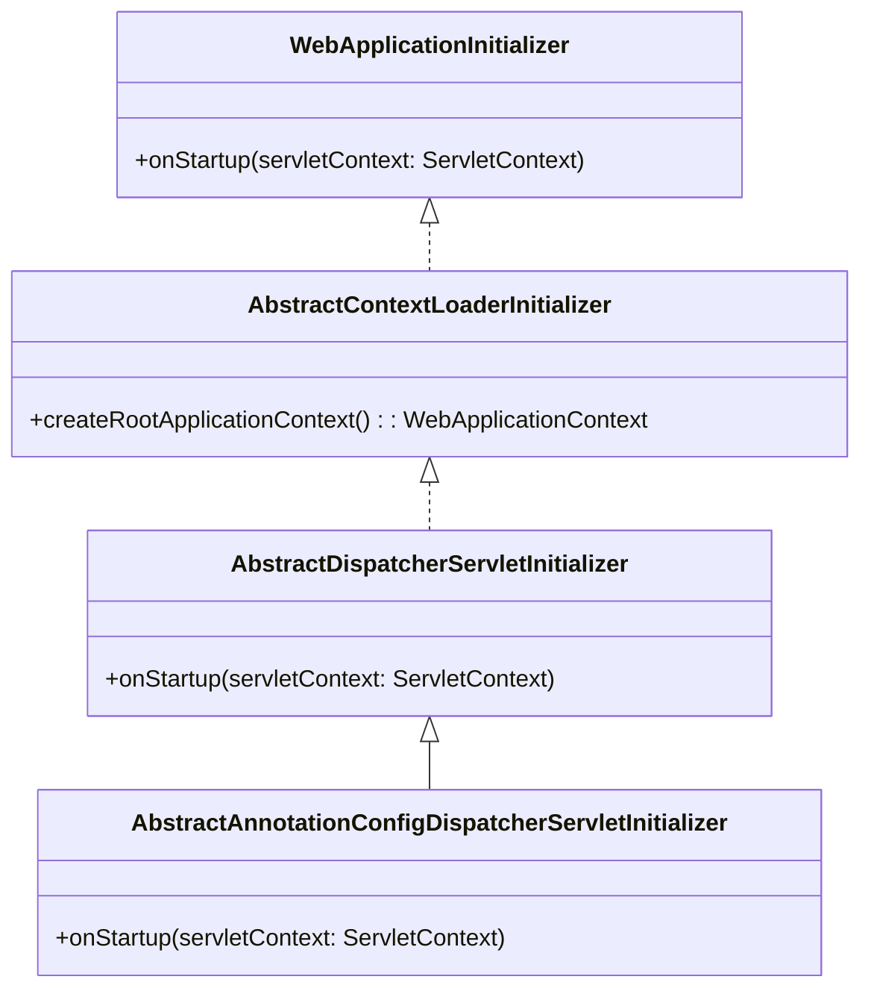

[PDF](https://github.com/eomjinyoung/bitcamp-study/blob/main/docs/%EC%8A%A4%ED%94%84%EB%A7%81%ED%94%84%EB%A0%88%EC%9E%84%EC%9B%8C%ED%81%AC1.pdf)

# Review
어제는 애너테이션 및 Java Config를 통한 IoC 컨테이너의 설정을 실습했다.

주요 포인트는 아래와 같다.
* 서블릿 기반 웹프로젝트에 Spring WebMVC를 적용할 수 있는가?
* 
* webapp/WEB-INF 에 app-servlet.xml과 같은 설정파일들을 두어야 하는 이유는?
  * WEB-INF 경로면 해당 파일들을 응답해주지 않는다. 그 외의 webapp 하위 경로라면 요청하면 정적으로 응답해준다. 클라이언트에게 설정을 응답할 이유가 없다. 보안상 잘못된 일이다.
* <param-value> 값이 있고 없음은 어떤 의미인가?
  * 태그가 있고 값이 비어있으면 IoC 컨테이너를 쓰지 않겠다는 이야기
  * 태그가 있고 값이 있으면 그 값의 IoC 컨테이너 설정 정보(app-servlet.xml)를 이용한다.
  * 아예 태그가 없으면 자동으로 찾는다.


# 시퀀스 다이어그램
시퀀스 다이어그램은 소프트웨어나 시스템의 동작을 나타내는 그래픽 표현이다. 이는 시간 순서대로 객체 간의 상호 작용을 보여준다. 객체 간에는 메시지가 전송되고, 이에 따라 객체들이 상태를 변경하거나 특정 동작을 수행한다. 시퀀스 다이어그램은 시스템의 동작을 이해하고 설명하는 데 유용하며, 소프트웨어 개발 과정에서 요구 사항을 명확히 이해하고 협업하는 데 도움이 된다.

## 시퀀스 다이어그램 예시
마크다운에서 mermaid를 써서 작성할 수도 있다.


### Sequance Diagram을 포함한 UML에 대한 흔한 오해
UML에 대한 완벽주의가 가장 큰 오해이다. UML은 완벽한 답이 항상 존재하는 도구가 아니다. 그래서 가장 중요한 것은 UML을 의사소통을 위한 도구로서 사용하는 것으로 생각하는 것이다. UML을 건축 설계 도면처럼 생각하면 안된다. UML을 사용할 때 완벽한 설계를 하자는 생각을 하면 안된다. 

## eGovFramework 문서 보기
아래 내용은 https://www.egovframe.go.kr/wiki/doku.php?id=egovframework:rte:ptl:dispatcherservlet 의 내용이다.

---

Client의 웹요청시에 DispatcherServlet에서 이루어지는 처리 흐름은 아래와 같다.
좀더 자세한 처리 흐름을 알고 싶다면 디버깅모드로 과정을 추적해 보는 것을 권장한다.


1. doService 메소드에서부터 웹요청의 처리가 시작된다. DispatcherServlet에서 사용되는 몇몇 정보를 request 객체에 담는 작업을 한 후 doDispatch 메소드를 호출한다.
2. 아래 3번~13번 작업이 doDispatch 메소드안에 있다. Controller, View 등의 컴포넌트들을 이용한 실제적인 웹요청처리가 이루어 진다.
3. getHandler 메소드는 RequestMapping 객체를 이용해서 요청에 해당하는 Controller를 얻게 된다.
4. 요청에 해당하는 Handler를 찾았다면 Handler를 HandlerExecutionChain 객체에 담아 리턴하는데, 이때 HandlerExecutionChain는 요청에 해당하는 interceptor들이 있다면 함께 담아 리턴한다.
5. 실행될 interceptor들이 있다면 interceptor의 preHandle 메소드를 차례로 실행한다.
6. Controller의 인스턴스는 HandlerExecutionChain의 getHandler 메소드를 이용해서 얻는다.
7. HandlerMapping과 마찬가지로 여러개의 HanlderAdaptor를 설정할 수 있는데, getHandlerAdaptor 메소드는 Controller에 적절한 HanlderAdaptor 하나를 리턴한다.
8. 선택된 HanlderAdaptor의 handle 메소드가 실행되는데, 실제 실행은 파라미터로 넘겨 받은 Controller를 실행한다.
9.  계층형 Controller인 경우는 handleRequest 메소드가 실행된다. @Controller인 경우는 HanlderAdaptor(AnnotationMethodHandlerAdapter)가 HandlerMethodInvoker를 이용해 실행할 Controller의 메소드를 invoke()한다.
10. interceptor의 postHandle 메소드가 실행된다.
11. resolveViewName 메소드는 논리적 뷰 이름을 가지고 해당 View 객체를 반환한다.
12. Model 객체의 데이터를 보여주기 위해 해당 View 객체의 render 메소드가 수행된다.


# Java Config로 IoC 컨테이너를 지정
## app\src-07\main\webapp\WEB-INF\web.xml
```xml
<?xml version="1.0" encoding="UTF-8"?>
<web-app xmlns="http://xmlns.jcp.org/xml/ns/javaee"
  xmlns:xsi="http://www.w3.org/2001/XMLSchema-instance"
  xsi:schemaLocation="http://xmlns.jcp.org/xml/ns/javaee
                      http://xmlns.jcp.org/xml/ns/javaee/web-app_4_0.xsd"
  version="4.0" metadata-complete="false">

  <description>
    스프링 Web MVC 프레임워크 예제 테스트
  </description>

  <display-name>java-spring-webmvc</display-name>

  <!-- Spring WebMVC의 프론트 컨트롤러 역할을 수행할 서블릿 지정 -->
  <servlet>
    <servlet-name>app</servlet-name>
    <servlet-class>org.springframework.web.servlet.DispatcherServlet</servlet-class>
    <!-- Java Config로 IoC 컨테이너를 지정할 때는 
         기본 IoC 컨테이너(XmlWebApplicationContext)를 교체해야 한다. 
         다음과 같이 초기화 파라미터를 통해 DispatcherServlet이 사용할 
         IoC 컨테이너 클래스와 Java Config 클래스를 설정한다.-->
    <init-param>
      <param-name>contextClass</param-name>
      <param-value>org.springframework.web.context.support.AnnotationConfigWebApplicationContext</param-value>
    </init-param>
    <init-param>
      <param-name>contextConfigLocation</param-name>
      <param-value>bitcamp.AppConfig</param-value>
    </init-param>
    <load-on-startup>1</load-on-startup>
  </servlet>
  <servlet-mapping>
    <servlet-name>app</servlet-name>
    <url-pattern>/app/*</url-pattern>
  </servlet-mapping>
  
  <welcome-file-list>
    <welcome-file>index.html</welcome-file>
    <welcome-file>index.htm</welcome-file>
    <welcome-file>default.htm</welcome-file>
  </welcome-file-list>

</web-app>
```
AdminConfig.java
```java
package bitcamp.config;


import org.springframework.context.annotation.ComponentScan;
import org.springframework.context.annotation.ComponentScan.Filter;
import org.springframework.context.annotation.FilterType;
import org.springframework.stereotype.Component;

//이걸로 대체함!
@ComponentScan(
    value="bitcamp.web",
    excludeFilters = @Filter(type= FilterType.REGEX, pattern = "bitcamp.web.admin.*")
)
public class AppConfig {

}
```
AdminConfig.java
```java
package bitcamp.config;


import org.springframework.context.annotation.ComponentScan;
import org.springframework.context.annotation.ComponentScan.Filter;
import org.springframework.context.annotation.FilterType;

@ComponentScan(
    value="bitcamp.web",
    excludeFilters = @Filter(type= FilterType.REGEX, pattern = "bitcamp.web.app.*")
)
public class AdminConfig {

}
```

XML에서 exclude-filter들을 JavaConfig들에서 @로 대체
```xml
  <context:component-scan base-package="bitcamp.web">
    <context:exclude-filter type="regex" expression="bitcamp.web.admin.*"/>
  </context:component-scan>
```


# XML이 아닌 다른 방법으로 Dispatcher Servlet 설정하기

web.xml에서가 아닌 다른 곳에서 DispatcherServlet 등록하기

# 서블릿 배치 방법의 분류

선언적 방법과 프로그램적 방법으로 분류할 수 있다. GPT에게 아래 헤더들을 던져주고 내용을 받아봤다.

## 선언적 방법 (Declarative)
### 선언적 방법이란?
선언적 프로그래밍은 어떻게 얻을 것인지가 아닌 얻고자 하는 것을 설명하는 프로그래밍 접근 방식입니다. 즉, 원하는 결과를 선언하고, 시스템은 그 결과를 달성하기 위한 방법을 결정합니다. 선언적 프로그래밍은 일반적으로 코드를 더 간결하고 읽기 쉽게 만들어주며, 잘 정의된 패턴이나 솔루션을 가진 도메인에서 특히 유용합니다.

## 프로그래머틱 방법 (Programmatic)
### 프로그래머틱 방법이란?
프로그래밍적 접근 방식은 원하는 결과를 달성하기 위해 직접적인 단계나 알고리즘을 명시하는 프로그래밍 스타일입니다. 즉, 문제를 해결하기 위해 컴퓨터가 따를 정확한 작업 순서를 정의하는 코드를 작성합니다. 프로그래밍적 프로그래밍은 보다 상세한 제어와 유연성을 제공하지만, 코드는 더 많은 세부 사항을 포함하고 있으며, 때로는 더 어려운 이해가 필요할 수 있습니다.

---

XML, Annotation을 사용하여 서블릿을 배치하던 방법은 선언적인 방법이다. JavaConfig를 통해서 서블릿을 배치하던 경우는 프로그램적인 방법이다. 스프링 프레임워크에서는 이 둘을 다 지원한다.

예시를 들면, 트랜잭션을 관리할 때는 선언적인 방법으로 @Transactional 애너테이션을 달 수도 있고, TransactionTemplate, TransactionOperator, TransactionManager 중 하나를 사용해서 프로그래머틱한 방법으로 관리할 수도 있다.

## 장단점이 무엇이고 무엇을 언제 써야 하는가?
복잡한 경우가 아니라면 선언적으로 처리하는 것이 편하다. 흐름과 조건을 직접 제어하는 것은 더 정밀한 제어가 가능하지만 작성하거나 이해하기가 더 어려워진다. 

# 오늘 학습은...
JavaConfig 위주 학습이었는데 진행이 빨라서 기록을 병행하기 힘들었다. 

# 프레임워크 클래스 확인
## SpringServletContainerInitializer.class
gradle\current\bin\caches\modules-2\files-2.1\org.springframework\spring-web\5.3.32\fa6384f5c3ec1e14534a3e9293fc8274edb64649\spring-web-5.3.32.jar!\org\springframework\web\SpringServletContainerInitializer.class

**이 소스코드를 보면 어떻게 reflect 패키지 기반으로, 특정 인터페이스를 구현한 클래스들을 인스턴스화하고 메서드를 실행하는지 볼 수 있다. 그리고,  `META-INF/services`에 javax.servlet.ServletContainerInitializer에 이 클래스명이 명시되어 있는 것도 확인할 수 있다. 이것은 java의 `Servlet` 동작 방법을 사용한 것이다. Spring framework만의 독특한 구동 방식이 아니다.**

위 문장이 핵심이다. 자바에 구현된 서블릿에 따라 META-INF/services/javax.~~~~를 찾는다. 스프링에서는 여기에 org.springframework.web.SpringServletContainerInitializer 가 데이터로 들어가 있다. 그래서 이것을 찾고 onStartup()를 실행한다.

```java
//
// Source code recreated from a .class file by IntelliJ IDEA
// (powered by FernFlower decompiler)
//

package org.springframework.web;

import java.lang.reflect.Modifier;
import java.util.ArrayList;
import java.util.Collections;
import java.util.Iterator;
import java.util.List;
import java.util.Set;
import javax.servlet.ServletContainerInitializer;
import javax.servlet.ServletContext;
import javax.servlet.ServletException;
import javax.servlet.annotation.HandlesTypes;
import org.springframework.core.annotation.AnnotationAwareOrderComparator;
import org.springframework.lang.Nullable;
import org.springframework.util.ReflectionUtils;

@HandlesTypes({WebApplicationInitializer.class})
public class SpringServletContainerInitializer implements ServletContainerInitializer {
  public SpringServletContainerInitializer() {
  }

  public void onStartup(@Nullable Set<Class<?>> webAppInitializerClasses, ServletContext servletContext) throws ServletException {
    List<WebApplicationInitializer> initializers = Collections.emptyList();
    Iterator var4;
    if (webAppInitializerClasses != null) {
      initializers = new ArrayList(webAppInitializerClasses.size());
      var4 = webAppInitializerClasses.iterator();

      while(var4.hasNext()) {
        Class<?> waiClass = (Class)var4.next();
        if (!waiClass.isInterface() && !Modifier.isAbstract(waiClass.getModifiers()) && WebApplicationInitializer.class.isAssignableFrom(waiClass)) {
          try {
            ((List)initializers).add((WebApplicationInitializer)ReflectionUtils.accessibleConstructor(waiClass, new Class[0]).newInstance());
          } catch (Throwable var7) {
            throw new ServletException("Failed to instantiate WebApplicationInitializer class", var7);
          }
        }
      }
    }

    if (((List)initializers).isEmpty()) {
      servletContext.log("No Spring WebApplicationInitializer types detected on classpath");
    } else {
      servletContext.log(((List)initializers).size() + " Spring WebApplicationInitializers detected on classpath");
      AnnotationAwareOrderComparator.sort((List)initializers);
      var4 = ((List)initializers).iterator();

      while(var4.hasNext()) {
        WebApplicationInitializer initializer = (WebApplicationInitializer)var4.next();
        initializer.onStartup(servletContext);
      }

    }
  }
}
```
디컴파일한 결과가 아니라 진짜 소스를 보고 싶다면? 공개되어 있다. 
[깃허브 링크](https://github.com/spring-projects/spring-framework/blob/main/spring-web/src/main/java/org/springframework/web/SpringServletContainerInitializer.java)





1. `WebApplicationInitializer`: 이 인터페이스는 Servlet 3.0+ 환경에서 웹 애플리케이션의 초기화를 구성하는 데 사용됩니다. 이 인터페이스를 구현한 클래스들은 웹 애플리케이션의 컨텍스트를 설정하고 초기화하는 메서드를 제공합니다. 주로 Spring Framework에서 사용되며, 애플리케이션 컨텍스트를 설정하고 초기화하는 Spring의 설정 클래스들은 보통 이 인터페이스를 구현하여 사용됩니다. 이를 통해 애플리케이션의 초기화 과정을 더욱 세밀하게 제어할 수 있습니다.
2. `AbstractDispatcherServletInitializer`: 이 클래스는 `WebApplicationInitializer` 인터페이스를 구현합니다. `AbstractAnnotationConfigDispatcherServletInitializer` 클래스는 이 클래스를 상속받습니다. 이 클래스는 `onStartup()` 메서드를 구현하여 서블릿 컨텍스트를 초기화하는 데 사용됩니다.
3. `AbstractContextLoaderInitializer`: 이 클래스는 `WebApplicationInitializer` 인터페이스를 구현합니다. 이 클래스는 루트 애플리케이션 컨텍스트를 설정하는 데 사용됩니다. 이 클래스는 `createRootApplicationContext()` 메서드를 구현하여 루트 애플리케이션 컨텍스트를 생성합니다.
4. `AbstractAnnotationConfigDispatcherServletInitializer`: 이 클래스는 `AbstractDispatcherServletInitializer` 클래스와 `AbstractContextLoaderInitializer` 클래스를 상속받습니다. 서블릿 및 루트 애플리케이션 컨텍스트를 설정하는데 사용됩니다.



GPT.. 계속해서 잘못된 정보가 나왔다. 하하.. 


**IoC Container 설정할 때 요즘 대세는 JavaConfig 방식이다. 그 중에서 혼동이 많이 발생하는 부분이 WebApplicationInitializer를 설정하는 부분인데, 위 다이어그램에서 보이는 인터페이스/클래스를 구현/상속하는 방법이 모두 가능하다. 가능하면 인터페이스를 상속하거나, 기능 구현이 최대한 많이 진행된 AbstractAnnotationConfigDispatcherServletInitializer를 사용하는게 좋다.**