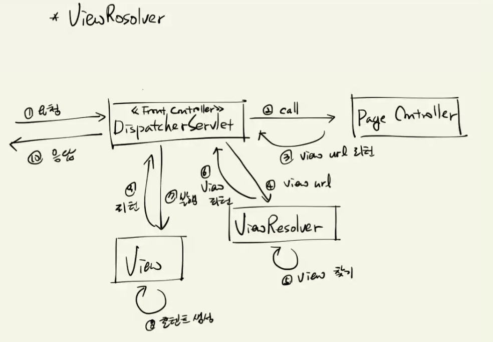

[PDF](https://github.com/eomjinyoung/bitcamp-study/blob/main/docs/%EC%8A%A4%ED%94%84%EB%A7%81%ED%94%84%EB%A0%88%EC%9E%84%EC%9B%8C%ED%81%AC1.pdf)

# Property 에 대한 복습
Field / Property 는 다르다.
게터/세터에서 다뤄질 때 Property라고 지칭된다. Getter만 있는 경우 Read-Only Property라고 한다. Setter만 있는 경우 Write-Only Property라고 한다. Getter, Setter 둘 다 있으면 Read/Writer Property라고 한다.

## 생성형 AI의 답변
Java에서는 getter와 setter 메서드를 사용하여 클래스의 인스턴스 변수에 접근하고 수정할 수 있습니다. Property를 직접적으로 지원하는 키워드나 데코레이터는 없지만, getter와 setter 메서드를 사용하여 비슷한 효과를 낼 수 있습니다.

예를 들어, Java에서의 Property는 다음과 같이 getter와 setter 메서드를 활용하여 구현할 수 있습니다.

```java
public class MyClass {
    private int myProperty;

    // Getter 메서드
    public int getMyProperty() {
        return myProperty;
    }

    // Setter 메서드
    public void setMyProperty(int value) {
        this.myProperty = value;
    }

    // Property 사용 예
    public static void main(String[] args) {
        MyClass obj = new MyClass();
        obj.setMyProperty(10);  // setter 호출
        System.out.println(obj.getMyProperty());  // getter 호출
    }
}
```

위 예제에서는 `myProperty` 변수에 대한 getter와 setter 메서드를 제공하여 외부에서 해당 변수에 접근할 수 있습니다. Java에서는 직접적인 Property 지원이 없기 때문에, getter와 setter 메서드를 사용하여 해당 변수에 접근하고 수정하는 것이 일반적인 방식입니다.

# 어제 배운 내용에 대한 점검
Spring에서..

* RequestHandler 의 파라미터로 다룰 수 있는 타입들은 무엇인가?
* @RequestParam 의 다양한 사용법은 무엇인가?
* RequestHandler에서 요청 파라미터 값을 객체로 받는 방법은?
* 객체가 포함하고 있는 객체에 요청 파라미터로 값을 받아 넣는 방법은?
* @InitBinder 은 무슨 목적으로 사용할 수 있는가?
  * init() 메서드에 묶기
  * 프로퍼티 에디터 등록하기
* Global로 @InitBinder 하는 방법은?
  * @ControllerAdvice
* @RequestHeader 애너테이션은 어떻게 사용하는가?
  * HTTP 요청 헤더를 받아 쓸 수 있다.
* User-Agent 는 무엇인가? 왜 복잡하며, 어떻게 받아서 쓰나? UA에서 브라우저를 구분하려면 어떻게 해야하나?
* Spring에서 쿠키를 활용하려면 어떻게 해야 하나?
  * Response 객체를 받아서 사용하는 수 밖에 없다. 스프링에서 따로 작성된 클래스가 없다.
* MultiPart 파일을 다루는 방법은? 요청 Body에 multipart/form-data Content-Type이 들어온다면?
* @RequestBody 애너테이션은 무엇이며 어떻게 쓰는가?
* RequestHandler의 리턴타입으로 String, HttpEntity, ResponseEntity 를 사용하려면 어떻게 해야 하는가?
  * 임의의 응답 헤더를 작성하여 응답하는 방법은?
  * 클라이언트에게 보내려는 상태 코드를 변경하는 방법은?


# MVC 패턴


항상 데이터는 컨트롤러에 요청하도록 제한하는 것이 MVC 패턴의 일관성있는 제어를 구현한다. 그래서 WEB-INF 아래로 jsp 파일들을 두어서, 직접 접근하는 것을 제한하는 것이다.

# View 객체로 응답하는 방법
1. ViewURL 을 리턴해주는 방법 (/WEB-INF/ 같은 사용자가 직접 접근 불가능한 경로)
2. ModelView 객체에 ViewURL을 담아서 리턴하는 방법
3. `redirect:` 접두어를 붙여서 리턴하는 방법 (h5)
4. `forward:` 접두어를 붙여서 리턴하는 방법 (h6)
```java
// 요청 핸들러의 리턴 값 - view URL 리턴하기, 리다이렉트, forward/include
package bitcamp.app1;

import org.springframework.stereotype.Controller;
import org.springframework.web.bind.annotation.GetMapping;
import org.springframework.web.bind.annotation.RequestMapping;
import org.springframework.web.servlet.ModelAndView;
import org.springframework.web.servlet.View;
import org.springframework.web.servlet.view.JstlView;

@Controller
@RequestMapping("/c05_2")
public class Controller05_2 {

  // 테스트:
  // http://localhost:9999/eomcs-spring-webmvc/app1/c05_2/h1
  @GetMapping("h1")
  public String handler1() {
    // 메서드 선언부에 @ResponseBody를 붙이지 않으면
    // 프론트 컨트롤러는 view URL로 간주한다.
    // => 리턴 URL의 '/'는 웹 애플리케이션 루트를 의미한다.
    return "/jsp/c05_2.jsp";
  }

  // 테스트:
  // http://localhost:9999/eomcs-spring-webmvc/app1/c05_2/h2
  @GetMapping("h2")
  public String handler2() {
    // MVC 패턴에서는 항상 Controller에 의해 View가 통제되어야 한다.
    // Controller를 경유하지 않고 View를 실행하게 해서는 안된다.
    // 그래야 View에 대해 일관성 있는 제어가 가능하다.
    // 문제는 jsp 파일을 웹 애플리케이션의 일반 폴더에 두게 되면
    // 다음과 같이 클라이언트에서 직접 실행을 요청할 수 있다.
    // http://localhost:9999/eomcs-spring-webmvc/jsp/c05_2.jsp
    //
    // 이것을 막으려면, 다음과 같이 WEB-INF 폴더 밑에 JSP 파일을 두어라.
    // /WEB-INF 폴더에 있는 파일은 클라이언트에서 직접 실행을 요청할 수 없다.
    return "/WEB-INF/jsp/c05_2.jsp";
  }

  // 테스트:
  // http://localhost:9999/eomcs-spring-webmvc/app1/c05_2/h3
  @GetMapping("h3")
  public View handler3() {
    return new JstlView("/WEB-INF/jsp/c05_2.jsp");
  }

  // 테스트:
  // http://localhost:9999/eomcs-spring-webmvc/app1/c05_2/h4
  @GetMapping("h4")
  public ModelAndView handler4() {
    System.out.println("===> /app1/c05_2/h4");
    ModelAndView mv = new ModelAndView();
    mv.setViewName("/WEB-INF/jsp/c05_2.jsp");
    return mv;
  }

  // 테스트:
  // http://localhost:9999/eomcs-spring-webmvc/app1/c05_2/h5
  @GetMapping("h5")
  public String handler5() {
    // 리다이렉트를 지정할 때는 URL 앞에 "redirect:" 접두어를 붙인다.
    // 즉 HTTP 응답이 다음과 같다.
    // HTTP/1.1 302
    // Location: h4
    // Content-Language: ko-KR
    // Content-Length: 0
    // Date: Fri, 19 Apr 2019 07:57:00 GMT

    return "redirect:h4";
  }

  // 테스트:
  // http://localhost:9999/eomcs-spring-webmvc/app1/c05_2/h6
  @GetMapping("h6")
  public String handler6() {
    // 포워드를 지정할 때는 URL 앞에 "forward:" 접두어를 붙인다.
    // 인클루드를 지정할 때는 URL 앞에 "include:" 접두어를 붙인다.
    return "forward:h4";
  }
}
```

# Review: Forward VS Include, Redirect VS Refresh
Forward는 기존출력을 취소한다. (그 기존출력이 출력되기 전에, 버퍼크기를 초과해버리면 취소 못한다.) Include는 기존 출력을 포함한다. 그리고 이런 과정은 Forward, Include를 했던 서블릿에서 같은 요청이 다음 서블릿으로 이어진다. 요청이 1번이라는 소리다.

Redirect는 해당 서블릿이 응답하면 브라우저가 해당 redirect 의 정보를 가지고 다시 요청을 한다. 그렇게 다음 서블릿으로 요청이 들어간다.

Refresh는 요청에 컨텐츠와 함께 refresh 응답을 한다. 해당 컨텐츠를 출력하고 일정 시간이 지나면 클라이언트는 (브라우저는) 다시 요청을 보낸다.


# ViewResolver



MVC 패턴을 시각화할 때, 의미적으론 크게 틀린 말은 아니지만 혼동되는 것이 View가 직접 응답하는 것처럼 보이는 경우가 있다. 실제로는 FrontController가 모든 요청과 응답을 처리한다.

## FrontController에서 JSP를 위해 하는 일
JSP에서는 request 객체에 저장된 값들을 꺼내 쓴다. (하나만 대상으로 꺼내는 게 아니라 없으면 다른 것 보고 ...)

이걸 매번 request에 setAttribute메서드로 넣어주기보다 Map 객체를 파라미터로 받아 쓴다거나 하는 식으로 발전했다.

여기서 좀 더 발전해서 일관성을 위해 Model 객체를 받아서 그 안에 넣는 방법으로 발전한다.

여기에 ModelAndView 라는 클래스를 만들어서, 사용할 데이터랑 JSP를 같이 담는 객체가 등장한다.

**모든 방법이 다 지원된다.**


```java
// 기본 View Resolver 사용하기
package bitcamp.app2;

import java.util.Map;
import org.springframework.stereotype.Controller;
import org.springframework.ui.Model;
import org.springframework.web.bind.annotation.GetMapping;
import org.springframework.web.bind.annotation.RequestMapping;

@Controller
@RequestMapping("/c01_1")
public class Controller01_1 {

  // 테스트:
  // http://localhost:9999/eomcs-spring-webmvc/app2/c01_1/h1
  @GetMapping("h1")
  // @ResponseBody // 뷰 이름을 리턴 할 때는 이 애노테이션을 붙이면 안된다.
  public String handler1(Model model) {

    model.addAttribute("name", "홍길동");
    model.addAttribute("age", 20);

    return "/jsp/c01_1.jsp";
    // 기본 ViewResolver는 리턴 값으로 받은 view name으로 JSP를 찾는다.
    // 웹 애플리케이션 디렉토리에서 JSP를 찾는다.

    // 따라서 위의 return문의 view name은 다음 JSP 경로와 같다.
    // /컨텍스트경로/jsp/c01_1.jsp

    // 웹 애플리케이션이 경로가 /eomcs-spring-webmvc 라면,
    // JSP 경로는 다음과 같다.
    // ==> /eomcs-spring-webmvc/jsp/c01_1.jsp
    //
    // InternalResourceViewResolver로 교체한 다음의 JSP URL은?
    // => /WEB-INF/jsp2//jsp/c01_1.jsp.jsp
  }

  // 테스트:
  // http://localhost:9999/eomcs-spring-webmvc/app2/c01_1/h2
  @GetMapping("h2")
  public void handler2(Model model) {
    model.addAttribute("name", "홍길동2");
    model.addAttribute("age", 30);

    // 기본 ViewRosolver를 사용할 때는
    // 뷰 이름을 리턴하지 않으면 오류 발생! 왜?

/*
뷰 이름을 리턴하지 않으면, requests handler의 URL을 viewURL로 사용한다.
즉 이렇게 된다. return "/c01_1/h2";

Spring webMVC에 기본으로 설정된 ViewResolver는 페이지 컨트롤러가 리턴한 ViewURL 을 갖고 ViewURL을 계산한다.
계산 방법은 아래와 같다.
 - 현재 URL = /app2/c01_1/h2
 - view URL = 현재 URL의 경로 + request handler의 URL
 -           = /app2/c01_1 + /c01_1/h2
 -           = /app2/c01_1/c01_1/h2
 -
 /app2/c01_1 (마지막 매핑은 본인 이름 같은 것. 어딨냐고 물어봤을 때 이름까지 답하진 않는다

 InternalResourceViewResolver로 교체한 다음은?
 => 리턴 값이 없으면 요청 URL(/c01_1/h2)을 리턴 값으로 사용한다.
 => 따라서 ViewResolver가 계산한 최종 URL은
 /WEB-INF/jsp2/c01_1/h2.jsp
*/

  }

  // 테스트:
  // http://localhost:9999/eomcs-spring-webmvc/app2/c01_1/h3
  @GetMapping("h3")
  public String handler3(Map<String, Object> map) {

    map.put("name", "홍길동3");
    map.put("age", 40);

    return "/WEB-INF/jsp/c01_1.jsp";
    // MVC 모델에서는 JSP는 뷰 콤포넌트로서 출력이라는 역할을 담당한다.
    // 출력할 데이터를 준비하는 일은 페이지 컨트롤러가 담당한다.
    // 그래서 JSP를 실행할 때는 항상 페이지 컨트롤러를 통해 실행해야 한다.
    // 페이지 컨트롤러가 하는 일이 없어도 프로그래밍의 일관성을 위해
    // 직접 JSP을 요청하지 않고, 페이지 컨트롤러를 통해 요청해야 한다.
    //
    // 그런데 웹 디렉토리에 JSP를 두면 클라이언트에서 JSP를 직접 요청할 수 있다.
    // 페이지 컨트롤러를 경유하지 않은 상태에서 실행해봐야 소용없지만,
    // 그래도 요청은 할 수 있다.
    // 이런 의미 없는 요청을 막는 방법으로,
    // JSP 파일을 /WEB-INF 폴더 아래에 두는 것을 권장한다.
    //
    // 웹 브라우저에서 다음 URL의 JSP를 요청해보라!
    // 1) http://localhost:8888/bitcamp-java-spring-webmvc/jsp/c01_1.jsp
    // => 클라이언트가 요청할 수 있다.
    // 2) http://localhost:8888/bitcamp-java-spring-webmvc/WEB-INF/jsp/c01_1.jsp
    // => 클라이언트가 요청할 수 없다.
    // => /WEB-INF 폴더에 있는 자원들은 클라이언트에서 직접 요청할 수 없다.
    // => 그래서 잘못된 요청을 막을 수 있다.
    // 실무에서는 이 방법을 사용한다.
  }

}
```

## 상대경로/절대경로
맨 앞의 `/`를 루트라고 부른다. 

루트가 있으면 절대경로이고, 없으면 상대경로이다.


`return "/jsp/c01_1.jsp";`

`return "jsp/c01_1.jsp";`

절대경로를 쓰면 머리 아프지 않을 것 같지만,
WEB-INF 경로의 이름을 바꾸거나, jsp -> 타임리프 등으로 변경한다거나 한다면
절대경로 사용은 악몽이 될 것이다.

그래서 InternalResourceViewResolver 클래스를 써야 한다. **유지보수성을 확보하는 것에 있어서 이것은 선택이 아니라 필수다.**

## 그럼 실무에서 viewURL을 어떻게 관리하나?
요청 URL을 찾아가도록 만든다. 요청 URL을 그대로 쓰지 않고...

InternalResourceViewResolver를 JavaConfig에서 설정한다.
```java
package bitcamp.config;

import org.springframework.context.annotation.Bean;
import org.springframework.context.annotation.ComponentScan;
import org.springframework.context.annotation.ComponentScan.Filter;
import org.springframework.context.annotation.FilterType;
import org.springframework.web.servlet.ViewResolver;
import org.springframework.web.servlet.view.InternalResourceViewResolver;

@ComponentScan(
    value = "bitcamp.app2",
    excludeFilters = @Filter(type = FilterType.REGEX, pattern = "bitcamp.web.app1.*")
)
public class App2Config {

  @Bean
  public ViewResolver viewResolver() {
    InternalResourceViewResolver vr = new InternalResourceViewResolver(
        "/WEB-INF/jsp2/",
        ".jsp"
    );
    return vr;
  }
}
```

```java
// 기본 View Resolver 교체 - InternalResourceViewResolver 사용하기
package bitcamp.app2;

import java.util.HashMap;
import java.util.Map;
import org.springframework.stereotype.Controller;
import org.springframework.ui.Model;
import org.springframework.web.bind.annotation.GetMapping;
import org.springframework.web.bind.annotation.RequestMapping;
import org.springframework.web.servlet.ModelAndView;

@Controller
@RequestMapping("/c01_2")
public class Controller01_2 {

  // 테스트:
  // http://localhost:9999/eomcs-spring-webmvc/app2/c01_2/h1
  @GetMapping("h1")
  public String handler1(Map<String, Object> map) {

    map.put("name", "홍길동");
    map.put("age", 20);

    //
    // ViewResolver?
    // => 실행할 뷰를 찾는 일을 한다.
    // => 페이지 컨트롤러가 리턴한 뷰 이름에 해당하는 뷰 콤포넌트를 찾는 역할.
    // => ResourceBundleViewResolver
    //    - *.properties 에서 뷰 이름에 해당하는 콤포넌트의 URL을 찾는다.
    // => InternalResouceViewResolver
    //    - 미리 지정된 접두사, 접미사를 사용하여 뷰이름으로 콤포넌트의 URL을 완성한다.
    //
    // View?
    // => 뷰를 실행하는 일을 한다.
    // => 템플릿 엔진을 실행하여 실제 클라이언트로 보낼 콘텐트를 생성한다.
    // => Thymeleaf, FreeMarker, JSP/JSTL, Tiles, RSS/Atom, PDF, Excel 등의
    //    엔진을 이용하여 콘텐트를 생성하는 뷰가 있다.
    //
    // ViewResolver 교체
    // => InternalResourceViewResolver를 사용하여
    //    JSP URL의 접두어와 접미사를 미리 설정해 둘 수 있어 URL을 지정하기 편리하다.
    // => 교체 방법은 XML에서 설정하는 방법과 Java Config로 설정하는 방법이 있다.
    //    자세한 것은 App2Config 클래스를 참고하라!
    //
    // ViewResolver 실행 과정?
    // => 페이지 컨트롤러는 클라이언트가 요청한 작업을 실행한 후
    //    그 결과를 출력할 뷰의 이름을 리턴한다.
    // => 프론트 컨트롤러는 request handler가 리턴한 URL을
    //    view resolver에게 전달한다.
    // => view resolver는 자신의 정책에 맞춰서 뷰 URL을 준비한다.
    // => InternalResourceViewResolver의 경우
    //    request handler가 리턴한 URL 앞, 뒤에
    //    접두사와 접미사를 붙여 JSP를 찾는다.
    //    예를 들어 다음 URL을 리턴하면,
    //      "c01_1/h1"
    //    최종 JSP URL은,
    //      "/WEB-INF/jsp2/c01_2/h1.jsp"
    //    이다.
    // => 프론트 컨트롤러는 ViewResolver가 준비한 URL을 가지고
    //    View 객체를 통해 해당 URL의 자원을 실행한다.
    //
    return "c01_2/h1"; // => /WEB-INF/jsp2/c01_1/h1.jsp
  }

  // 테스트:
  // http://localhost:9999/eomcs-spring-webmvc/app2/c01_1/h2
  @GetMapping("h2")
  public void handler2(Model model) {

    model.addAttribute("name", "홍길동2");
    model.addAttribute("age", 30);

    // InternalResourceViewResolver를 사용하는 경우,
    // request handler가 뷰 이름을 리턴하지 않으면
    // request handler의 URL을 뷰 이름으로 사용한다.
    // 즉 이 핸들러의 URL은 "/c01_2/h2" 이기 때문에 뷰 이름도 "/c01_2/h2"가 된다.
    // InternalResourceViewResolver는 바로 이 URL을 사용하여 다음과 같이 최종 URL을 만든다.
    // => "/WEB-INF/jsp2/" + "/c01_2/h2" + ".jsp"
    // => "/WEB-INF/jsp2/c01_2/h2.jsp"
    //
    // 실무에서는 이 방법을 많이 사용한다.
  }

  // 테스트:
  // http://localhost:9999/eomcs-spring-webmvc/app2/c01_2/h3
  @GetMapping("h3")
  public Map<String, Object> handler3() {

    HashMap<String, Object> map = new HashMap<>();
    map.put("name", "홍길동3");
    map.put("age", 40);

    // Map 객체에 값을 담아 리턴하면
    // 프론트 컨트롤러는 Map 객체에 보관되어 있는 값들을 ServletRequest 보관소로 옮긴다.
    // 그리고 view URL은 request handler의 URL을 사용한다.
    // => "/WEB-INF/jsp2" + "/c01_2/h3" + ".jsp" = "/WEB-INF/jsp2/c01_2/h3.jsp"
    return map;
  }

  // 테스트:
  // http://localhost:9999/eomcs-spring-webmvc/app2/c01_2/h4
  @GetMapping("h4")
  public ModelAndView handler4() {

    ModelAndView mv = new ModelAndView();
    mv.addObject("name", "홍길동3");
    mv.addObject("age", 40);
    mv.setViewName("c01_2/h4");

    // ModelAndView 객체에 값과 뷰 이름을 담아 리턴하면
    // 프론트 컨트롤러는 ModelAndView 객체에 보관되어 있는 값들을
    // ServletRequest 보관소로 옮기고,
    // 설정된 뷰 이름을 ViewResolver에게 넘긴다.
    //
    return mv;
  }

  // 테스트:
  // http://localhost:9999/eomcs-spring-webmvc/app2/c01_2/h5
  @GetMapping("h5")
  public ModelAndView handler5() {

    ModelAndView mv = new ModelAndView();
    mv.addObject("name", "홍길동3");
    mv.addObject("age", 40);

    // ModelAndView 객체에 값과 뷰 이름을 담아 리턴하면
    // 프론트 컨트롤러는 ModelAndView 객체에 보관되어 있는 값들을
    // ServletRequest 보관소로 옮기고,
    // 뷰 이름을 지정하지 않으면 request handler의 path를 ViewResolver에게 넘긴다.
    // => /c01_2/h5
    // InternalResourceViewResolver 는 위 URL을 다음과 같이 바꾼다.
    // => /WEB-INF/jsp2/c01_2/h5.jsp
    // 그런 후에 해당 URL의 JSP를 실행한다.
    return mv;
  }

}
```


# URL에 쿼리스트링을 사용하지 않고 값을 넣는 경우
```java
// URL 에서 값 추출하기 - @PathVariable
package bitcamp.app2;

import org.springframework.stereotype.Controller;
import org.springframework.web.bind.annotation.GetMapping;
import org.springframework.web.bind.annotation.PathVariable;
import org.springframework.web.bind.annotation.RequestMapping;
import org.springframework.web.bind.annotation.ResponseBody;

@Controller
@RequestMapping("/c02_1")
public class Controller02_1 {

  // 테스트:
  //   http://localhost:9999/eomcs-spring-webmvc/app2/c02_1?name=kim&age=20
  @GetMapping
  @ResponseBody
  public String handler1(String name, int age) {
    // 클라이언트로부터 값을 받는 일반적인 방법
    // => Query String 으로 받는다.
    // => 즉 URL 다음에 "?변수=값&변수=값" 형태로 값을 받는다.
    // => Query String의 값을 request handler에서 받으려면
    //    아규먼트를 선언하면 된다.
    //    아규먼트 앞에 @RequestParam을 붙여도 되고
    //    아규먼트이 이름이 요청 파라미터의 이름과 같다면 @RequestParam을 생략해도 된다.
    return String.format("name=%s, age=%d", name, age);
  }

  // 테스트:
  //   http://localhost:9999/eomcs-spring-webmvc/app2/c02_1/kim/20
  @GetMapping("{name}/{age}")
  @ResponseBody
  public String handler2(
      /*
      @PathVariable("name") String name,
      @PathVariable("age") int age
       */
      // URL의 변수 이름을 생략하면 아규먼트 이름을 사용한다.
      @PathVariable String name,
      @PathVariable int age
      ) {
    // URL path에 값을 포함하여 전달할 수 있고, 그 값을 아규먼트로 받을 수 있다.
    // URL path에 포함된 값을 받으려면 request handler의 URL을 설정할 때
    // 다음의 문법으로 선언해야 한다.
    // => .../{변수명}/{변수명}
    // 이렇게 선언된 변수 값을 받으려면 다음과 같이 아규먼트를 선언해야 한다.
    // => @PathVariable(변수명) String 아규먼트
    // 변수명과 아규먼트의 이름이 같다면, 다음과 같이 변수명을 생략할 수 있다.
    // => @PathVariable String 아규먼트
    //
    return String.format("name=%s, age=%d", name, age);
  }

  // 테스트:
  //   http://localhost:9999/eomcs-spring-webmvc/app2/c02_1/kim_20
  @GetMapping("{name}_{age}")
  @ResponseBody
  public String handler3(
      @PathVariable String name,
      @PathVariable int age
      ) {
    return String.format("name=%s, age=%d", name, age);
  }

}
```

# @MatrixVariable
```java
// URL 에서 값 추출하기 - @MatrixVariable
package bitcamp.app2;

import org.springframework.stereotype.Controller;
import org.springframework.web.bind.annotation.GetMapping;
import org.springframework.web.bind.annotation.MatrixVariable;
import org.springframework.web.bind.annotation.PathVariable;
import org.springframework.web.bind.annotation.RequestMapping;
import org.springframework.web.bind.annotation.ResponseBody;

@Controller
@RequestMapping("/c02_2")
public class Controller02_2 {

  // 테스트:
  // http://.../app2/c02_2?name=kim&age=20
  @GetMapping
  @ResponseBody
  public String handler1(String name, int age) {
    // Query String 으로 값 받기
    return String.format("name=%s, age=%d", name, age);
  }

  // 테스트:
  // http://.../app2/c02_2/name=kim;age=20
  @GetMapping(value = "{value}", produces = "text/plain;charset=UTF-8")
  @ResponseBody
  public String handler2(//
      @PathVariable("value") String value,
      // value 값 중에서 name 항목의 값을 받고 싶을 때 @MatrixVariable 을 사용한다.
      // 단 value의 형식은 "이름=값;이름=값;이름=값" 형태여야 한다.
      // @MatrixVariable("name") String name,
      // @MatrixVariable("age") int age

      // 매트릭스 변수명을 생략하면 아규먼트의 이름을 사용한다.
      @MatrixVariable String name,
      @MatrixVariable int age
      ) {

    // @MatrixVariable 애노테이션을 사용하려면
    // IoC 컨테이너에서 이 애노테이션을 활성화시키는 설정을 추가해야 한다.
    // 1) XML 설정
    //    => <mvc:annotation-driven enable-matrix-variables="true"/>
    // 2) Java Config 설정
    //    => @EnableWebMvc 애노테이션을 활성화시킨다.
    //    => WebMvcConfigurer 구현체를 정의한다.
    //    => UrlPathHelper 객체의 removeSemicolonContent 프로퍼티 값을 false로 설정한다.

    // 테스트1
    // http://.../app2/c02_2/name=kim;age=20
    // => @PathVariable("value") : name=kim <== 첫 번째 세미콜론의 값만 가져온다.
    // => @MatrixVariable("name") : kim
    // => @MatrixVariable("age") : 20
    //
    // 테스트2
    // http://.../app2/c02_2/user;name=kim;age=20
    // => @PathVariable("value") : user <== 첫 번째 세미콜론의 값만 가져온다.
    // => @MatrixVariable("name") : kim
    // => @MatrixVariable("age") : 20
    return String.format("value:%s \n name:%s, age:%d", value, name, age);
  }

  // 테스트:
  // http://.../app2/c02_2/name=teamA;qty=5/title=work1;state=1
  @GetMapping(value = "{team}/{task}", produces = "text/plain;charset=UTF-8")
  @ResponseBody
  public String handler3(
      // 여러 개의 패스 변수가 있을 때 값을 꺼내는 방법
      @MatrixVariable String name,
      @MatrixVariable int qty,
      @MatrixVariable String title,
      @MatrixVariable int state
      ) {

    return String.format("team: %s(%d)\n task: %s, %d", name, qty, title, state);
  }

  // http://.../app2/c02_2/h4/name=teamA;qty=5/name=work1;qty=1
  @GetMapping(value = "h4/{team}/{task}", produces = "text/plain;charset=UTF-8")
  @ResponseBody
  public String handler4(
      // 여러 개의 패스 변수가 있을 때 값을 꺼내는 방법
      // => 만약 항목의 이름이 같다면?
      @MatrixVariable(name = "name", pathVar = "team") String name1,
      @MatrixVariable(name = "qty", pathVar = "team") int qty1,
      @MatrixVariable(name = "name", pathVar = "task") String name2,
      @MatrixVariable(name = "qty", pathVar = "task") int qty2) {

    return String.format("team: %s(%d)\n task: %s, %d", name1, qty1, name2, qty2);
  }
}
```

# PathVariable, @MatrixVariable
핸들러에 URL을 통해 값을 세분화하여 전달할 수 있다.

값이 중복되는 경우에 어떻게 처리할지도 제어할 수 있다.


```java
// URL 에서 값 추출하기 - @MatrixVariable
package bitcamp.app2;

import org.springframework.stereotype.Controller;
import org.springframework.web.bind.annotation.GetMapping;
import org.springframework.web.bind.annotation.MatrixVariable;
import org.springframework.web.bind.annotation.PathVariable;
import org.springframework.web.bind.annotation.RequestMapping;
import org.springframework.web.bind.annotation.ResponseBody;

@Controller
@RequestMapping("/c02_2")
public class Controller02_2 {

  // 테스트:
  // http://.../app2/c02_2?name=kim&age=20
  @GetMapping
  @ResponseBody
  public String handler1(String name, int age) {
    // Query String 으로 값 받기
    return String.format("name=%s, age=%d", name, age);
  }

  // 테스트:
  // http://.../app2/c02_2/name=kim;age=20
  @GetMapping(value = "{value}", produces = "text/plain;charset=UTF-8")
  @ResponseBody
  public String handler2(//
      @PathVariable("value") String value,
      // value 값 중에서 name 항목의 값을 받고 싶을 때 @MatrixVariable 을 사용한다.
      // 단 value의 형식은 "이름=값;이름=값;이름=값" 형태여야 한다.
      // @MatrixVariable("name") String name,
      // @MatrixVariable("age") int age

      // 매트릭스 변수명을 생략하면 아규먼트의 이름을 사용한다.
      @MatrixVariable String name,
      @MatrixVariable int age
      ) {

    // @MatrixVariable 애노테이션을 사용하려면
    // IoC 컨테이너에서 이 애노테이션을 활성화시키는 설정을 추가해야 한다.
    // 1) XML 설정
    //    => <mvc:annotation-driven enable-matrix-variables="true"/>
    // 2) Java Config 설정
    //    => @EnableWebMvc 애노테이션을 활성화시킨다.
    //    => WebMvcConfigurer 구현체를 정의한다.
    //    => UrlPathHelper 객체의 removeSemicolonContent 프로퍼티 값을 false로 설정한다.

    // 테스트1
    // http://.../app2/c02_2/name=kim;age=20
    // => @PathVariable("value") : name=kim <== 첫 번째 세미콜론의 값만 가져온다.
    // => @MatrixVariable("name") : kim
    // => @MatrixVariable("age") : 20
    //
    // 테스트2
    // http://.../app2/c02_2/user;name=kim;age=20
    // => @PathVariable("value") : user <== 첫 번째 세미콜론의 값만 가져온다.
    // => @MatrixVariable("name") : kim
    // => @MatrixVariable("age") : 20
    return String.format("value:%s \n name:%s, age:%d", value, name, age);
  }

  // 테스트:
  // http://.../app2/c02_2/name=teamA;qty=5/title=work1;state=1
  @GetMapping(value = "{team}/{task}", produces = "text/plain;charset=UTF-8")
  @ResponseBody
  public String handler3(
      // 여러 개의 패스 변수가 있을 때 값을 꺼내는 방법
      @MatrixVariable String name,
      @MatrixVariable int qty,
      @MatrixVariable String title,
      @MatrixVariable int state
      ) {

    return String.format("team: %s(%d)\n task: %s, %d", name, qty, title, state);
  }

  // http://.../app2/c02_2/h4/name=teamA;qty=5/name=work1;qty=1
  @GetMapping(value = "h4/{team}/{task}", produces = "text/plain;charset=UTF-8")
  @ResponseBody
  public String handler4(
      // 여러 개의 패스 변수가 있을 때 값을 꺼내는 방법
      // => 만약 항목의 이름이 같다면?
      @MatrixVariable(name = "name", pathVar = "team") String name1,
      @MatrixVariable(name = "qty", pathVar = "team") int qty1,
      @MatrixVariable(name = "name", pathVar = "task") String name2,
      @MatrixVariable(name = "qty", pathVar = "task") int qty2) {

    return String.format("team: %s(%d)\n task: %s, %d", name1, qty1, name2, qty2);
  }
}
```

# URL을 Regular Expression (정규표현식)
male / female ~~~

정규표현식 예시: 

`value="h2/{name:[a-zA-Z0-9]+}/{tel:[0-9]+-[0-9]+-[0-9]+}/{gender:male|female}"` 

```java
// URL 에서 값 추출하기 - 정규표현식으로 URL 다루기 
package bitcamp.app2;

import org.springframework.stereotype.Controller;
import org.springframework.web.bind.annotation.GetMapping;
import org.springframework.web.bind.annotation.PathVariable;
import org.springframework.web.bind.annotation.RequestMapping;
import org.springframework.web.bind.annotation.ResponseBody;

@Controller 
@RequestMapping("/c02_3")
public class Controller02_3 {

  // 테스트:
  //   http://.../app2/c02_3/h1/hongkildong/010-1111-2222/man
  @GetMapping(
      value="h1/{name}/{tel}/{gender}", 
      produces="text/plain;charset=UTF-8")
  @ResponseBody
  public String handler1(
      @PathVariable String name, 
      @PathVariable String tel,
      @PathVariable String gender) {
    
    return String.format("name: %s\n tel: %s \n gender: %s", 
        name, tel, gender);
  }
  
  // 테스트:
  //   http://.../app2/c02_3/h1/hongkildong/010-1111-2222/man
  @GetMapping(
      value="h2/{name:[a-zA-Z0-9]+}/{tel:[0-9]+-[0-9]+-[0-9]+}/{gender:man|woman}", 
      produces="text/plain;charset=UTF-8")
  @ResponseBody
  public String handler2(
      @PathVariable String name, 
      @PathVariable String tel,
      @PathVariable String gender) {
    
    // 패스 변수를 사용할 때,
    // 패스 변수의 값 규칙을 정규표현식으로 정의할 수 있다.
    // 정규 표현식에 어긋간 URL의 경우 예외가 발생할 것이다.
    //
    return String.format("name: %s\n tel: %s \n gender: %s", 
        name, tel, gender);
  }

}
```

# 논리학
인공지능 논리 입문, 코어 논리학과 같은 책 읽어보기를 추천.
특히나 조건이 많아질 때, 그를 최적화하기 위해 논리학은 필수적임.

부동산, 보험, 은행 등 금융 분야거나 물류센터 등등 도메인에 따라 조금 다를 수 있지만 결국 코어한 부분으로 들어가면 아주 많은 조건에 대응해야 하는 상황이 온다. 그 때를 대비해서 논리학에 대해 배워두기를 추천한다.