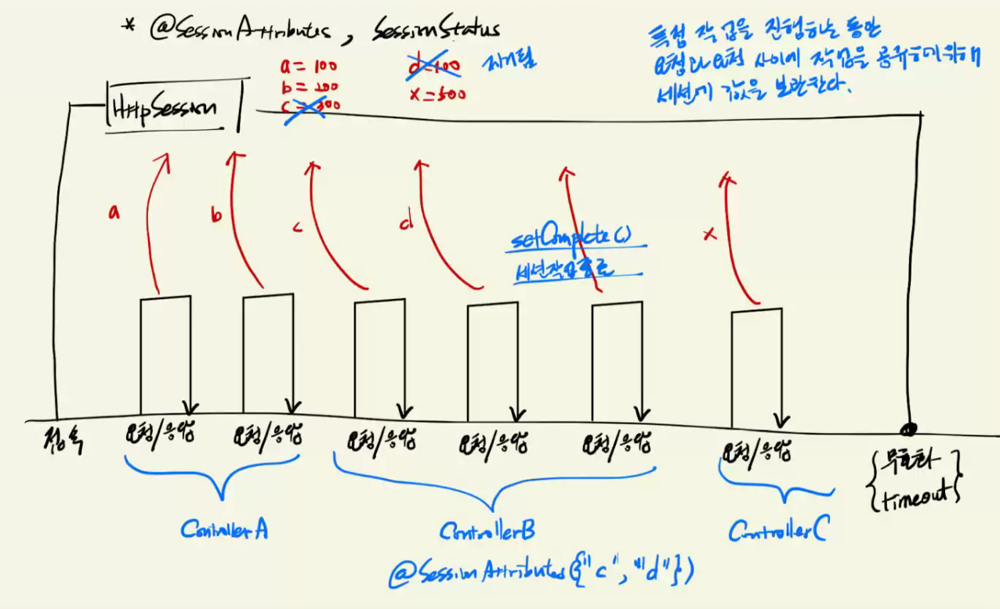

[PDF](https://github.com/eomjinyoung/bitcamp-study/blob/main/docs/%EC%8A%A4%ED%94%84%EB%A7%81%ED%94%84%EB%A0%88%EC%9E%84%EC%9B%8C%ED%81%AC1.pdf)

# @modelAttribute
해당 이름을 가진 값이 세션에 있으면 우선적으로 세션에서 값을 꺼내고,

만약 세션에 없으면 파라미터에서 꺼내고 그조차도 없으면 빈문자열을 할당해둔다.

단 @SessionAttribute에서 명시된 값들은 세션에 없는 경우 에러를 띄운다. 파라미터에서도 꺼내지 않는다.

# Spring Framework에서 session(세션) 다루기
```java
// 세션 다루기 - HttpSession 직접 사용하기
package bitcamp.app2;

import javax.servlet.http.HttpSession;

import org.springframework.stereotype.Controller;
import org.springframework.web.bind.annotation.GetMapping;
import org.springframework.web.bind.annotation.ModelAttribute;
import org.springframework.web.bind.annotation.RequestMapping;
import org.springframework.web.bind.annotation.ResponseBody;

@Controller
@RequestMapping("/c03_1")
public class Controller03_1 {

  // 테스트:
  //   http://.../app2/c03_1/h1
  @GetMapping(value = "h1", produces = "text/plain;charset=UTF-8")
  @ResponseBody
  public String handler1(HttpSession session) {
    // HttpSession 객체를 사용하려면 아규먼트로 받아야 한다.
    //
    session.setAttribute("name", "홍길동");
    session.setAttribute("age", "20");
//    session.setAttribute("name2", "임꺽정");
//    session.setAttribute("age2", "30");

    return "세션에 값을 보관했음!";
  }

  // 테스트:
  //   http://.../app2/c03_1/h2
  @GetMapping(value = "h2", produces = "text/plain;charset=UTF-8")
  @ResponseBody
  public String handler2(HttpSession session) {
    // HttpSession 객체를 사용하려면 아규먼트로 받아야 한다.
    //
    return String.format("name=%s, age=%s, name2=%s, age2=%s, tel2=%s",
            session.getAttribute("name"),
            session.getAttribute("age"),
            session.getAttribute("name2"),
            session.getAttribute("age2"),
            session.getAttribute("tel2"));
  }

  // 테스트:
  //   http://.../app2/c03_1/h3
  @GetMapping(value = "h3", produces = "text/plain;charset=UTF-8")
  @ResponseBody
  public String handler3(HttpSession session) {
    // HttpSession 객체를 사용하려면 아규먼트로 받아야 한다.
    //

    // 세션을 무효화시키기
    session.invalidate();

    return "세션을 무효화시켰음!";
  }

  @GetMapping(value = "h4", produces = "text/plain;charset=UTF-8")
  @ResponseBody
  public String handler4(
          // 현재 페이지 컨트롤러의 @SessionAttributes 에 지정된 이름이 아니라면,
          // 프론트 컨트롤러는 요청 파라미터에서 해당 이름의 값을 찾아 넘겨준다.
          // 요청 파라미터에 해당 이름의 값이 없다면,
          // 프론트 컨트롤러는 빈 문자열을 넘겨준다.
          @ModelAttribute("name") String name,
          @ModelAttribute("age") String age,
          @ModelAttribute("name2") String name2,
          @ModelAttribute("age2") String age2) {

    return String.format("name=%s, age=%s, name2=%s, age2=%s",
            name, age, name2, age2);
  }
}
```

## 세션에 값 중복하여 보관하기

@SessionAttributes로 세션에도 값을 중복해서 보관시킬 수 있다.
```java
@SessionAttributes({"name2", "age2"}) //세션에도 중복해서 보관한다.
```

```java
// 세션 다루기 - @SessionAttributes, @ModelAttribute
package bitcamp.app2;

import javax.servlet.http.HttpSession;

import org.springframework.stereotype.Controller;
import org.springframework.ui.Model;
import org.springframework.web.bind.annotation.GetMapping;
import org.springframework.web.bind.annotation.ModelAttribute;
import org.springframework.web.bind.annotation.RequestMapping;
import org.springframework.web.bind.annotation.ResponseBody;
import org.springframework.web.bind.annotation.SessionAttributes;

@Controller
@RequestMapping("/c03_2")

// request handler 가 뷰 컴포넌트(jsp)에 전달하는 값 중에서 
// 세션에 보관할 값의 이름을 지정하면 
// 프론트 컨트롤러는 그 값을 HttpSession 객체에도 보관해 둔다.
// 또한 @ModelAttribute에서 지정한 이름의 값을 세션에서 꺼낼 때도 사용한다.
// 즉 @SessionAttributes 에 이름을 지정해 두지 않으면
// 세션에 해당 값이 들어 있어도 
// @ModelAttribute가 붙은 아규먼트에 값을 넣어주지 않는다.

@SessionAttributes({"name2", "age2"}) //세션에도 중복해서 보관한다.
public class Controller03_2 {

  // 테스트:
  //   http://.../app2/c03_2/h1
  @GetMapping(value = "h1", produces = "text/plain;charset=UTF-8")
  @ResponseBody
  public String handler1(Model model) {

    // Model 객체에 값을 담으면 프론트 컨트롤러는 ServletRequest 보관소에 값을 옮긴다.
    // 만약 @SessionAttributes 에서 지정한 이름의 값이라면
    // HttpSession 객체에도 보관된다.
    model.addAttribute("name2", "임꺽정");
    model.addAttribute("age2", "30");

    // @SessionAttributes에 등록되지 않은 이름의 값은 세션에 보관되지 않는다.
    model.addAttribute("tel2", "1111-2222");

    return "세션에 값 보관했음!";

  }

  // 테스트:
  //   http://.../app2/c03_2/h2
  @GetMapping(value = "h2", produces = "text/plain;charset=UTF-8")
  @ResponseBody
  public String handler2(HttpSession session) {
    return String.format("name=%s, age=%s, name2=%s, age2=%s, tel2=%s",
        session.getAttribute("name"),
        session.getAttribute("age"),
        session.getAttribute("name2"),
        session.getAttribute("age2"),
        session.getAttribute("tel2"));
  }


  // 테스트:
  //   http://.../app2/c03_2/h3
  @GetMapping(value = "h3", produces = "text/plain;charset=UTF-8")
  @ResponseBody
  public String handler3(HttpSession session) {
    session.invalidate();
    return "세션 무효화되었음!";
  }

  // 테스트:
  //   1) http://.../app2/c03_1/h1 을 실행하여 name과 age 값을 세션에 보관한다.
  //   2) http://.../app2/c03_2/h1 을 실행하여 name2와 age2 값을 세션에 보관한다.
  //   3) http://.../app2/c03_2/h4 을 실행하여 세션에 보관된 값을 꺼낸다.
  @GetMapping(value = "h4", produces = "text/plain;charset=UTF-8")
  @ResponseBody
  public String handler4(
      // 세션에는 보관되어 있지만,
      // 현재 페이지 컨트롤러의 @SessionAttributes에 지정되지 않은 값 꺼내기
      @ModelAttribute("name") String name,
      @ModelAttribute("age") String age,

      // 세션에 보관되어 있고,
      // 현재 페이지 컨트롤러의 @SessionAttributes에 지정된 값 꺼내기
      @ModelAttribute("name2") String name2,
      @ModelAttribute("age2") String age2,

      // 세션에 보관되어 있지 않고,
      // 현재 페이지 컨트롤러의 @SessionAttributes에 지정되지 않은 값 꺼내기
      @ModelAttribute("tel2") String tel2) {

    // @ModelAttribute
    // 1. @SessionAttributes에 지정된 이름인 경우,
    //   1) 무조건 HttpSession 객체에서 값을 꺼내 넘긴다.
    ///     만약 없다면, 예외 발생!
    // 2. @SessionAttributes에 지정된 이름이 아닌 경우,
    //   2) 요청 파라미터의 값을 꺼내 넘긴다.
    //   3) 없으면, 빈 문자열을 넘긴다.

    return String.format("name=%s, age=%s, name2=%s, age2=%s, tel2=%s",
        name, age, name2, age2, tel2);
  }
}
```
### 됐다가 안됐다가?
위 코드들 작업하다가 세션에 값이 들어갔다가 안들어갔다가 하는 것처럼 보이는 경우가 있다면 그것은 이유가 무엇일까?

invalidate 하면, 기존 세션 무효화함. 그 다음에 세션이 요구될 때 프론트컨트롤러에서 만들어줌 (당연히 서블릿 기반)
클라이언트가 접속했다고 세션이 바로 생기는게 아니라 getSession 메서드가 호출될 때 만들어짐. 최초로 겟세션 메서드가 호출될 때 만들어진다는 것. 그래서 invalidate 하고 겟세션 하지 않은 상태에서 세션관련해서 무언가 작업을 하면 그 작업은 문제가 생긴다!

세션 객체가 존재하지 않는 상태에서 세션을 넣으면 안됨. 겟세션이 호출된 이후에 세션에 값을 넣으면 됨.

그래서, 위 03_2 기준으로 h3 -> h1 -> h4 하면, h1에서 제대로 세션에 값이 들어가지 않았기 때문에 오류가 발생함 (세션 객체에 기대하던 값이 없어서) h4에서 겟세션을 호출하기 때문.

위 코드에서 h2, h4에서 세션을 생성함 (파라미터로 세션을 요구하고 있기 때문에 프론트 컨트롤러가 만들어준다.)

### 위 내용 정리하면
세션 Invalidate 한 다음에, getSession() 호출하지 않는 다른 메서드에서 세션에 값을 넣는다면 세션이 없는 상태라서 문제가 생긴다.
그러면 어떻게 해결하나? **쓰건 안쓰건 getSession 호출하기 위해 파라미터에 HttpSession 객체를 요구해서, 프론트 컨트롤러가 getSession 호출하도록 하면 된다.** 다만 이것이 좋은 방법이라고 할 수는 없다. 다른 방법도 있다. 시작 페이지를 jsp로 두면, 항상 session이 만들어지고 시작한다. 물론 이것도 항상 좋은 방법이라고 말할 수 있을까 고민이 된다. Spring Framework 의 동작방법을 꿰고 있는게 아니라면, 비직관적인 방법이다.

```java
  // 테스트:
  //   http://.../app2/c03_2/h1
  @GetMapping(value = "h1", produces = "text/plain;charset=UTF-8")
  @ResponseBody
  public String handler1(Model model, HttpSession session) {

    // Model 객체에 값을 담으면 프론트 컨트롤러는 ServletRequest 보관소에 값을 옮긴다.
    // 만약 @SessionAttributes 에서 지정한 이름의 값이라면
    // HttpSession 객체에도 보관된다.
    model.addAttribute("name2", "임꺽정");
    model.addAttribute("age2", "30");

    // @SessionAttributes에 등록되지 않은 이름의 값은 세션에 보관되지 않는다.
    model.addAttribute("tel2", "1111-2222");

    return "세션에 값 보관했음!";

  }
```


# 세션에 저장한 값을 제어하기 - 일부만 삭제하기

```java
// 세션 다루기 - 세션의 값을 무효화시키는 방법
package bitcamp.app2;

import javax.servlet.http.HttpSession;
import org.springframework.stereotype.Controller;
import org.springframework.web.bind.annotation.GetMapping;
import org.springframework.web.bind.annotation.ModelAttribute;
import org.springframework.web.bind.annotation.RequestMapping;
import org.springframework.web.bind.annotation.ResponseBody;
import org.springframework.web.bind.annotation.SessionAttributes;
import org.springframework.web.bind.support.SessionStatus;

@Controller
@RequestMapping("/c03_3")

// 세션에 보관된 값 중에서 현재 페이지 컨트롤러에서 사용할 값을 지정한다.
// 또한 세션에 보관할 값이기도 하다.
@SessionAttributes({"name", "name2"})
public class Controller03_3 {

  // 테스트:
  // http://.../app2/c03_3/h1
  @GetMapping(value = "h1", produces = "text/plain;charset=UTF-8")
  @ResponseBody
  public String handler1(HttpSession session) {
    return String.format("name=%s, age=%s, name2=%s, age2=%s",
        session.getAttribute("name"),
        session.getAttribute("age"),
        session.getAttribute("name2"),
        session.getAttribute("age2"));
  }

  // 테스트:
  // http://.../app2/c03_3/h2
  @GetMapping(value = "h2", produces = "text/plain;charset=UTF-8")
  @ResponseBody
  public String handler2(HttpSession session) {
    // 세션을 완전히 무효화시키기
    session.invalidate();
    // 용도:
    // => 페이지 컨트롤러에 상관없이 모든 세션 값을 삭제할 때 사용하라.
    // 세션 자체를 무효화시켜 다음에 요청이 들어 왔을 때 새로 세션을 만들게 한다.
    //
    return "session.invalidate()";
  }

  // 테스트:
  // http://.../app2/c03_3/h3
  @GetMapping(value = "h3", produces = "text/plain;charset=UTF-8")
  @ResponseBody
  public String handler3(SessionStatus status) {
    // 현재 페이지 컨트롤러의 @SessionAttributes 에 지정된 값만 무효화시키기
    status.setComplete();
    // 용도:
    // => 보통 페이지 컨트롤러는 서로 관련된 작업을 처리하는 요청 핸들러를 정의한다.
    //    예) BoardController : add(), detail(), list(), update(), delete()
    // => 또는 트랜잭션과 관련된 작업을 처리하는 요청 핸들러를 두기도 한다.
    //    예) BookOrderController: 장바구니담기(), 주문하기(), 결제하기()
    // => 이렇게 특정 작업에 관계된 요청 핸들러가 작업하는 동안
    //    공유할 데이터가 있다면 세션에 보관하면 편할 것이다.
    //    작업이 완료되면 그 작업을 처리하는 동안 세션에 보관했던 데이터는 삭제해야 한다.
    //    세션의 모든 데이터가 아니라
    //    현재 페이지 컨트롤러가 보관한 데이터만 삭제하고 싶을 때
    //    바로 이 방식으로 처리하면 된다.
    // => 즉 세션을 그대로 유지한채로 이 페이지 컨트롤러에서
    // @SessionAttributes로 지정한 값만 무효화시킬 때 사용한다.
    return "status.setComplete()";
  }

  @GetMapping(value="h4", produces="text/plain;charset=UTF-8")
  @ResponseBody
  public String handler4(
      @ModelAttribute("name") String name,
      @ModelAttribute("age") String age,
      @ModelAttribute("name2") String name2,
      @ModelAttribute("age2") String age2) {

    return String.format("name=%s, age=%s, name2=%s, age2=%s",
        name, age, name2, age2);
  }

}
```
### 왜 이런 세밀한 제어가 필요한가?



예를 들어 보험에 가입하는 업무를 한다고 하자. 로그인을 한 다음에 보험 상품에 대해서 정보들을 입력할 것이다. 그럼, 가입작업에 필요한 데이터들은 해당 고객만의 저장소인 세션을 활용해서 저장한다. 그런데 가입작업이 끝나면, 가입을 위해 세션에 저장했던 정보들은 필요가 없어진다.

이런 상황을 관리하기 위한 것이 SessionAttributes의 목적이기도 한다. 그리고 이것을 지원하는 것이 setComplete() 메서드이다. 해당 세션에서 진행하던 작업을 종료하기 위한 것이다. 반대로 말하면 로그아웃은 setComplete()가 아닌 invalidate()를 호출해야 한다. 중간 작업의 결과물만 제거하는 게 아니라 해당 세션 전체를 다 제거해야 하기 때문이다.

SessionAttributes, 해당 핸들러에서 세션에 값을 저장하고 나중에 그것을 setComplete로 삭제하고... 도입 목적을 이해해야 한다.


## 

```java
// 세션 다루기 - @SessionAttributes를 사용하는 예
package bitcamp.app2;

import org.springframework.stereotype.Controller;
import org.springframework.ui.Model;
import org.springframework.web.bind.annotation.*;
import org.springframework.web.bind.support.SessionStatus;

import javax.servlet.http.HttpSession;

@Controller
@RequestMapping("/c03_4")
@SessionAttributes({"name", "age", "tel"})
public class Controller03_4 {

  // 테스트:
  // http://.../app2/c03_4/step0
  @GetMapping(value = "step0", produces = "text/plain;charset=UTF-8")
  @ResponseBody
  public String step0(HttpSession session) {
    // 프론트 컨트롤러에게 HttpSession을 요구하면
    // 기존에 만든게 있다면 그 객체를 넘겨 줄 것이고,
    // 없다면 새로 만들어 넘겨 줄 것이다.
    // 어찌 되었든 이 요청 핸들러를 실행하는 순간 HttpSession 객체가 존재하게 된다.
    // 보통 로그인 과정에서 HttpSession 객체가 준비될 것이고,
    // 그 전에 JSP를 실행하는 과정에서 HttpSession 객체가 생성될 것이다.
    // 따라서 이 메서드처럼 일부러 HttpSession 객체를 만들게 할 필요는 없다.
    // 다만 @SessionAttributes와 @ModelAttribute를 테스트하기 위해
    // 예제를 실행하는 과정에서 HttpSession 객체를 미리 준비할 필요가 있기 때문에
    // 예제 테스트를 위해 이 메서드를 만든 것이다.
    // 이 메서드를 먼저 실행하여 HttpSession 객체를 준비한 후에 step1,2,3,4를 테스트 하라!
    return "세션을 준비했음!";
  }

  // 테스트:
  // http://.../app2/c03_4/step1?name=hong
  @GetMapping(value = "step1", produces = "text/plain;charset=UTF-8")
  @ResponseBody
  public String step1(String name, Model model) {
    model.addAttribute("name", name);
    return "이름 저장했음!";
  }

  // 테스트:
  // http://.../app2/c03_4/step2?age=20
  @GetMapping(value = "step2", produces = "text/plain;charset=UTF-8")
  @ResponseBody
  public String step2(int age, Model model) {
    model.addAttribute("age", age);
    return "나이 저장했음!";
  }

  // 테스트:
  // http://.../app2/c03_4/step3?tel=1111
  @GetMapping(value = "step3", produces = "text/plain;charset=UTF-8")
  @ResponseBody
  public String step3(String tel, Model model) {
    model.addAttribute("tel", tel);
    return "전화번호 저장했음!";
  }

  // 테스트:
  // http://.../app2/c03_4/step4
  @GetMapping(value = "step4", produces = "text/plain;charset=UTF-8")
  @ResponseBody
  public String step4(
          @ModelAttribute("name") String name,
          @ModelAttribute("age") int age,
          @ModelAttribute("tel") String tel,
          SessionStatus status) {

    // 이 페이지 컨트롤러가 작업을 하는 동안 세션에 임시 보관했던 값들은
    // 예를 들어, "DB에 저장한 후" 세션에서 제거한다.
    status.setComplete();

    return String.format("이름=%s, 나이=%d, 전화=%s 를 DB에 저장했음!\n", name, age, tel);
  }
}
```

# 필터와 인터셉터


향후 배울 AOP(관점지향프로그래밍) 라는 기술도 기존 코드를 손대지 않고 기능을 추가하는 OCP를 지키는 방식이다. AOP, 필터와 인터셉터는 DispatcherServlet 혹은 Controller를 손대지 않고, 요청/응답을 처리하는 기능을 추가하는 방식이다.

인터셉터는 어디에 쓸 수 있나?
권한 체크, 로그인 체크...


## Spring Interceptor
```java
// 스프링 인터셉터 다루기
package bitcamp.app2;

import org.springframework.stereotype.Controller;
import org.springframework.web.bind.annotation.GetMapping;
import org.springframework.web.bind.annotation.RequestMapping;

@Controller 
@RequestMapping("/c04_1")
public class Controller04_1 {

  // 테스트:
  //   http://.../app2/c04_1/h1
  @GetMapping("h1")
  public String handler1() {
    System.out.println("c04_1.handler1() 호출");
    return "c04_1";
  }
  
  // 테스트:
  //   http://.../app2/c04_1/a/h2
  @GetMapping("a/h2")
  public String handler2() {
    System.out.println("c04_1.handler2() 호출");
    return "c04_1";
  }
  
  
  // 테스트:
  //   http://.../app2/c04_1/b/h3
  @GetMapping("b/h3")
  public String handler3() {
    System.out.println("c04_1.handler3() 호출");
    return "c04_1";
  }

}
```

### Interceptor를 구현하는 방법

1. `HandlerInterceptor` 인터페이스를 구현한다.
2. 3개의 메서드를 구현할 수 있다.
   * 다음 인터셉터나 페이지 컨트롤러를 계속 실행하고 싶다면 true를 리턴한다.
3. DispatcherServlet의 IoC Container에 인터셉터가 등록되어야 프론트 컨트롤러가 이것을 사용한다.
  * 해당 `WebMvcOnfigurer` 구현 클래스에서 (JavaConfig 라고도 부르며 App2Config.java로 작성했던..) `addInterceptors` 메서드를 구현한다.

DispatcherServlet의 IoC Container에 인터셉터 등록하기
```java
  @Override
public void addInterceptors(InterceptorRegistry registry) {
  registry.addInterceptor(new Controller04_1_Interceptor1());
}
```

인터셉터를 구현하기
```java
package bitcamp.app2;

import javax.servlet.http.HttpServletRequest;
import javax.servlet.http.HttpServletResponse;
import org.springframework.web.servlet.HandlerInterceptor;
import org.springframework.web.servlet.ModelAndView;

// 인터셉터 만들기
// => 프론트 컨트롤러와 페이지 컨트롤러 사이에 코드를 삽입하는 기술
// => 프론트 컨트롤러와 뷰 컴포넌트 사이에 코드를 삽입하는 기술
//
// 인터셉터를 배치하기
// => 프론트 컨트롤러의 IoC 설정 파일에 배치 정보를 추가한다.
//
public class Controller04_1_Interceptor1 implements HandlerInterceptor {
  @Override
  public boolean preHandle(HttpServletRequest request, HttpServletResponse response, Object handler)
      throws Exception {
    // 페이지 컨트롤러의 핸들러를 호출하기 전에 이 메서드가 먼저 호출된다.
    System.out.println("Interceptor1.preHandle()");

    // 다음 인터셉터나 페이지 컨트롤러를 계속 실행하고 싶다면 true를 리턴한다.
    // 여기서 요청 처리를 완료하고 싶다면 false를 리턴한다.
    return true;
  }

  @Override
  public void postHandle(HttpServletRequest request, HttpServletResponse response, Object handler,
      ModelAndView modelAndView) throws Exception {
    // 페이지 컨트롤러의 핸들러가 리턴한 후 이 메서드가 호출된다.
    System.out.println("Interceptor1.postHandle()");
  }

  @Override
  public void afterCompletion(HttpServletRequest request, HttpServletResponse response,
      Object handler, Exception ex) throws Exception {
    // JSP를 실행한 후 이 메서드가 호출된다.
    System.out.println("Interceptor1.afterCompletion()");
  }
}
```

## JavaConfig에서 Interceptor 제어하기

아래 코드에서 registry 객체에 addInterceptor 메서드를 사용하는 방법을 참조하기
* 와일드카드가 1개이면 하위 경로는 포함하지 않음.
* 와일드카드가 2개이면 하위 경로도 포함함.


```java
package bitcamp.config;

import org.springframework.context.annotation.Bean;
import org.springframework.context.annotation.ComponentScan;
import org.springframework.web.servlet.ViewResolver;
import org.springframework.web.servlet.config.annotation.EnableWebMvc;
import org.springframework.web.servlet.config.annotation.InterceptorRegistry;
import org.springframework.web.servlet.config.annotation.PathMatchConfigurer;
import org.springframework.web.servlet.config.annotation.WebMvcConfigurer;
import org.springframework.web.servlet.view.InternalResourceViewResolver;
import org.springframework.web.util.UrlPathHelper;
import bitcamp.app2.Controller04_1_Interceptor1;
import bitcamp.app2.Controller04_1_Interceptor2;
import bitcamp.app2.Controller04_1_Interceptor3;
import bitcamp.app2.Controller04_1_Interceptor4;

@ComponentScan("bitcamp.app2")
// => 지정된 패키지를 뒤져서 @Component, @Controller 등 붙은 클래스에 대해 인스턴스를 생성한다.
//

@EnableWebMvc
// => Web MVC 관련 객체를 등록하고 설정한다.
// => WebMvcConfigurer 구현체를 찾아 메서드를 호출한다.
//
public class App2Config implements WebMvcConfigurer {

  // DispatcherServlet의 기본 ViewResolver를 교체하기
  // 1) XML 설정
  // <bean id="viewResolver"
  //       class="org.springframework.web.servlet.view.InternalResourceViewResolver">
  //   <property name="viewClass" value="org.springframework.web.servlet.view.JstlView"/>
  //   <property name="prefix" value="/WEB-INF/jsp/"/>
  //   <property name="suffix" value=".jsp"/>
  // </bean>
  //
  // 2) Java Config 설정
  @Bean
  public ViewResolver viewResolver() {
    InternalResourceViewResolver vr = new InternalResourceViewResolver(
        "/WEB-INF/jsp2/", // prefix
        ".jsp" // suffix
    );
    return vr;
    // => prefix + 페이지컨트롤러 리턴 값 + suffix
    // 예) "/WEB-INF/jsp2/" + "board/list" + ".jsp" = /WEB-INF/jsp2/board/list.jsp
  }

  // @MatrixVariable 애노테이션 처리를 활성화시킨다.
  // => 이 작업을 수행하려면 MVC 관련 설정 작업을 수행할 수 있도록
  // WebMvcConfigurer 인터페이스를 구현해야 한다.
  // => 그리고 다음 메서드를 오버라이딩 하여 기존 설정을 변경한다.
  //
  // DispatcherServlet 이 MVC 관련 설정을 처리하는 과정
  // => WebMVC 설정을 활성화시켰는지 검사한다.
  // => 활성화시켰으면, IoC 컨테이너가 관리하는 객체 중에서
  // WebMvcConfigurer 구현체를 찾는다.
  // 관리하는 객체?
  // - IoC 컨테이너에 들어 있는 객체
  // - @Component, @Service, @Controller, @RestController, @Repository
  // 애노테이션이 붙은 클래스들은 IoC 컨테이너가 자동으로 객체를 생성하여 보관한다.
  // - 하지만 WebMvcConfigurer 구현체는 Java Config 클래스이기 때문에
  // 일반 객체로 표시하지 말고, @Configuration 을 붙여
  // Java Config 클래스임을 명확히 하는 것이 유지보수에 좋다.
  // 물론, @Configuration 가 붙은 클래스도 객체가 생성되어 IoC 컨테이너에 보관되는 것은 같다.
  //
  // => 객체를 찾았으면, WebMvcConfigurer 규칙에 따라 메서드를 호출하여
  // 설정을 추가하거나 기존 설정을 변경한다.
  // => WebMVC 설정을 활성화시키지 않으면,
  // WebMvcConfigurer 구현체가 있다 하더라도 무시한다.
  // => WebMVC 설정을 활성화시키는 방법
  // 1) XML 설정
  // <mvc:annotation-driven/>
  // 2) Java Config 설정
  // @EnableWebMvc 애노테이션 표시
  //
  @Override
  public void configurePathMatch(PathMatchConfigurer configurer) {
    UrlPathHelper helper = new UrlPathHelper();
    helper.setRemoveSemicolonContent(false);

    // DispatcherServlet의 MVC Path 관련 설정을 변경한다.
    configurer.setUrlPathHelper(helper);
  }

  // 이 설정을 사용하는 프론트 컨트롤러에 적용할 인터셉터 설정하기
  @Override
  public void addInterceptors(InterceptorRegistry registry) {

    // 1) 모든 요청에 대해 실행할 인터셉터 등록하기
    // => 인터셉터를 적용할 URL을 지정하지 않으면
    // 현재 프론트 컨트롤러의 모든 요청에 대해 적용된다.
    //
    registry.addInterceptor(new Controller04_1_Interceptor1());

    // 2) 특정 요청에 대해 실행할 인터셉터 등록하기
    // => 패턴: /c04_1/*
    // 적용 가능:
    // /c04_1/x
    // /c04_1/y
    // 적용 불가:
    // /x
    // /c03_1/x
    // /c04_1/a/x
    // /c04_1/a/b/x
    // 즉, /c04_1/ 바로 밑의 있는 자원에 대해서만 인터셉터를 적용한다.
    //
    registry
        .addInterceptor(new Controller04_1_Interceptor2())
        .addPathPatterns("/c04_1/*");

    // 3) 특정 요청에 대해 실행할 인터셉터 등록하기
    // => 패턴: /c04_1/**
    // 적용 가능:
    // /c04_1/x
    // /c04_1/y
    // /c04_1/a/x
    // /c04_1/a/b/x
    // 적용 불가:
    // /x
    // /c03_1/x
    // 즉, /c04_1/ 의 모든 하위 경로에 있는 자원에 대해서만 인터셉터를 적용한다.
    //
    registry
        .addInterceptor(new Controller04_1_Interceptor3())
        .addPathPatterns("/c04_1/**");

    // 4) 특정 요청에 대해 인터셉터 적용을 제외하기
    // => 패턴: /c04_1/** (include), /c04_1/a/** (exclude)
    // 적용 가능:
    // /c04_1/x
    // /c04_1/y
    // /c04_1/b/x
    // /c04_1/b/c/x
    // 적용 불가:
    // /x
    // /c03_1/x
    // /c04_1/a/x
    // /c04_1/a/b/x
    // 즉, /c04_1/ 의 모든 하위 경로에 있는 자원에 대해서만 인터셉터를 적용한다.
    // 단 /c04_1/a/ 의 모든 하위 경로에 있는 자원은 제외한다.
    registry
        .addInterceptor(new Controller04_1_Interceptor4())
        .addPathPatterns("/c04_1/**")
        .excludePathPatterns("/c04_1/a/**");
  }
}
```

### Chaining Methods
메서드들을 체이닝할 수 있다.

```java
    registry
        .addInterceptor(new Controller04_1_Interceptor4())
        .addPathPatterns("/c04_1/**")
        .excludePathPatterns("/c04_1/a/**");
```

# RESTful API
## JSON 형식의 컨텐츠 출력하기

1. JSP로 JSON 형식의 데이터 만들어서 보내주기
2. GSON, Jackson-databind 등 라이브러리로 json객체 만들어서 보내주기
3. **Json 형식의 문자열을 그냥 리턴하기** (라이브러리가 있어야 동작)

3번을 쓰면 된다.

```java
// JSON 콘텐트 출력하기
package bitcamp.app2;

import java.sql.Date;
import java.util.ArrayList;
import org.springframework.stereotype.Controller;
import org.springframework.ui.Model;
import org.springframework.web.bind.annotation.GetMapping;
import org.springframework.web.bind.annotation.RequestMapping;
import org.springframework.web.bind.annotation.ResponseBody;
import com.google.gson.Gson;

@Controller
@RequestMapping("/c05_1")
public class Controller05_1 {

  ArrayList<Board> list = new ArrayList<>();

  public Controller05_1() {
    list.add(new Board(1, "제목입니다1", "내용", "홍길동", 10, Date.valueOf("2019-5-1")));
    list.add(new Board(2, "제목입니다2", "내용", "홍길동2", 11, Date.valueOf("2019-5-2")));
    list.add(new Board(3, "제목입니다3", "내용", "홍길동3", 12, Date.valueOf("2019-5-3")));
    list.add(new Board(4, "제목입니다4", "내용", "홍길동4", 13, Date.valueOf("2019-5-4")));
    list.add(new Board(5, "제목입니다5", "내용", "홍길동5", 14, Date.valueOf("2019-5-5")));
    list.add(new Board(6, "제목입니다6", "내용", "홍길동6", 15, Date.valueOf("2019-6-1")));
    list.add(new Board(7, "제목입니다7", "내용", "홍길동7", 16, Date.valueOf("2019-6-1")));
    list.add(new Board(8, "제목입니다8", "내용", "홍길동8", 17, Date.valueOf("2019-6-1")));
    list.add(new Board(9, "제목입니다9", "내용", "홍길동9", 18, Date.valueOf("2019-6-1")));
    list.add(new Board(10, "제목입니다10", "내용", "홍길동10", 19, Date.valueOf("2019-7-1")));
    list.add(new Board(11, "제목입니다11", "내용", "홍길동11", 11, Date.valueOf("2019-8-1")));
    list.add(new Board(12, "제목입니다12", "내용", "홍길동12", 12, Date.valueOf("2019-9-1")));
    list.add(new Board(13, "제목입니다13", "내용", "홍길동13", 13, Date.valueOf("2019-10-1")));
  }

  // 1) JSP에서 JSON 형식의 콘텐트 출력하기
  // 직접 테스트:
  //   http://.../app2/c05_1/h1
  // HTML에서 AJAX 요청 테스트:
  //   http://.../html/app2/c05_1.html
  //
  @GetMapping("h1")
  public void handler1(Model model) {
    model.addAttribute("list", this.list);

    //return "c05_1/h1";
  }

  // 2) Google Gson 라이브러리를 사용하여 JSON 형식의 콘텐트 출력하기
  // => mvnrepository.com에서 gson 검색하여 라이브러리 정보를 가져온다.
  // => build.gradle 파일에 추가한다.
  // => '$gradle eclipse' 실행한다.
  // => 이클립스에서 프로젝트를 리프래시 한다.
  // 테스트:
  //   http://.../app2/c05_1/h2
  @GetMapping(value="h2", produces="text/plain;charset=UTF-8")
  @ResponseBody
  public String handler2() {
    return new Gson().toJson(this.list);
  }


  // 3) Google Gson 라이브러리를 사용하여 JSON 형식의 콘텐트 출력하기 II
  // => 페이지 컨트롤러의 리턴 값이 String이 아니면
  //    프론트 컨트롤러는
  //    Google의 Gson 라이브러리나 Jackson 라이브러리를 사용하여
  //    자동으로 JSON 형식의 문자열로 만들어 클라이언트로 출력한다.
  // => 단 Gson 또는 Jackson 라이브러리가 있어야 한다.
  //    둘 다 있다면 Jackson 라이브러리가 기본으로 사용된다.
  // => build.gradle 파일에서 gson 또는 jackson 라이브러리를 추가하는 부분의
  //    주석을 참고하라!
  // 테스트:
  //   http://.../app2/c05_1/h3
  @GetMapping("h3")
  @ResponseBody
  public Object handler3() {
    return this.list; // JSON 형식의 문자열은 자동으로 UTF-8로 인코딩 된다.
  }

}
```

```groovy
plugins {
    id 'java'
    id 'application'
    // id 'eclipse'
    // id 'war'
}

tasks.withType(JavaCompile) {
    options.encoding = 'UTF-8';
}

//// 이클립스에서 출력할 프로젝트 이름을 설정한다.
//eclipse {
//    project {
//        name = "eomcs-spring-webmvc"
//    }
//}

//war {
//    archiveBaseName = "spring"
//}

repositories {
    mavenCentral()
}

dependencies {
    //providedCompile 'javax.servlet:javax.servlet-api:4.0.1'
    implementation 'org.apache.tomcat.embed:tomcat-embed-jasper:9.0.85'
    implementation 'javax.servlet:jstl:1.2'
    implementation 'org.springframework:spring-webmvc:5.3.32'
    implementation 'org.apache.logging.log4j:log4j-core:2.23.1'

    // 파일 업로드 처리
    //implementation group: 'commons-fileupload', name: 'commons-fileupload', version: '1.4'

    // JSON 형식을 다루는 라이브러리
    // @Controller가 붙은 일반적인 페이지 컨트롤러의 요청 핸들러를 실행할 때
    // 요청 파라미터의 문자열을 int나 boolean 등으로 바꾸기 위해
    // 기본으로 장착된 변환기를 사용한다.
    // 그 변환기는 HttpMessageConverter 규칙에 따라 만든 변환기이다.
    //
    // 또한 요청 핸들러가 리턴한 값을 문자열로 만들어 클라이언트로 출력할 때도
    // 이 HttpMessageConverter를 사용한다.
    // 즉 클라이언트가 보낸 파라미터 값을 핸들러의 아규먼트 타입으로 바꿀 때도 이 변환기를 사용하고
    // 핸들러의 리턴 값을 클라이언트로 보내기 위해 문자열로 바꿀 때도 이 변환기를 사용한다.
    //
    // 스프링이 사용하는 기본 데이터 변환기는 MappingJackson2HttpMessageConverter 이다.
    // 만약 이 변환기가 없다면 Google의 Gson 변환기를 사용한다.
    // 구글의 Gson 변환기 마저 없다면 컨버터가 없다는 예외를 발생시킨다.
    // 컨버터가 하는 일은 JSON 데이터로 변환하는 것이다.
    //      클라이언트가 보낸 JSON 요청 파라미터 ===> 자바 객체
    //      핸들러가 리턴하는 자바 객체 ===> JSON 형식의 문자열
    //
    // MappingJackson2HttpMessageConverter?
    // => 요청 파라미터로 JSON 문자열을 받으면 요청 핸들러를 호출할 때 자바 객체로 변환시킨다.
    // => 요청 핸들러가 자바 객체를 리턴할 때 JSON 문자열로 변환한다.
    //
    // 주의!
    // => MappingJackson2HttpMessageConverter를 사용하려면
    //    다음과 같이 의존하는 라이브러리를 추가해야 한다.
    //
    //    implementation 'com.fasterxml.jackson.core:jackson-databind:2.13.0'
    implementation 'com.fasterxml.jackson.core:jackson-databind:2.17.0'

    // => 그런데 JSON 데이터를 처리할 때
    //    MappingJackson2HttpMessageConverter 대신 GsonHttpMessageConverter 를 사용할 수 있다.
    //    단 GsonHttpMessageConverter를 사용하려면
    //    다음과 같이 이 클래스가 들어있는 의존 라이브러리를 추가해야 한다.
    // => 만약 동시에 추가한다면 기본으로 Jackson 라이브러리를 사용한다.

    //
    //implementation group: 'com.google.code.gson', name: 'gson', version: '2.8.9'
    implementation 'com.google.code.gson:gson:2.10.1'

    implementation 'com.github.ben-manes.caffeine:guava:3.1.8'
    //implementation 'com.google.guava:guava:28.2-jre'
    testImplementation 'junit:junit:4.12'
}
application {
    mainClass = 'bitcamp.App'
}

```

### 어떻게 자동 변환하는 것인가?


### 그럼 jackson 써야 해요 gson 써야 해요?
가능하면 jackson 사용 추천 (Spring에서 기본으로 사용하는 라이브러리인 만큼)

## @RestController

페이지 컨트롤러를 @RestController로 선언하면, 리턴 값은 HttpMessageConverter에 의해 자동으로 변환된다. @ResponseBody를 붙일 필요가 없다.

```java
// JSON 콘텐트 출력하기 - @RestController
package bitcamp.app2;

import java.sql.Date;
import java.util.ArrayList;
import java.util.HashMap;
import org.springframework.web.bind.annotation.GetMapping;
import org.springframework.web.bind.annotation.RequestMapping;
import org.springframework.web.bind.annotation.RestController;

@RestController
// => 페이지 컨트롤러를 @RestController로 선언하면,
//    리턴 값은 HttpMessageConverter에 의해 자동으로 변환된다.
// => @ResponseBody를 붙일 필요가 없다.
//
@RequestMapping("/c05_2")
public class Controller05_2 {

  ArrayList<Board> list = new ArrayList<>();

  public Controller05_2() {
    list.add(new Board(1, "제목입니다1", "내용", "홍길동", 10, Date.valueOf("2019-5-1")));
    list.add(new Board(2, "제목입니다2", "내용", "홍길동2", 11, Date.valueOf("2019-5-2")));
    list.add(new Board(3, "제목입니다3", "내용", "홍길동3", 12, Date.valueOf("2019-5-3")));
    list.add(new Board(4, "제목입니다4", "내용", "홍길동4", 13, Date.valueOf("2019-5-4")));
    list.add(new Board(5, "제목입니다5", "내용", "홍길동5", 14, Date.valueOf("2019-5-5")));
    list.add(new Board(6, "제목입니다6", "내용", "홍길동6", 15, Date.valueOf("2019-6-1")));
    list.add(new Board(7, "제목입니다7", "내용", "홍길동7", 16, Date.valueOf("2019-6-1")));
    list.add(new Board(8, "제목입니다8", "내용", "홍길동8", 17, Date.valueOf("2019-6-1")));
    list.add(new Board(9, "제목입니다9", "내용", "홍길동9", 18, Date.valueOf("2019-6-1")));
    list.add(new Board(10, "제목입니다10", "내용", "홍길동10", 19, Date.valueOf("2019-7-1")));
    list.add(new Board(11, "제목입니다11", "내용", "홍길동11", 11, Date.valueOf("2019-8-1")));
    list.add(new Board(12, "제목입니다12", "내용", "홍길동12", 12, Date.valueOf("2019-9-1")));
    list.add(new Board(13, "제목입니다13", "내용", "홍길동13", 13, Date.valueOf("2019-10-1")));
  }

  // 테스트:
  //   http://.../app2/c05_2/h1
  @GetMapping("h1")
  public Object handler1() {
    return this.list; // JSON 형식의 문자열은 자동으로 UTF-8로 인코딩 된다.
  }

  // 테스트:
  //   http://.../app2/c05_2/h2
  @GetMapping(value="h2", produces="text/plain;charset=UTF-8")
  public String handler2() {
    return "안녕하세요!"; // String 타입은 그대로 출력한다.
    // 단 출력 문자열의 인코딩을 지정해야 한글이 깨지지 않는다.
  }

  // 테스트:
  //   http://.../app2/c05_2/h3
  @GetMapping("h3")
  public int handler3() {
    return 100; // primitive 타입의 값도 그대로 출력한다.
  }

  // 테스트:
  //   http://.../app2/c05_2/h4
  @GetMapping("h4")
  public Object handler4() {
    // primitive 타입이나 String 타입의 값을 JSON 형식으로 출력하려면
    // 도메인 객체나 맵 객체 담아 리턴하라!
    HashMap<String,Object> content = new HashMap<>();
    content.put("v1", 100);
    content.put("v2", "Hello");

    return content;
  }
}
```

### Spring-Boot
스프링부트는 스프링 프레임워크에서처럼 서버사이드에서 렌더링해서 주려고 쓰는 것이 아니다. 만약 그렇게 쓰고 있으면 잘못 쓰는 것. 스프링부트는 처음부터 RESTful 적용하여 json등의 데이터만 주는 백엔드 서버로 분리하려는 것. 이런 것은 어떻게 볼 수 있나? Getting Started 문서를 보면, 그렇게 사용한다. Spring-Boot로 JSP 혹은 타임리프를 함께 사용하려고 하지 말자. (사용하려면 설정도 하고 라이브러리도 설치해서 할 수는 있다. 가능해도 그렇게 쓰지 말고 백엔드, 프론트엔드 분리시킬 생각을 해야 한다.)

## POST로 JSON 바로 받기
```java
// JSON 콘텐트 입력받기 - @RestController
package bitcamp.app2;

import java.net.URLDecoder;
import java.util.Map;
import org.springframework.web.bind.annotation.RequestBody;
import org.springframework.web.bind.annotation.RequestMapping;
import org.springframework.web.bind.annotation.RestController;

@RestController
@RequestMapping("/c05_3")
public class Controller05_3 {

  // 1) 요청 파라미터 값을 낱개로 입력 받기
  // 테스트
  //   http://.../app2/c05_3/h1?no=1&title=ok&writer=kim&viewCount=100
  @RequestMapping(value = "h1", produces = "text/plain;charset=UTF-8")
  public Object handler1(
      int no,
      String title,
      String writer,
      int viewCount) {

    return String.format("%d,%s,%s,%d", no, title, writer, viewCount);
  }

  // 2) 요청 파라미터 값을 객체로 입력 받기
  // 테스트
  //   http://.../app2/c05_3/h2?no=1&title=ok&writer=kim&viewCount=100
  @RequestMapping(value = "h2", produces = "text/plain;charset=UTF-8")
  public Object handler2(Board board) {
    return board.toString();
  }

  // 3) JSON 형식의 요청 파라미터 값을 통째로 문자열로 받기
  // 테스트
  //   http://.../html/app2/c05_3.html
  @RequestMapping(value = "h3", produces = "text/plain;charset=UTF-8")
  public Object handler3(@RequestBody String content) throws Exception {
    System.out.println(content);
    System.out.println(
        URLDecoder.decode(content, "UTF-8")); //한글 깨지는 경우라면 charset을 명시하도록 URLDecoder을 사용하라
    return "OK!";
  }

  // 4) JSON 형식의 요청 파라미터 값을 맵 객체로 받기
  // => HttpMessageConverter 구현체(예:MappingJackson2HttpMessageConverter)가
  //    클라이언트가 보낸 데이터를 Map 객체에 담아준다.
  // => 이 기능을 쓰고 싶다면 Gson 또는 Jackson 라이브러리를 반드시 포함해야 한다.
  //    그래야 스프링의 DispatcherServlet에서 찾는다.
  // 테스트
  //   http://.../html/app2/c05_3.html
  @RequestMapping(value = "h4", produces = "text/plain;charset=UTF-8")
  public Object handler4(@RequestBody Map<String, Object> content) throws Exception {
    System.out.println(content);
    return "OK!";
  }

  // 5) JSON 형식의 요청 파라미터 값을 도메인 객체로 받기
  // => HttpMessageConverter 구현체(예: MappingJackson2HttpMessageConverter)가
  //    클라이언트가 보낸 데이터를 도메인 객체(예: Board, Member, Lesson 등)에 담아준다.
  // => Json 데이터의 프로퍼티 명과 도메인 객체의 프로퍼티 명이 일치해야 한다.
  //
  // 테스트
  //   http://.../html/app2/c05_3.html
  @RequestMapping(value = "h5", produces = "text/plain;charset=UTF-8")
  public Object handler5(@RequestBody Board content) throws Exception {
    System.out.println(content);

    // 주의!
    // => 클라이언트에서 보낸 날짜 데이터의 문자열 형식이 yyyy-MM-dd 형태여야 한다.
    //    그래야 java.util.Date 타입의 값으로 변환해 준다.
    //    예) 2019-05-01 ===> java.util.Date 객체 변환 성공!
    // => 만약 이 형태가 아니면 변환할 수 없어 실행 오류가 발생한다.
    //    예) 05/01/2020 또는 2020-5-1 ===> 변환 오류!
    //
    // @JsonFormat 애노테이션 사용
    // => 이 애노테이션은 MappingJackson2HttpMessageConverter를 위한 것이다.
    //    GsonHttpMessageConverter는 이 애노테이션을 인식하지 않는다.
    // => 도메인 객체의 프로퍼티에 이 애노테이션을 붙이면
    //    2019-05-01 이나 2019-5-1 모두 처리할 수 있다.
    // => 뿐만 아니라, 도메인 객체를 JSON 문자열로 변환할 때도
    //    해당 형식으로 변환된다.
    //

    return "OK!";
  }
}
```

# VO에서 날짜 관리하기
애노테이션을 통해 jackson에서 JsonFormat을 어떻게 넣을지 결정할 수 있다.
필드에 붙일수도 있고 Setter에 붙일 수도 있는데, 필드에 붙이는 방법을 추천한다.


```java
  @JsonFormat(
      shape = JsonFormat.Shape.STRING,
      pattern = "yyyy-MM-dd")
  protected Date createdDate;

    ...
    ...

  //@JsonFormat(shape = JsonFormat.Shape.STRING, pattern = "yyyy-MM-dd")
  public void setCreatedDate(Date createdDate) {
    this.createdDate = createdDate;
  }
```


```java
package bitcamp.app2;

import com.fasterxml.jackson.annotation.JsonFormat;
import java.sql.Date;
//import com.fasterxml.jackson.annotation.JsonFormat;

public class Board {

  protected int no;
  protected String title;
  protected String content;
  protected String writer;
  protected int viewCount;

  // Jackson 라이브러리를 사용한다면
  // Date 필드의 JSON 입출력 형식을 지정할 수 있다.
  // 다음 애노테이션을 setter나 field에 붙이면 된다.
  @JsonFormat(
      shape = JsonFormat.Shape.STRING,
      pattern = "yyyy-MM-dd")
  protected Date createdDate;

  public Board() {
  }

  public Board(
      int no, String title, String content, String writer,
      int viewCount, Date createdDate) {
    this.no = no;
    this.title = title;
    this.content = content;
    this.writer = writer;
    this.viewCount = viewCount;
    this.createdDate = createdDate;
  }

  @Override
  public String toString() {
    return "Board [no=" + no + ", title=" + title + ", content=" + content + ", writer=" + writer
        + ", viewCount=" + viewCount + ", createdDate=" + createdDate + "]";
  }

  public int getNo() {
    return no;
  }

  public void setNo(int no) {
    this.no = no;
  }

  public String getTitle() {
    return title;
  }

  public void setTitle(String title) {
    this.title = title;
  }

  public String getContent() {
    return content;
  }

  public void setContent(String content) {
    this.content = content;
  }

  public String getWriter() {
    return writer;
  }

  public void setWriter(String writer) {
    this.writer = writer;
  }

  public int getViewCount() {
    return viewCount;
  }

  public void setViewCount(int viewCount) {
    this.viewCount = viewCount;
  }

  public Date getCreatedDate() {
    return createdDate;
  }

  //@JsonFormat(shape=JsonFormat.Shape.STRING,pattern="yyyy-MM-dd")
  public void setCreatedDate(Date createdDate) {
    this.createdDate = createdDate;
  }
}
```


# 에외 다루기

## 

```java
// 예외 다루기
package bitcamp.app2;

import org.springframework.stereotype.Controller;
import org.springframework.web.bind.annotation.ExceptionHandler;
import org.springframework.web.bind.annotation.GetMapping;
import org.springframework.web.bind.annotation.PostMapping;
import org.springframework.web.bind.annotation.RequestMapping;
import org.springframework.web.servlet.ModelAndView;

import java.io.IOException;
import java.sql.SQLException;

@Controller
@RequestMapping("/c06_1")
public class Controller06_1 {

  // 테스트:
  // http://.../app2/c06_1/get
  @GetMapping("get")
  public void get() {
  }

  // 테스트:
  // http://.../app2/c06_1/post
  @PostMapping("post")
  public void post() {
  }

  // 테스트:
  // http://.../app2/c06_1/error1
  @GetMapping("error1")
  public void error1() throws Exception {
    throw new Exception("request handler에서 Exception 발생!");
    // Request Handler에서 예외를 던졌을 때 처리 절차!
    // 1) 페이지 컨트롤러 안에 예외 처리기가 있다면,
    // => 그 메서드를 호출한다.
    // 2) @ControllerAdvice 객체에 예외 처리기가 있다면,
    // => 그 메서드를 호출한다.
    // 3) web.xml 에 지정된 오류 처리 기본 페이지가 설정되어 있다면,
    // => 그 페이지를 실행한다.
    // 4) 서블릿 컨테이너의 기본 오류 처리 페이지를 실행한다.
    //
  }

  // 테스트:
  // http://.../app2/c06_1/error2
  @GetMapping("error2")
  public void error() throws Exception {
    throw new IOException("request handler에서 IOException 발생!");
  }

  // 테스트:
  // http://.../app2/c06_1/error3
  @GetMapping("error3")
  public void error3() throws Exception {
    throw new SQLException("request handler에서 SQLException 발생!");
  }

  @ExceptionHandler
  public ModelAndView exceptionHandler(Exception ex) {
    System.out.println("Controller06_1.exceptionHandler() 호출됨!");
    ModelAndView mv = new ModelAndView();
    mv.addObject("error", ex);
    mv.setViewName("error6");
    return mv;
  }
}
```

### web.xml 오류 페이지 설정(선택)

```xml
  <error-page>
    <location>/app2/error</location>
  </error-page>
```

## 오류페이지를 찾는 순서


## @GlobalControllerAdvice

@ExceptionHandler 가 호출된다.

```java
// 모든 페이지 컨트롤러에 적용할 작업을 설정한다.
package bitcamp.app2;

import java.io.IOException;
import java.sql.SQLException;
import org.springframework.web.bind.annotation.ControllerAdvice;
import org.springframework.web.bind.annotation.ExceptionHandler;
import org.springframework.web.servlet.ModelAndView;

@ControllerAdvice
public class GlobalControllerAdvice {

  // DispatcherServlet은
  // request handler가 던지는 예외에 따라
  // 그 예외를 받을 수 있는 메서드를 찾아 호출한다.
  // 단, @ExceptionHandler 가 선언된 메서드여야 한다.
  //
  @ExceptionHandler
  public ModelAndView exceptionHandler(Exception ex) {
    ModelAndView mv = new ModelAndView();
    mv.addObject("error", ex);
    mv.setViewName("error3");
    return mv;
  }

  @ExceptionHandler
  public ModelAndView ioExceptionHandler(IOException ex) {
    ModelAndView mv = new ModelAndView();
    mv.addObject("error", ex);
    mv.setViewName("error4");
    return mv;
  }

  @ExceptionHandler
  public ModelAndView sqlExceptionHandler(SQLException ex) {
    ModelAndView mv = new ModelAndView();
    mv.addObject("error", ex);
    mv.setViewName("error5");
    return mv;
  }
}
```

## Exception을 catch 하지 마시고 항상 throw 하세요
에러페이지를 출력하여, 디버그에 활용하세요. 에러페이지를 출력하지 않으면 디버깅이 어려워질 수 있습니다.
또한 에러페이지는 클라이언트의 당혹감을 줄여줄 수 있습니다.

## 에러 페이지 구조
web.xml은 포괄적으로 사용할 수 있는 에러페이지를 처리한다.

공통적으로 처리할 ExceptionHandler가 있다면 ExceptionHandler는 ControllerAdvice 클래스에 애너테이션을 붙인다.

개별 핸들러에서 개별적으로 에러 페이지를 만드려면 @ExceptionHandler


