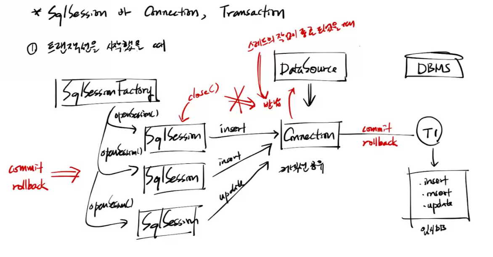

[PDF](https://github.com/eomjinyoung/bitcamp-study/blob/main/docs/%EC%8A%A4%ED%94%84%EB%A7%81%ED%94%84%EB%A0%88%EC%9E%84%EC%9B%8C%ED%81%AC1.pdf)


# MyBatis

```java
  @Override
  public void add(Member member) { //매번 세션 받아야 한다.. 커넥션을 공유하지 않도록 하기 위함이다. 내부적으로 DB커넥션풀을 쓴다. mybatis-config.xml 을 보면 <dataSource type="POOLED"> 라는 부분이 있다. 같은 스레드는 같은 커넥션을 계속 쓴다는 것이다. 이 말은 트랜잭션을 구현하기 위해 커넥션을 공유하는 방법이 이미 적용되어 있다는 것이다. (물론 그럴 일은 없겠지만 이 프로그램을 단 한사람만 사용 하는 경우라면 클라를 구분하기 위해 매번 세션을 받지 않아도 된다.) 커밋/롤백 이전까지 같은 클라는 openSession() 에서 받은 같은 세션을 쓸 것이다.
    try (SqlSession sqlSession = sqlSessionFactory.openSession()) {
      sqlSession.insert("MemberDao.add", member);
    } //catch 하지 않아도 된다. 예외 발생시 컨트롤러가 받고 예외페이지를 클라에게 줄 것이다. try를 쓰는 것은 try-with-resource 문법을 써서 자원 할당/해제를 편하게 쓰려는 것이다.
  }
```

## SqlSession, Connection, Transaction
### Transaction 을 시작하지 않았을 때
트랜잭션을 시작하지 않았을 때
* openSession() 메서드를 호출해 DataSource에서 Connection 을 받을 것이다.
* SqlSession은 각각의 Connection을 받을 것이다.
* SqlSession이 close() 로 반환하면, 그 세션이 가지고 있던 커넥션이 DataSource에 반납될 것이다.

트랜잭션을 시작했을 때
* **SqlSession이 close() 로 반환해도, 그 세션이 가지고 있던 커넥션은 반납되지 않는다.!**
* 해당 스레드의 작업이 종료되었을 때, 그 세션이 가지고 있던 커넥션을 반납한다.



## 가능하면 MyBatis 애너테이션 문법 사용을 줄이자
원래 목적이 sql문과 java코드를 분리하는 것이었으므로..

## 동적 SQL (Dynamic SQL)
MyBatis에서도 조건에 따라 SQL문을 다이나믹하게 구성할 수 있도록 지원한다. MyBatis는 JSTL의 영향을 많이 받았다고 한다.

```java
<?xml version="1.0" encoding="UTF-8" ?>
<!DOCTYPE mapper
  PUBLIC "-//mybatis.org//DTD Mapper 3.0//EN"
  "https://mybatis.org/dtd/mybatis-3-mapper.dtd">

<!--하나의 DAO를 위해서 매퍼를 작성하고, 그 DAO의 인터페이스 이름과 일치시켜 어떤 DAO를 위한 것인지 바로 알아볼 수 있게 하자
    그리고 id를 메서드 이름과 일치시켜 그 DAO의 어떤 메서드가 해당 SQL문을 사용하는지 바로 알 수 있게 하자.-->
<mapper namespace="MemberDao">
  <insert id="add" parameterType="bitcamp.myapp.vo.Member">
    insert into members(email,name,password,photo)
    values(#{email}, #{name}, sha2(#{password},256),#{photo})

  </insert>

  <delete id="delete" parameterType="int">
    delete from members where member_no=#{value}
    <!--원시값(오토박싱), 스트링은 단 한개의 파라미터가 오는 경우 이름 마음대로 적어도 됨
        일반적으로는 value 라고 적음. number라고 적는 경우도 있음-->
  </delete>

  <select id="findAll" resultType="bitcamp.myapp.vo.Member">
    SELECT
    member_no as no,
    email,
    name,
    photo,
    created_date as createdDate
    FROM
    members
  </select>

  <select id="findBy" resultType="bitcamp.myapp.vo.Member" parameterType="int">
    SELECT member_no as no,
    email,
    name,
    photo,
    created_date as createdDate
    FROM members
    where member_no=#{no}
  </select>


  <update id="update" parameterType="bitcamp.myapp.vo.Member">
    UPDATE members
    SET
    email=#{email},
    name=#{name},
    photo=#{photo}
    <if test="password != ''"> <!-- Dynamic SQL !! -->
      , password=sha2(#{password}, 256)
    </if>
    WHERE member_no=#{no}
  </update>

  <select id="findByEmailAndPassword" resultType="bitcamp.myapp.vo.Member" parameterType="int">
    SELECT member_no as no,
    email,
    name,
    created_date as createdDate
    FROM members
    WHERE
    email=#{email} AND password=sha2(#{password},256)


  </select>
iu
</mapper>
```

# resultMap을 설정하는 이유
VO 필드와 DB 컬럼 이름의 차이를 해소하기 위해 별명을 따로 부여할 필요가 없음.

한번 resultMap을 잡아주면 type을 설정하기 위해 매번 FQName을 작성하지 않아도 됨
* FQName이 변경되면 resultMap 에서 한번만 변경해주면 됨
* 만약 resultMap에 담지 않았더라면 모든 코드에서 다 변경해줘야 함

## 더 편하게 하는 방법
`mybatis-config.xml`에서 패키지 내 모든 클래스에 대해서 별명을 자동부여할 수 있다. 

```xml
  <typeAliases>
    <package name="bitcamp.myapp.vo"/>
  </typeAliases>
```

이렇게하면 FQName을 적지 않고 클래스 이름만 적어도 자동 부여된 별명으로 잡혀서 클래스를 잡는다. 동일한 이름을 갖는 클래스가 많다면 주의해야 한다. 다만 그 중에서 한 패키지만 쓰는 경우라면 이 설정으로 유지보수를 더 편하게 할 수 있을 것이다.