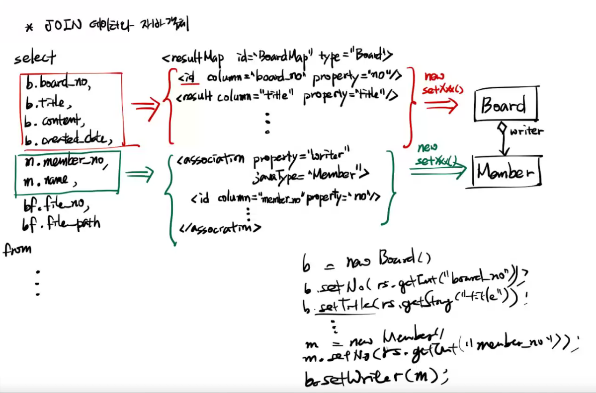
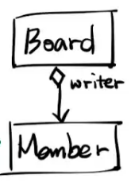

[PDF](https://github.com/eomjinyoung/bitcamp-study/blob/main/docs/%EC%8A%A4%ED%94%84%EB%A7%81%ED%94%84%EB%A0%88%EC%9E%84%EC%9B%8C%ED%81%AC1.pdf)


# join 데이터와 자바 객체

```xml
  <resultMap id="BoardMap" type="Board">
    <id column="board_no" property="no"/>
    <result column="title" property="title"/>
    <result column="content" property="content"/>
    <result column="created_date" property="createdDate"/>
    <result column="file_count" property="fileCount"/>
    <result column="category" property="category"/>

    <association property="writer" javaType="Member">
      <id column="member_no" property="no"/>
      <result column="name" property="name"/>
    </association>

    <collection property="files" ofType="AttachedFile">
      <id column="file_no" property="no"/>
      <result column="file_path" property="filePath"/>
      <result column="board_no" property="boardNo"/>
    </collection>

  </resultMap>
```

```xml
  <select id="findBy" resultMap="BoardMap" parameterType="int">
    select
      b.board_no,
      b.title,  
      b.content,
      b.created_date,
      m.member_no,  
      m.name,
      bf.file_no,
      bf.file_path
    from
      boards b inner join members m on b.writer=m.member_no
      left outer join board_files bf on b.board_no=bf.board_no
    where
      b.board_no=#{value}
  </select>
```

89일차에 많은 작업을 했는데, 그 중 하나로 이렇게 매퍼를 만들었다.
join을 시켜서 board, member의 데이터를 가져오고 그것들을 객체로 담는다.



여기서 볼 것은, 아래 사진의 부분이다.



Board 객체는 Member 객체를 writer라는 이름의 멤버로 포함하고 있다. 

이 그림을 보면 아래와 같은 코드가 연상되어야 한다.

```java
//vo
  ...
  private Member writer;

  public void setWriter(Member writer) {
    this.writer = writer;
  }
  ...
```
```java
  board.setWriter(model);
```

특히, 매퍼에서 마이바티스를 위해 작성해둔 부분을 보고 다시 확인할 수 있다.
```xml
    <association property="writer" javaType="Member">
      <id column="member_no" property="no"/>
      <result column="name" property="name"/>
    </association>

    <collection property="files" ofType="AttachedFile">
      <id column="file_no" property="no"/>
      <result column="file_path" property="filePath"/>
      <result column="board_no" property="boardNo"/>
```

여기서 Member, AttachedFile이라는 클래스의 객체를 만들어서 세터의 아규먼트로 줄 것으로 예상을 할 수 있다.

이런 작업들을 mapper에 정의해두면 MyBatis가 java의 기본 API를 활용하여 처리할 것이다.

.png)

# 시각화 공부
오늘 공부는 코드단을 제외하면 대부분 시각화 자료를 만들면서 공부를 했다.
그 자료를 블로그에 올리는 적합한 방법을 찾아봐야겠다.